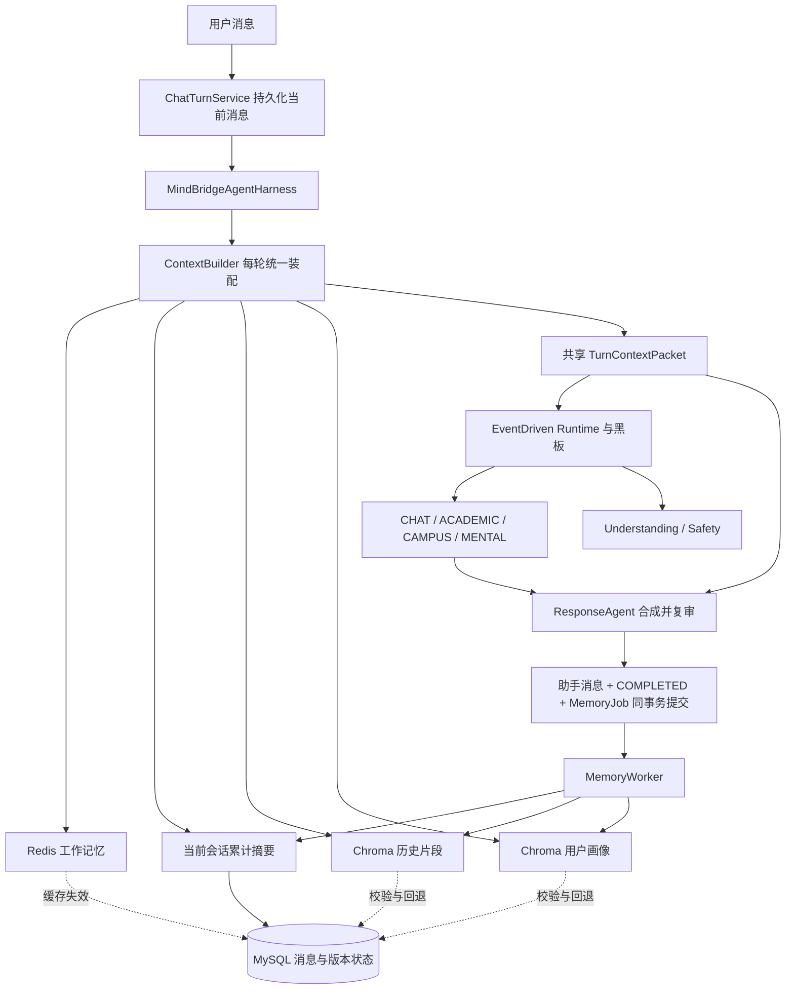

# CampusCare 三层记忆与 Harness 统一上下文改造方案

> 核对日期：2026-09-17。本文是基于两个项目实际源码的改造设计，尚未实施业务代码变更，也未进行运行时性能测试。文中的预算、阈值和验收指标均为建议值，不是已测成果。

## 1. 结论与目标

可以按 EchoMind 的思路改造，而且 CampusCare 已具备相当一部分基础。推荐在现有 `ContextBuilder`、`TurnContextPacket`、Redis 缓存、SQL 增量摘要和用户记忆治理上演进，补齐 Chroma 情景记忆、异步画像更新，并将基础上下文装配入口上移到 `MindBridgeAgentHarness`。

目标结构为：

```text
三层记忆：
  L1 工作记忆：Redis 保存当前会话近期消息
  L2 情景记忆：当前会话累计摘要 + ChromaDB 历史片段摘要
  L3 用户画像：ChromaDB 保存稳定偏好、背景、长期约束

每轮基础上下文：
  Redis 工作记忆
  + 当前会话累计摘要
  + Chroma 历史片段
  + 用户画像

Harness 每轮装配一次 → 共享 TurnContextPacket → 各专业 Agent 消费
```

“三层”描述记忆职责，“四块”描述模型输入，累计摘要属于情景记忆在当前会话中的压缩状态，并非第四层记忆。

保留 MySQL 作为消息、摘要版本、画像状态和异步任务的持久事实源。Chroma 实际保存历史摘要和画像文档及向量，承担语义检索；SQL 副本用于恢复、版本校验、更正和删除。这个选择满足目标存储形态，同时保留 CampusCare 已有的可靠性。

本轮设计重点：

1. 让各专业 Agent 真正共用完整的四块基础记忆，而非只获得摘要中的 `currentGoal`。
2. 同一轮只加载、检索、去重一次；Agent 不自行读取 Redis、Chroma 或历史消息表。
3. 滑动窗口与增量摘要通过覆盖游标协作，历史片段按需召回，避免重复注入。
4. 画像提炼、摘要压缩和向量写入通过可恢复后台任务执行。
5. 保留现有事件驱动协作、专业 Agent 工具权限、澄清恢复、风险优先和最终回答复审流程。

## 2. 核对范围与源码依据

### 2.1 两个实际目录

CampusCare 后端目录：

```text
D:\download\CampusCare\mindbridge_v7_5_simple_revision_exit
```

EchoMind 实际目录：

```text
D:\download\EchoMind所有代码+详细文档+ 简历3_____(人已满，不可申请)\EchoMind所有代码+详细文档+简历\EchoMind
```

用户提供路径中的下划线在实际文件系统中属于同一个目录名。下表路径均相对于各自项目根目录。核对时 CampusCare 目录不是 Git 工作树；本方案不要求初始化 Git。

### 2.2 CampusCare 当前实现

| 能力 | 源码位置 | 核对结论 |
|---|---|---|
| Redis 近期消息 | `app/services/memory.py:27`，`RedisShortTermMemoryStore` | 已有消息 ID、TTL、容量限制、读取状态和失败容错；默认缓存 40 条、TTL 24 小时 |
| SQL 回退 | `app/services/context_builder.py:710`，`_load_recent_messages` | 缓存不可用、消息不足或缺少 ID 时查询 SQL；限定用户、会话和当前消息之前的数据；当前回退函数没有修复缓存 |
| 累计摘要 | `app/services/memory.py:215`，`ConversationSummaryService` | 已有 `covered_until_message_id`、版本号和 CAS；只压缩游标之后且退出近期窗口的消息 |
| 摘要生成方式 | 同上及 `update_summary_v2` | 支持注入 summarizer，但当前生产调用未传入，实际默认是规则抽取，不是 LLM 摘要 |
| 用户记忆 | `app/services/user_memory.py:78`、`:106` | SQL 保存显式“请记住”信息；按相关性选取，支持更正、删除、过期和跨会话使用；尚无 Chroma 自动画像链路 |
| 基础上下文装配 | `app/agents/event_driven_runtime.py:53`；`app/services/context_builder.py:336` | 当前是 Runtime 调用 ContextBuilder；Harness 尚未直接持有本轮统一装配结果 |
| 共享上下文 | `TurnContextPacket`、`AgentRuntimeServices.context_packet`、黑板 `turn_memory` | 已有共享机制，可以扩展，不必另造一套 MemoryContext 并行运行 |
| 专业 Agent 视图 | `app/services/context_builder.py:202`，`for_specialist` | 只注入 currentGoal、最近 4/6 条、最多 3 条用户记忆等；没有完整累计摘要及 Chroma 历史片段 |
| 最终回答 | `app/agents/autonomous.py:691`，`ResponseAgent.act` | 实际模型输入为 userInput、routePlan、specialistResults；没有调用 `for_response()` 直接注入基础记忆 |
| 现有预算器 | `app/services/context_builder.py:425`，`build_response_prompt` | 有预算、裁剪和来源记录，但当前 ResponseAgent 实际生成路径没有调用它；仅修改此函数不能保证线上路径生效 |
| 成功轮次提交 | `app/services/chat.py:430`，`_finalize_completed_turn` | 已验证的助手消息、ChatTurn 完成状态和 Trace 在 SQL 中提交 |
| 当前记忆后处理 | `app/services/chat.py:495`，`_after_completed_turn` | 成功提交后同步追加缓存、更新摘要、标记记忆使用；这是生产链路的重要改造入口 |
| Harness 兼容保存路径 | `app/agents/harness.py:213` 附近，`save_assistant_message` | 也调用摘要更新；实施时统一入口，避免两条路径重复执行 |
| Chroma 与 Embedding | `app/services/vector_store.py`、`embedding.py` | 已用于知识库；当前 Chroma PersistentClient 和知识库 collection 不能直接等同于用户记忆库 |

额外需要修正的预算问题：`for_specialist()` 输出主要使用 camelCase，而 `_fit_knowledge_view()` 裁剪的是 `recent_messages`、`current_goal` 等 snake_case 字段。它无法可靠裁剪专业 Agent 实际使用的 `recentMessages` 等内容，因此应统一字段契约并在实际发送前做 token 预算。

现有 `TurnContextPacket` 虽然是 frozen dataclass，内部仍含可变 dict；新版本需要保证嵌套数据不可被 Agent 原地修改，或只返回受控副本。

### 2.3 EchoMind 可借鉴的部分

| 能力 | 源码位置 | 实际行为 |
|---|---|---|
| 四块记忆上下文 | `memory/conversation_memory.py:48`，`MemoryContext` | recent_messages、relevant_history、user_profile、summary |
| 三层统一读取 | 同文件 `get_context():221` | 一次读取工作记忆、情景历史、画像和 Redis 累计摘要 |
| 滑动压缩 | `_compress():256` | 工作记忆达到 15 条触发压缩，保留最近 5 条；读取窗口最多 20 条 |
| 增量合并摘要 | `_merge_summary():445` | 旧摘要与新增摘要再次合并，累计摘要最多 800 字符 |
| 历史摘要向量化 | `_store_episodic():343` | `episodic` collection 的 document 保存片段摘要，metadata 包含用户、会话等信息 |
| 跨会话召回 | `_search_episodic():319` | 先查同会话，数量不足再扩展到同用户历史，按文本去重 |
| 用户画像 | `update_profile():162`、`_get_profile():362` | LLM 提炼偏好和实体，Chroma 稳定用户文档 ID 保存画像 |
| 异步更新 | `api/main.py:319` | `asyncio.create_task()` 更新画像 |
| 共享背景 | `api/main.py:287`、`agents/agent_orchestrator.py:237` | API 先装配 context，再把统一背景放入编排请求供 Agent 使用 |

EchoMind 的集中装配实际位于 API + MemoryManager，不是同名 Harness。CampusCare 应借鉴职责划分，把同一职责放到现有 Harness + ContextBuilder 中。

### 2.4 不直接照搬的实现细节

- EchoMind 的 Redis 读取和写入路径没有完整 SQL 回退。Chroma 的异常返回空结果、HTTP 服务失败切本地，与“Redis 缓存回退”是不同能力。
- EchoMind 使用临时 `create_task()` 更新画像，没有持久任务、版本冲突控制和重启补偿；画像先 delete 后 add 有更新空窗。
- EchoMind 压缩过程删除并重建 Redis 列表，缺少并发保护；CampusCare 应从 SQL 游标读取待压缩增量，Redis 只承担缓存职责。
- EchoMind 情景文档 ID 包含当前时间，重试可能重复写入；本方案使用稳定区间 ID。
- EchoMind 只做文本级去重，未通过来源区间去除“累计摘要 + 同会话历史片段”的重叠。
- EchoMind 的同会话查询把多个字段直接传给 Chroma `where`，在其固定的 Chroma 0.5.23 下应使用显式 `$and` 并做集成测试，不能假定召回链路已经验证有效。
- 文件头提到 API Embedding，但实际 collection 写入依赖 Chroma 默认 embedding。本方案复用 CampusCare 明确配置的 EmbeddingBackend，并记录模型版本和维度。
- 不复制 EchoMind 中背景信息后的虚构 assistant 确认消息，也不使用转义后的中文画像文本。

## 3. 目标架构与职责



职责分配：

| 组件 | 改造后的职责 |
|---|---|
| Harness | 校验范围、处理澄清状态、调用一次基础上下文装配、将 packet 交给 Runtime |
| ContextBuilder | 唯一上下文装配与 prompt 渲染入口；调用记忆服务、预算、去重、生成 manifest |
| MemoryRetrievalService | Redis/SQL 工作记忆读取、Chroma 情景与画像读取、来源校验和回退；不构造角色 prompt |
| ConversationSummaryService | 按增量区间生成结构化累计摘要，保留 CAS 和规则降级能力 |
| UserMemoryService / ProfileService | 维护画像事实、更正、状态、删除、相关性和异步提炼 |
| MemoryVectorStore | 记忆专用 Chroma collections、稳定 ID upsert、过滤、删除、版本检查 |
| MemoryJobService / MemoryWorker | 持久任务、领取租约、重试、幂等、压缩与画像提炼、索引补偿 |
| Runtime / 专业 Agent | 消费同一 packet；仅补充自身任务、Skill、工具及依赖结果 |

不让专业 Agent 获得长期记忆写入工具；记忆回写统一发生在用户消息治理和最终轮次提交之后，避免未经接受的草稿成为用户记忆。

## 4. 数据设计

### 4.1 工作记忆与累计摘要

建议新 Redis key 使用版本命名空间：

```text
campuscare:memory:v3:recent:{user_id}:{session_public_id}
campuscare:memory:v3:summary:{user_id}:{session_public_id}
campuscare:memory:v3:profile:{user_id}:{profile_version}
```

- 工作记忆继续缓存最近 40 条、TTL 24 小时；**缓存容量不等于 prompt 窗口大小**，模型默认近期窗口仍为 8 条消息。
- 消息至少携带 message_id、turn_id、role、content、顺序与状态信息；去重依据 message_id，排序依据该会话内的确定顺序。
- 近期窗口按完整轮次边界尽量保留 user/assistant 配对；失败轮次的 user 消息可以保留，失败 assistant 草稿不进入记忆。
- 累计摘要继续由 `ConversationSummary` 持久保存，Redis 可缓存同一版本快照。新增缓存必须携带 version、covered_until_message_id，不能只缓存正文。
- SQL 缓存重建通过独立 `replace_records()` 或原子合并接口保留消息 ID。当前 `replace(AiMessage)` 不保留 ID，不能直接用于回填。
- 回填与新消息 append 并发时通过 Lua/版本比较合并去重，或放弃过时回填；不能用旧 SQL 快照覆盖更新的缓存尾部。

### 4.2 情景记忆

新增 SQL `ConversationEpisode`，对应 Chroma `campuscare_episodic_v1_<embedding_version>`。

| 字段 | 含义 |
|---|---|
| id / public_id | 稳定片段标识 |
| user_id / session_id | 归属范围 |
| source_start_message_id / source_end_message_id | 该片段覆盖的真实消息区间 |
| summary_text / facts_json | 增量片段摘要及结构化事实，SQL 保留可重建副本 |
| content_hash / version | 内容与修订版本 |
| status / index_status | ACTIVE、DELETED 等状态；PENDING、INDEXED、FAILED 等索引状态 |
| embedding_version | provider、model、digest、dimension 对应的版本标识 |
| created_at / expires_at | 时效与失效控制 |

唯一约束建议为 `(session_id, source_start_message_id, source_end_message_id, schema_version)`。Chroma ID 由此稳定生成，文档修订使用同一 ID upsert。

Chroma `document` 存**本次退出窗口区间的独立片段摘要**，不在每次压缩时把不断累积的整份会话摘要再存一遍。这样可以避免检索结果每条都重复旧信息。

Metadata 只放可过滤的标量：user_id、session_id、source_start/end、status、version、content_hash、embedding_version、时间戳。复杂事实和完整溯源保存在 SQL，不把整段原始聊天塞进 metadata。

### 4.3 用户画像

复用 `UserMemory` 作为画像事实表，保留原有 public_id 和查询/删除 API。建议增加：

- `origin`：EXPLICIT / EXTRACTED。
- `version`、`updated_from_turn_id`、`evidence_message_ids_json`。
- `sensitivity`、`visibility_scope`、`index_status`。
- 对同用户同 memory_key 的有效版本执行事务级冲突控制；历史版本继续保留 SUPERSEDED/DELETED 状态。

新增 `UserProfileState` 保存用户级 `profile_version`、提炼游标/进度、记忆删除代际 `memory_epoch`。多个会话更新同一用户画像时按用户串行合并或 CAS 重试。

Chroma `campuscare_profile_v1_<embedding_version>` 按**画像事实条目**保存，ID 使用 `profile:{user_id}:{memory_public_id}`。上下文里的“用户画像”是这些条目的有界聚合，不需要使用一个无限增长的大 JSON 文档。

画像示例：

```json
{
  "memory_key": "LEARNING_PREFERENCE:learning_format",
  "value": "偏好清单式学习计划",
  "origin": "EXPLICIT",
  "confidence": 1.0,
  "source_message_ids": [101],
  "version": 2,
  "status": "ACTIVE"
}
```

画像可以包含稳定学习偏好、校区/专业等明确背景，以及具有有效期的长期约束。临时情绪放入会话记忆，不能自动固化为永久心理标签。提炼模型只从用户原话提取用户事实，助手建议不能自动变成用户偏好。

明确“请记住”和更正继续走轻量同步 SQL 写入，随后异步索引，使下一次请求即使在 Chroma 尚未更新时仍可从 SQL 得到最新事实。隐式稳定信息走异步提炼；低置信度条目不自动成为 ACTIVE。

## 5. Harness 统一装配与 Agent 复用

### 5.1 读取顺序

1. `ChatTurnService` 持久化当前用户消息，保留 requestId 幂等契约。
2. Harness 校验 user/session/current_message 归属，处理澄清续接与当前输入。
3. Harness 调用 `ContextBuilder.build_base_context()`，内部调用 MemoryRetrievalService。
4. 固定本轮读取边界：当前消息 ID、上一可用摘要版本、画像版本、可见历史片段版本。
5. 读取近期消息和累计摘要，检查摘要与近期窗口之间是否存在未覆盖消息。
6. 使用当前输入加必要的目标/澄清信息构建一次有界检索 query，检索同用户 Chroma 历史和相关画像。
7. 统一进行状态校验、冲突消解、来源去重、预算裁剪，生成 packet 和 manifest。
8. Runtime 接收必传 packet，并把同一快照交给所有 Agent、黑板和最终回答流程。

普通轮次 `build_base_context()` 调用一次。完全不进入 Runtime 的确定性澄清追问可跳过昂贵检索，但应记录 `context_skipped_reason`；继续遵循同一轮消息与任务提交机制。

### 5.2 Packet 契约

在现有 `TurnContextPacket` 上升级 `packet_version=3`，主要新增或明确以下字段：

```text
snapshot_id / turn_id / packet_version
user_id / session_id / current_message_id / current_input
recent_messages
structured_summary / summary_version / summary_covered_until_message_id
relevant_history: EpisodeMemory[]
user_profile: ProfileFact[] / profile_version
clarification_state / safety_context
manifest
```

`selected_user_memories` 在兼容期可以是 `user_profile` 的适配视图，**不能同时以两份正文注入模型**。不存在的记忆用空数组或空摘要表示，不虚构背景。

统一基础记忆渲染接口建议为：

```text
ContextBuilder.render_base_memory(packet, audience, budget)
ContextBuilder.build_specialist_prompt(packet, work_item, dependencies, skills)
ContextBuilder.build_response_prompt(packet, results, route_plan, review_context)
```

这是扩展现有 ContextBuilder 的接口，不新增另一套 prompt builder。四个基础区块使用一致的字段名称和渲染规则：

```text
<base_memory>
  <working_memory>当前窗口内消息</working_memory>
  <conversation_summary>累计摘要</conversation_summary>
  <relevant_history>检索到的历史片段</relevant_history>
  <user_profile>有效画像事实</user_profile>
</base_memory>
```

所有记忆标记为 REFERENCE_DATA。当前输入单独注入一次，工作记忆中排除当前消息。历史里的 role 是数据属性，不提升为 system 指令。

### 5.3 专业 Agent 如何共用

| 消费者 | 输入方式 |
|---|---|
| GeneralChatAgent | 四块共享基础上下文 + CHAT 任务 + 自身工具/Skill |
| AcademicPlanningAgent | 同一基础上下文 + 学习任务与约束 + 必要依赖结果 |
| CampusAffairsAgent | 同一基础上下文的授权视图 + 校务任务；历史个人陈述不能当作现行校规证据 |
| PsychologicalSupportAgent | 同一基础上下文的授权视图 + 本轮支持任务和必要风险信息 |
| ResponseAgent | 同一 packet 渲染的基础记忆 + 有界 routePlan + 去重后的 specialistResults |
| UnderstandingAgent | 从同一 packet 提取轻量路由视图；新增必要的画像/历史线索，保持独立小预算 |
| SafetyAgent | 从同一 packet 提取当前消息、最近风险线索与必要历史；当前危险信号不能被旧低风险记忆覆盖 |

四个专业 Agent 的默认基础区块和来源一致；领域任务信息通过附加区块传入。只有明确的敏感性权限和模型预算可以让具体视图不同，差异必须记录在 manifest，不能继续隐式地只给某个 Agent `currentGoal`。

当前代码以 category 字符串排除部分 CAMPUS 记忆，覆盖能力有限；改造为结构化 sensitivity/visibility_scope 筛选。共享基础快照不意味着向校务任务暴露所有心理历史。

同一轮 AgentLoop 重试、Response 安全修订都复用同一 snapshot，不再次检索，不把四块基础记忆一轮轮追加到已有 messages。工具结果单独限额，循环中的完整请求每次重新计算预算。

需要明确：共享 packet 可以避免重复加载和重复拼接；多个独立模型调用仍各自消耗所收到的基础上下文 token，不能把“装配一次”等同于“全部 Agent 只付一次输入 token”。

## 6. 滑动窗口与增量摘要

### 6.1 正常压缩算法

建议保留当前默认 `context_recent_message_limit=8`，单位是**消息条数**，通常约四轮对话。

```text
C = 已提交累计摘要的 covered_until_message_id
B = 本次任务可处理的已完成轮次边界
R = B 以内需要原样保留的近期消息窗口，按轮次边界对齐
E = C 之后、R 起点之前尚未摘要的消息区间

若 E 为空：不调用摘要模型
若 E 非空且达到触发条件：
  生成 E 的独立片段摘要 episode_summary
  new_summary = 合并(old_summary, E 的新增事实/episode_summary)
  验证来源、字段、长度、角色归属
  CAS 提交 new_summary 与新游标
  同一 SQL 事务保存 ConversationEpisode 与索引任务
  异步向 Chroma upsert episode_summary
```

可以让一次结构化 LLM 调用返回 `episode_summary` 和 `updated_summary`，避免默认每次压缩调用两次模型。规则 `update_summary_v2` 保留作降级，输出必须同样标明来源、降级状态和覆盖区间。

摘要生成失败且规则降级也无有效输出时，不推进游标。压缩只改变派生记忆，不删除 SQL 原始消息。

建议触发条件：退出窗口的未摘要消息达到 4 条，或其估算 token 超过 1,500，或会话进入归档/闲置收尾。门槛影响任务执行，不改变“未摘要消息必须可被观察和补齐”的要求。

### 6.2 处理异步摘要滞后

仅取“旧摘要 + 最新 8 条”会漏掉中间消息，这是异步化必须解决的问题。

例如摘要只覆盖到 80，当前历史已有 100 条，近期窗口为 93–100，那么 81–92 不能凭空消失。上述数字只是单会话连续编号示意，实际数据库 ID 不必连续。

装配时按 SQL 查询确认区间，而不是用全局 ID 相减计算消息数：

1. 查询 `(C, current_message_id)` 范围内应可见的已提交消息，识别窗口之外的未覆盖增量。
2. 小规模滞后：把这些增量临时并入工作记忆桥接区，纳入统一 token 上限；同时提高压缩任务优先级。
3. 超出桥接预算：使用无 LLM 的结构化应急压缩提取有来源的目标、约束和更正，并优先保留最新原话；记录 `summary_lag` 与具体遗漏/裁剪范围。
4. 应急视图不推进持久化摘要游标。后台仍从原始消息完整补算。
5. 不承诺故障期间保留全部历史细节，但不静默伪装成完整上下文，也不为补摘要无限阻塞本轮响应。

正常预算优先保证最新对话与有效目标，后台积压通过指标和重试解决，不能靠扩大 prompt 到无限长度掩盖。

### 6.3 轮次顺序与读取一致性

- 同会话运行中的生成请求需要明确串行或拒绝重叠的策略；现有 requestId 幂等不等于同会话跨进程串行。
- 最小方案在 ChatTurn 层用数据库可见的活动轮次约束/租约串行生成；不同会话可以并发。
- MemoryWorker 为同会话摘要任务串行推进；同用户画像更新使用单独的版本冲突控制。
- 本轮 packet 不读取覆盖范围晚于当前请求的摘要；必要时取保留的上一版本或回退为受限原始窗口。
- 在 LLM 调用期间不持有长数据库事务；先读取版本与区间，调用模型，再开启短事务 CAS 提交。

### 6.4 短会话与归档也要产生情景记忆

如果只有“超过窗口才写 Chroma”，少于 8 条消息的会话永远没有历史片段，会削弱跨会话复用。

因此增加收尾任务：会话归档时立即入队，或闲置超过建议 30 分钟后由周期扫描器入队。将尚未形成情景片段的尾部消息生成一个有界 episode。

- 归档时可完成最终摘要，归档会话不再接受新消息。
- 未归档但闲置的会话可能恢复，收尾 episode 只是历史检索副本，不强行推进活动会话累计摘要到近期窗口内部。
- 每会话只保留一个可修订的尾部 episode 范围；后续压缩覆盖该范围时，在 SQL 中替换/标记旧尾部片段并异步更新索引。
- 通过来源区间去重保证尾部片段不会在当前会话再次重复注入。
- 新会话立即创建时可能遇到异步尚未完成；允许从同用户最新已完成会话的 SQL 尾部做小规模规则摘要回退，并标记来源，不能声称向量记忆已实时就绪。

## 7. 历史检索、冲突处理与去重

### 7.1 检索策略

一次检索 query 由当前用户输入和必要的累计目标/澄清信息组成，不把整份历史重新送去 embedding。优先尝试同用户、不同会话历史；同会话只允许召回当前累计摘要和近期窗口没有保留的补充细节。

首版建议默认排除当前会话 episode，显著降低重复；之后需要精细补充时再按来源事实覆盖度启用同会话召回。

Chroma 查询必须在数据库侧包含 user_id 过滤，复合条件使用显式 `$and`。用户身份来自鉴权结果，不接受 Agent 或模型生成的 user_id 作为检索范围。查回后仍按 SQL 校验归属、状态、版本和有效期。

候选先取 8 条，再按语义相关性、时效性、与当前任务的关系和来源覆盖筛选，最终最多 3 条且受 token 上限限制。分数阈值需根据选定 embedding 的距离分布标定，不能直接沿用知识库分数。

画像优先获取已知稳定偏好和相关约束，Chroma 可用于相关条目检索；SQL 中刚更正、刚创建的有效条目必须覆盖滞后的 Chroma 结果。旧索引返回的正文不能绕过 SQL 状态校验直接进入 prompt。

### 7.2 去重分层

| 层次 | 规则 |
|---|---|
| 当前输入 | 当前 message_id 从 recent、同轮画像候选和历史来源中排除；当前原文单独保留 |
| 原始消息 | 按 message_id 去重，不按正文去重，避免把不同时间同一句话错误合并 |
| 摘要与窗口 | 持久摘要覆盖区间与原样窗口默认不重叠；桥接区只包含未摘要消息 |
| 历史片段 | 同源区间、稳定 episode ID、content_hash 去重；排除已被当前摘要/窗口代表的片段 |
| 事实语义 | memory_key/entity_key + source ID + 最新有效版本消解重复事实；不能只靠字符串完全相同 |
| 画像与历史 | 画像已明确包含的稳定偏好，不在历史片段里再次展开；片段若仍有独立任务细节则保留这些部分 |
| Agent 输入 | 同一 prompt 中基础记忆只出现一次；黑板 full payload、manifest 正文、routePlan 不再次拷贝同一历史 |
| 多轮模型调用 | 每次无状态模型调用按需携带有界记忆；不能因为上一次请求发过就从下一次请求中彻底移除必要背景 |

去重前先处理更正。当前用户明确更正优先于旧摘要、旧 episode 和旧画像；同用户同事实键选择最新有效事实。跨会话冲突不得简单比较不同领域文本的时间就全盘覆盖，应以同一事实键和用户来源为依据。

用户历史中“学校规定……”只是过去的陈述，不能替代知识库 RAG 的有效政策证据。最终回答保持个人记忆与外部事实来源的区别。

## 8. 异步更新、幂等与故障回退

### 8.1 持久任务设计

建议新增独立 `MemoryJob`，复用当前 SQL 后台 worker 的实现经验，但不把记忆任务塞进风险报告的 ToolJob；后者的业务语义是报表、案例和预警。

最小字段：job_id、dedupe_key、kind、user_id、session_id、turn_id、target_message_id、status、attempts、run_after、lease_owner、lease_expires_at、expected_version、memory_epoch、last_error。

任务类型：

- COMPACT_SESSION：增量累计摘要与 episode 生成。
- UPDATE_PROFILE：提炼新的用户画像候选并合并。
- INDEX_EPISODE / INDEX_PROFILE：把 SQL 派生状态同步到 Chroma。
- FINALIZE_SESSION：短会话、归档和闲置收尾。
- DELETE_MEMORY：索引删除及派生记忆失效补偿。

状态流转为 `PENDING → RUNNING → SUCCEEDED`，失败后按退避回到 PENDING，超过次数进入 FAILED 待补偿。通过数据库原子领取和租约恢复支持多 worker；不能仅靠进程内线程锁。

### 8.2 正确的提交时机

在 `ChatService._finalize_completed_turn()` 现有事务内新增 MemoryJob 记录，与助手消息、ChatTurn COMPLETED 和 Trace 一起 commit。这样不会出现“回答已提交，但进程在入队前退出导致永远不更新记忆”的空窗。

`_after_completed_turn()` 保留可失败的 Redis 缓存写入和 worker 唤醒，不再同步调用 LLM 摘要/画像。worker 自己创建 SQL Session，不能持有请求结束后的 Session。

显式“记住/更正”在 UserMemoryService 的事务中同时产生 INDEX_PROFILE 任务。抽取任务和索引任务分开，Chroma 不可用时不重复调用 LLM。

失败或中断轮次不从 `partial_content`、未接受 response_proposal、工具原始结果提炼画像。已持久化的用户显式记忆可以保留，必须记录它来源于用户输入而非成功回答。

任务幂等键建议：

```text
COMPACT_SESSION:{session_id}:{completed_turn_id}
UPDATE_PROFILE:{user_id}:{completed_turn_id}
INDEX_EPISODE:{episode_id}:{version}
INDEX_PROFILE:{memory_public_id}:{version}
```

同会话任务可合并到最新高水位，实际待处理区间由 SQL 游标决定；同一消息区间重试不产生新 episode。画像抽取维护独立增量进度，不能每轮反复扫描整段会话。

### 8.3 各类故障的行为

| 故障 | 读取行为 | 写入与恢复 |
|---|---|---|
| Redis miss / 过期 / 超时 | 回退同用户同会话 SQL，排除当前消息，保留消息 ID；记录 fallback | 尝试有界安全回填；失败不影响回答 |
| Redis 缓存缺尾/版本陈旧 | 通过 SQL 轮次高水位/缓存元信息发现，不把“数量够”当成“内容完整” | 重建或原子补齐 |
| Chroma 历史不可用 | 从 SQL episode 候选做有界词法匹配；没有合格结果则返回空历史 | INDEX 任务重试，SQL 摘要照常提交 |
| Chroma 画像落后/不可用 | 回退 SQL ACTIVE 最新版本画像 | 稳定 ID upsert 重试，不先 delete 再 add |
| Embedding 不可用 | 历史与画像走 SQL 相关性回退 | 保留待索引状态，恢复后批量补写 |
| 摘要模型不可用 | 使用有效旧摘要与桥接窗口；可用规则降级摘要 | 校验有效后才推进游标；保留降级记录 |
| 画像模型不可用 | 使用已有有效画像 | 重试增量任务，不用空画像覆盖旧画像 |
| Worker 崩溃 | 请求侧继续使用已提交快照 | 租约超时重新领取，幂等执行 |
| SQL 故障 | 按当前消息持久化失败契约结束请求 | 不允许仅凭 Redis 宣布轮次成功 |

明确配置 Chroma 模式：单机可以先使用独立记忆目录的 PersistentClient；多实例或独立 worker 部署使用固定 Chroma 服务。生产不自动从远端切换到另一份本地库，避免不同进程读取不同长期记忆。

## 9. 上下文预算与可观测性

### 9.1 建议初始预算

以下是初始上限，不是每轮必须填满的配额：

| 内容 | 建议上限 |
|---|---:|
| 工作记忆（含正常范围内桥接） | 2,200 tokens，默认 8 条近期消息 |
| 累计摘要 | 700 tokens |
| Chroma 历史片段 | 800 tokens，最多 3 条 |
| 用户画像 | 500 tokens，最多 5 条 |
| 四块基础记忆合计 | 4,200 tokens |

整体输入还包含 system、当前输入、Skill、workItem、依赖结果、工具 schema/结果、Response 合成数据。沿用当前 `context_input_max_tokens=12000` 作为应用上限，并对每个模型配置计算：

```text
可用输入预算 = min(应用输入上限, 模型上下文窗口 - 本次输出预算 - 安全余量)
```

不能只给基础记忆限额而让 specialistResults、工具结果或安全修订无限增长。不同 Agent 使用不同模型配置时，分别计算最终预算；现有 CJK token 估算可作首版近似，有 tokenizer 时采用实际计数。

普通超额裁剪顺序：低相关历史 → 低相关画像 → 摘要非核心条目 → 较旧工作消息。保护当前输入、当前明确更正、必要安全指令与任务硬约束；校规类任务给真实证据保留空间。保护项本身超限时走明确的受控失败/降级，不能发送超模型窗口的请求。

### 9.2 Manifest 与指标

扩展现有 ContextManifest，记录：

- snapshot_id、packet_version、summary_version、summary_covered_until、profile_version。
- recent_message_ids、episode_ids、profile_fact_ids；每个来源的版本、hash、token 数。
- 本轮候选量、选中量、去重原因、裁剪原因、授权过滤原因。
- redis_status、chroma_status、fallback_source、summary_lag、profile_lag、任务积压。
- context_load_ms、context_render_ms、每类记忆的 token、每个 Agent 实际输入 token。

区分“packet 中可用的来源”和“实际发给该 Agent 的来源”。当前 Response payload 直接复制基础 manifest，不能证明这些内容实际进入模型输入；改造后每次发送都生成或核对对应的 prompt manifest。

Trace 默认记录 ID、hash、版本和状态，不复制历史正文。`app/services/trace.py` 的敏感字段过滤需要同步覆盖新增字段及 camelCase/snake_case 变体。

减少上下文膨胀的核心验收是固定预算和去重正确性；总成本另按本轮所有模型调用累计。不得只测单个 prompt 就宣称多 Agent 总 token 已下降。

## 10. 更正、删除与跨会话边界

跨会话复用按 user_id 隔离；Redis 工作记忆仍按 session 隔离。新会话的累计摘要为空，但可以召回该用户以前的 episode 和有效画像。

归档与遗忘采用不同语义：沿用现有“归档停止继续聊天并移出活动列表”的含义，归档会话仍可作为跨会话记忆来源；若用户请求遗忘，执行专门的删除/失效流程，不把归档当作自动清除长期记忆。

新增记忆生命周期要求：

1. 画像删除立即将 SQL 状态置为 DELETED、增加 memory_epoch，并同事务入队索引删除任务。
2. 读取端先校验 SQL 状态与 epoch，Chroma 删除延迟期间也不能继续注入旧画像。
3. 后台写入前检查 epoch；旧任务不能把已删除内容重新创建。保留不参与模型输入的最小抑制标记，防止历史扫描再次提炼同一已删除事实。
4. 涉及“遗忘这项信息”时，定位包含该事实的 episode、累计摘要和画像缓存，先使受影响派生片段失效，再重建；无法精确定位时宁可暂时排除整个相关片段。
5. 整个会话删除或用户全部遗忘，需覆盖工作缓存、SQL 派生状态、Chroma 文档和未执行任务。原始聊天的删除范围需由对应产品操作明确，不和当前归档 API 混为一谈。

已有 `/api/user/memories` 查询与删除应继续工作，并在返回结构中适配画像来源/状态；引入自动画像后应能查看并删除这些条目，避免只有显式记忆可管理。

## 11. 文件级改造清单

以下新增文件名是推荐命名，实施时可以按项目现有目录风格调整，但职责和单入口约束应保持。

| 文件 | 改造内容 |
|---|---|
| `app/agents/harness.py` | 创建/注入 ContextBuilder；完成澄清准备后只装配一次；把 packet 传给 Runtime；统一旧保存方法的记忆触发行为 |
| `app/agents/event_driven_runtime.py` | `run()` 必传 packet，移除内部读取记忆和二次装配；继续发布同一 turn_memory artifact |
| `app/agents/autonomous.py` | 专业 Agent 和 Response 实际模型调用接入统一 prompt builder；Understanding/Safety 从 packet 派生视图 |
| `app/services/context_builder.py` | packet v3、四块基础渲染、历史/画像去重、所有实际 prompt 的预算与 manifest；修复字段裁剪错配 |
| `app/services/memory.py` | 保留 Redis store 和 CAS；新增安全回填；摘要增量任务化、区间校验、LLM summarizer 与规则降级 |
| `app/services/user_memory.py` | 演进为画像事实治理层，保留显式记忆兼容；新增版本、来源、提炼进度、更正与索引任务 |
| `app/services/memory_retrieval.py`（新） | 统一记忆读取、Chroma/SQL 回退、版本校验和召回筛选 |
| `app/services/memory_vector_store.py`（新） | 独立记忆 collections、显式 embeddings、过滤、upsert、删除、模型版本隔离 |
| `app/services/memory_jobs.py`（新） | MemoryJobService 与 worker，事务入队、租约、重试、合并、收尾扫描 |
| `app/services/profile_extraction.py`（新） | 稳定画像增量提炼与结构校验，不依赖具体 Agent 工具 |
| `app/services/chat.py` | 在 `_finalize_completed_turn` 同事务入队；`_after_completed_turn` 去掉同步摘要模型调用 |
| `app/services/chat_turns.py` | 必要的同会话活动轮次协调；保存消息时记录缓存更新所需边界 |
| `app/services/conversations.py` | 归档同事务创建收尾任务；保持归档与遗忘语义区分 |
| `app/models/entities.py` | 新增 ConversationEpisode、UserProfileState、MemoryJob，扩展 UserMemory/摘要版本必要字段 |
| `app/core/config.py` | 新记忆配置、预算、超时与 feature flags；清理/映射重复压缩配置 |
| `app/main.py` | worker 生命周期、关闭与重启恢复；独立 worker 模式可另设启动入口 |
| `app/services/trace.py` | 新记忆字段脱敏、每个模型调用的实际 context manifest |
| `app/api/routes.py`、`app/schemas/dtos.py` | 画像可查看/删除、来源字段与兼容 API |
| `app/services/embedding.py` | 提供记忆专用配置适配，复用 backend，不让记忆开关耦合知识库开关 |
| `migrations/versions/` | 在实施时实际 head 后新增迁移，增加新表、索引、约束与字段 |
| `docker-compose.yml`、配置示例、README | 记忆存储目录或 Chroma 服务、worker、配置和恢复方式 |

核对目录中最新编号迁移为 `0014_five_intent_route_v3`，其父 revision 为 `0013_specialist_trace_contract`；这不是运行中的数据库版本证明。实施前执行 `alembic heads/current`，再确定新迁移的 `down_revision`。

建议新增配置：

```text
MEMORY_V3_ENABLED
MEMORY_EPISODIC_ENABLED
MEMORY_PROFILE_EXTRACTION_ENABLED
MEMORY_WORKER_ENABLED
MEMORY_CHROMA_MODE / MEMORY_CHROMA_PATH / MEMORY_CHROMA_HOST / PORT
MEMORY_EMBEDDING_PROVIDER / MODEL / VERSION
MEMORY_HISTORY_CANDIDATE_K=8
MEMORY_HISTORY_TOP_K=3
MEMORY_HISTORY_MAX_TOKENS=800
MEMORY_BASE_MAX_TOKENS=4200
MEMORY_COMPACTION_MIN_MESSAGES=4
MEMORY_COMPACTION_MAX_DELTA_TOKENS=1500
MEMORY_IDLE_FINALIZE_SECONDS=1800
MEMORY_PROFILE_MIN_CONFIDENCE=0.85
MEMORY_READ_DEADLINE_MS=800
```

上述数值为初始调优参数。800 ms 指可选记忆检索的共享等待预算，SQL 必要鉴权与消息持久化使用现有独立超时。各子请求必须消费同一个剩余时间，不能每一步都各等 800 ms。

当前 `context_recent_message_limit` 与 `memory_compaction_recent_messages` 存在重复表达，实际摘要服务读取前者；改造后选定一个权威配置，旧名字作有明确期限的兼容别名。

## 12. 分阶段实施与迁移

### 阶段 0：锁定真实调用链与基线

- 记录当前模型配置、数据库 migration head、知识库 collection 和环境依赖，不输出凭据。
- 跑现有上下文、记忆、Agent、澄清、生成完成及风险复审回归，记录真实结果。
- 捕获每个 Agent 实际输入的结构/hash/token 和基础记忆来源，建立可比较基线。
- 对没有 Git 的目录先建立明确的文件备份清单；不重置或覆盖其他改动。

完成标准：测试与实际模型输入路径可复现，明确 `build_response_prompt` 原先未接入的事实。

### 阶段 1：统一装配入口与四块契约

- 将 build_base_context 调用移到 Harness，Runtime 必传 packet。
- 扩展 packet 字段，Chroma 历史暂为空，画像适配现有 UserMemory。
- 专业 Agent、Response 全部使用同一基础渲染；修复实际输入预算和 manifest。

完成标准：同轮只装配一次；四个专业 Agent 使用同一 snapshot；Response 实际收到基础记忆；最终回复仍只由 Runtime 接受后的结果产生，不增加第二次回答生成。

### 阶段 2：持久后台任务与增量压缩

- 新增表、任务领取和事务入队，摘要 LLM/规则降级，保留 CAS。
- 实现窗口桥接、稳定 episode ID、短会话收尾与并发顺序。
- 摘要模型移出请求关键路径；缓存安全回填。

完成标准：崩溃恢复、重放、两 worker 并发均不丢消息、不重复推进游标，Chroma 尚未启用也能运行。

### 阶段 3：Chroma 历史与画像

- 建立记忆专用 collections 与 embedding 版本；实现 SQL 校验和回退。
- 增量提炼画像并保留显式更正优先级。
- 完成删除、旧任务抑制、跨会话召回与相同用户多会话冲突测试。

完成标准：第二个会话可以使用第一个会话的相关事实，用户间零串读，画像和历史索引故障时仍能受控回答。

### 阶段 4：回填、评估与启用

- 优先回填已有 ACTIVE UserMemory；既有 SQL 摘要可作为单个 legacy episode，标记真实覆盖范围，不能伪造细粒度区间。
- 原始历史按会话分页回填，限定速率与模型预算。对明确已删除/失效记忆先建立抑制规则，再执行历史抽取。
- 需要重切片时由原始消息生成标准 episode，替换 legacy episode，避免两套片段重复召回。
- 先 shadow 读取记录新旧选择差异，再按用户/配置启用 MEMORY_V3；同一轮只选择一套基础记忆正文。
- 关闭新读取与提炼开关即可回退；保留原有 SQL 表和旧代码兼容期，不在首轮实施中删除旧数据。

Embedding 变更时新建版本 collection 并完成回填校验后切换，不能在同一 collection 混用不同维度或不同模型向量。

## 13. 验收与测试清单

### 13.1 必须通过的行为测试

| 场景 | 预期 |
|---|---|
| 单轮/短会话 | 当前输入只注入一次；无摘要时正常回答 |
| 跨会话偏好复用 | 会话 A 记住清单偏好，会话 B 的学习计划使用相关偏好 |
| 未达到压缩阈值的旧会话 | 经收尾任务或即时 SQL 回退仍可复用相关历史 |
| 三个以上压缩周期 | 游标单调推进，旧目标/有效约束保留；Chroma 保存独立增量片段 |
| 后台摘要滞后 | 摘要与近期窗口中间的消息被桥接或明确降级，不能无记录丢弃 |
| 同一消息重复投递 | requestId 幂等；不重复写消息、画像或 episode |
| 两 worker 处理同一区间 | CAS + 唯一键保证不重复；旧任务不能覆盖新版本 |
| 用户更正与删除 | 新事实立即胜出；Chroma 延迟、重试、历史回填都不复活旧事实 |
| Redis 清空/停机/脏缓存 | SQL 回退正确，保留用户和会话边界，回填不覆盖并发新消息 |
| Chroma 或 Embedding 故障 | 回退 SQL，不影响已提交消息，不无限等待 |
| 不同用户相同问题 | 检索、SQL 回退、缓存和日志均不串用户 |
| 多专业 Agent | 同一 snapshot、同一基础区块；授权/裁剪差异可解释；不自行再次查记忆 |
| AgentLoop 工具多轮 | 同一调用内基础记忆没有重复追加，完整输入不越预算 |
| Response 与安全修订 | 实际输入包含基础记忆，修订复用快照，仍只暴露最终接受的答案 |
| 当前危机信号与旧正常画像冲突 | 当前风险信号优先，旧记忆不能阻止风险通道 |
| 校规问题 | 历史陈述不被当作知识库证据，现有 RAG 权限与证据要求保持 |
| UTF-8 与中文 | 新文件 UTF-8，中文直接可读，无意外 Unicode 转义或乱码 |

### 13.2 测试文件落点

扩展现有：

- `tests/test_context_builder.py`、`test_user_memory.py`、`test_user_memory_api.py`。
- `tests/test_event_driven_multi_agent.py`、`test_specialist_agents_v2.py`。
- `tests/test_response_agent_direct_generation_v3.py`、`test_turn_execution_no_second_response_model_v3.py`。
- `tests/test_chat_turns.py`、`test_chat_completion.py`、`test_clarification_study_plan_flow.py`。
- `tests/test_safety_response_review_v2.py`、`test_response_safety_revision_exit_v5.py`、`test_routing_safety_boundaries.py`。
- `tests/test_migrations_and_import.py`。

新增记忆向量检索、任务崩溃恢复、画像版本并发、长会话窗口覆盖集成测试。Chroma 的 `$and`、metadata 类型和真实 upsert 行为必须在固定版本下测试，不能全用 mock 代替。

### 13.3 量化评估

构造至少 100 轮的固定对话，包含改口、话题切换、计划约束、临时情绪、跨会话引用和故障注入，对比当前基线与改造结果：

- 单次模型实际输入始终不超过该模型预算；基础记忆正常情况不超过 4,200 tokens。
- 同一 prompt 中按来源 ID 判断的重复消息/重复片段为 0；语义重复比例另行标注评估。
- 专业 Agent 数量增加时，记忆存储读取次数不按 Agent 数线性增长。
- 压缩任务输入为上次游标之后的增量，而非每次处理完整历史。
- 关键事实召回率、更正生效率、跨会话回答正确率不低于原基线；原基线没有的能力用新增数据集单独报告。
- 跟踪 p50/p95 上下文读取耗时、首个响应事件耗时、总轮次耗时、总模型 token、后台积压年龄。
- 建议正常负载下画像/索引更新 p95 在 10 秒内可见；是否达到必须实测，并分别报告冷启动与热缓存结果。

所有“减少多少 token、提速多少、命中率多少”的数字都应在实施后的评估报告给出，方案阶段不预先承诺收益百分比。

## 14. 实施后的完成定义

完成改造应同时满足以下条件：

1. Harness 是每轮基础上下文装配的唯一发起者，ContextBuilder 是唯一装配与渲染实现。
2. 三层记忆真实落地：Redis 近期消息、Chroma 历史摘要、Chroma 用户画像；SQL 能恢复并治理它们。
3. 累计摘要持续增量合并，窗口与摘要覆盖边界清晰，异步落后有显式补齐/降级。
4. 各专业 Agent 与最终 Response 真正使用四块基础记忆，同轮共享版本和来源。
5. 异步任务可重试、可恢复、可去重；更正与删除不会被旧任务或旧向量结果反向覆盖。
6. 正常与故障场景均通过回归，实际模型输入预算、去重和跨会话复用经过测试证明。

推荐实施顺序是：**先统一 Harness 与真实 prompt 链路，再做持久任务和增量压缩，最后接入 Chroma 检索及自动画像**。这样每个阶段都能独立验收，也能避免新记忆已经入库、Agent 却仍然没有使用的情况。
