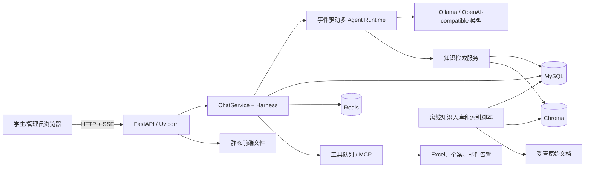

# MindBridge Day 1：项目全景与面试基线

> 日期：2026-08-05  
> 目标：理解项目解决的问题、主要组件、启动入口和在线/离线边界。

## 1. 一句话定义

MindBridge 是一个面向高校学生的 AI 陪伴与校务咨询原型。它把流式对话、心理风险安全门、校园知识检索、多 Agent 协作、上下文记忆、后台处置和可观测性放进同一个 FastAPI 应用。

它不是医疗诊断系统，也不是可以绝对保证答案正确的校务系统。它通过安全门禁、证据约束和后台闭环降低风险。

## 2. 它解决什么问题

学生的问题并不只有一种：

1. 普通陪伴，例如“最近压力很大”。
2. 校务事实咨询，例如“休学要准备什么材料”。
3. 复合规划，例如“我挂科后还能否毕业，接下来怎么安排”。
4. 高风险心理表达，需要优先安全回复并触发后台处置。

普通的单次大模型调用缺少以下工程能力：

- 不知道校园政策证据来自哪里。
- 容易把相关材料误当成支持结论的证据。
- 无法可靠处理中途断线、重复请求和跨轮澄清。
- 高风险消息不能只生成一段文字，还要形成后台报告和告警闭环。
- 很难说明一次回答经历了哪些路由、检索、审查和降级步骤。

MindBridge 的核心价值是把“一次模型回答”变成一条受约束、可恢复、可追踪的业务流程。

## 3. 系统组件图



注意：Chroma 在当前项目中通过 Python `PersistentClient` 访问持久化目录，不是 `docker-compose.yml` 中的独立服务。

## 4. 各组件保存或负责什么

| 组件 | 当前项目中的职责 | 是否事实源 |
|---|---|---|
| Browser | 学生聊天、管理员后台、消费 SSE | 否 |
| FastAPI | HTTP 路由、认证依赖、请求和响应协议 | 否 |
| MySQL | 用户、会话、消息、ChatTurn、摘要、显式记忆、知识元数据、Trace、工具任务 | 是 |
| Redis | 某个会话的近期消息缓存，失败时允许回退 MySQL | 否 |
| Chroma | 知识 Chunk 的向量及近邻检索索引 | 不是业务主事实源 |
| Ollama/模型 API | 路由辅助、语义判断、回答生成、Embedding | 否 |
| 工具队列/MCP | 执行 Excel 台账、个案和风险通知等副作用 | 任务状态写入 MySQL |
| 静态文件 | 原生 HTML、CSS、JavaScript 前端 | 否 |

### 为什么 MySQL 是事实源，Redis 不是

MySQL 保存需要长期一致、可审计的数据。Redis 只为近期上下文读取提速，并设置过期时间；Redis miss、数据过旧或连接异常时，系统可以回到 MySQL。因此 Redis 丢失不会等于聊天事实丢失。

### Chroma 保存的不是“完整业务数据”

Chroma 面向向量相似度检索。知识文档的治理状态和 ACTIVE collection 指针由 MySQL 管理，原始受管文件位于数据目录。Chroma 更接近可重建的检索索引。

## 5. 在线链路和离线链路

### 在线请求链路

用户正在等待结果，延迟和故障恢复非常重要：

```text
浏览器发起聊天
-> FastAPI 认证和参数处理
-> ChatService 创建或复用 ChatTurn
-> Harness 准备一轮 Agent 执行
-> Runtime 完成理解、安全、知识和回复协作
-> 模型生成内容
-> SSE 持续向浏览器发送快照
-> MySQL 保存最终状态和正式消息
```

在线路径只读取已激活的知识索引，不应该临时重建 Chroma 索引或批量生成 Embedding。

### 离线构建或后台链路

用户通常不在前台同步等待完整结果：

- `scripts/import_knowledge.py`：同步 Manifest 管理的知识语料。
- `scripts/manage_knowledge_index.py`：构建、验证、切换和回滚索引。
- 知识入库 worker：处理管理员上传的文档任务。
- 工具队列 worker：执行 Excel、个案、邮件告警等任务。
- `app/evaluation/`、`app/rag_eval/`：离线评测。

## 6. 从哪里开始看代码

不要从 `app/` 第一行开始逐文件阅读。Day 1 只沿下面四层看：

```text
README.md              项目的能力说明和运行约定
requirements.txt       Python 依赖清单
docker-compose.yml     部署时有哪些服务，它们如何连接
app/main.py            FastAPI 应用如何创建和启动
app/api/routes.py      HTTP 地址如何映射到 Python 函数
```

### 快速定位命令

在仓库根目录打开 PowerShell：

```powershell
rg -n "def create_app|include_router|mount" app/main.py
rg -n "@router.*chat|def chat_stream" app/api/routes.py
rg -n "services:|mysql:|redis:|app:" docker-compose.yml
```

`rg -n` 表示搜索文本并显示行号。面试现场不知道代码在哪时，先搜索类名、函数名或路由地址，不要凭记忆乱翻目录。

## 7. 启动入口 `app/main.py`

核心顺序如下：

1. `create_app()` 创建 `FastAPI` 对象。
2. 注册 HTTP 中间件，为前端静态资源增加 `Cache-Control: no-store`。
3. 注册 startup：初始化演示数据、标记陈旧生成任务为中断、启动工具队列 worker 和知识入库 worker。
4. 注册 shutdown：停止两个后台 worker。
5. `app.include_router(router)` 注册 API 路由。
6. `app.mount("/", StaticFiles(...))` 把静态前端挂载到根路径。
7. 模块底部的 `app = create_app()` 创建 Uvicorn 要加载的 ASGI 应用对象。

Docker 中的启动命令是：

```text
alembic upgrade head
-> python scripts/import_knowledge.py
-> uvicorn app.main:app --host 0.0.0.0 --port 8080
```

`app.main:app` 的冒号左边是 Python 模块，右边是该模块中的变量。

## 8. 路由入口 `app/api/routes.py`

路由装饰器把“HTTP 方法 + URL”映射到 Python 函数：

```python
@router.get("/actuator/health")
def health():
    return {"status": "UP"}
```

含义是：收到 `GET /actuator/health` 时调用 `health()`，FastAPI 把返回字典序列化成 JSON。

聊天入口：

```python
@router.post("/api/chat/stream")
async def chat_stream(...):
    ...
```

这一层目前能看到四件事：

1. `Depends(current_user)` 完成当前用户认证。
2. `Depends(get_db)` 为请求提供 SQLAlchemy Session，并在请求后关闭。
3. 管理员账号被禁止发起学生聊天。
4. `StreamingResponse(..., media_type="text/event-stream")` 返回 SSE 流。

Day 1 不深入 `ChatService`；只需知道路由验证边界后把工作交给 Service。Day 2 再继续向下追。

## 9. `requirements.txt` 应该怎么看

不要背版本号，先按用途分组：

- Web：`fastapi`、`uvicorn`、`python-multipart`。
- 数据库：`sqlalchemy`、`alembic`、`pymysql`。
- 缓存：`redis`。
- 配置：`pydantic-settings`。
- 向量库：`chromadb`。
- 网络请求：`httpx`。
- 文档和配置解析：`pypdf`、`PyYAML`、`markdown-it-py`。
- 后台输出和协议：`openpyxl`、`mcp`。

## 10. `docker-compose.yml` 应该怎么看

当前 Compose 定义三个服务：

- `mysql`：容器端口 3306，映射到宿主机 13306。
- `redis`：容器端口 6379，映射到宿主机 16379。
- `app`：FastAPI 应用，映射到宿主机 8080。

容器内的 `app` 不能用 `127.0.0.1:11434` 访问宿主机 Ollama，因为容器的 `127.0.0.1` 指向容器自己。因此配置使用：

```text
http://host.docker.internal:11434
```

## 11. 90 秒项目介绍初稿

MindBridge 是面向高校学生的 AI 陪伴与校务咨询平台，覆盖普通对话、校园政策咨询和心理高风险场景。项目以 FastAPI 和 SSE 承载聊天，通过事件驱动多 Agent 完成理解、安全判断、知识检索和回复审查；用 MySQL 保存业务事实、Redis 缓存近期上下文、Chroma 支撑向量检索。系统还加入幂等 ChatTurn、受约束的 Agentic RAG、Trace 和后台告警闭环，使回答更可恢复、可追踪，并降低无依据回答和高风险漏判。它不是简单包装模型 API，而是将模型能力纳入一条有证据、安全门禁和失败恢复的业务流程。

这只是 Day 1 初稿。后续每学懂一个模块，再把抽象名词替换成你能够解释的具体机制。

## 12. 初始弱项清单

由于尚未进行口述基线，以下暂时按“待验证”处理：

1. 能否区分 FastAPI、Uvicorn 和 Docker。
2. 能否说明 MySQL、Redis、Chroma 的数据边界。
3. 能否区分在线请求、后台任务和离线构建。
4. 能否沿 `app.main:app` 找到创建应用、注册路由和挂载静态文件的位置。
5. 能否解释“多 Agent + RAG + 风险闭环”为何不同于单次模型调用。

## 13. Day 1 验收题

完成 Day 1 前，需要脱离本文回答：

1. 项目最核心的业务问题是什么？
2. 为什么它不是普通的大模型 API 包装？
3. MySQL、Redis、Chroma 分别保存或索引什么？
4. 哪些能力位于在线链路，哪些属于离线或后台链路？
5. `app/main.py` 启动时依次完成什么？
6. 如何在一分钟内找到聊天 HTTP 入口？
