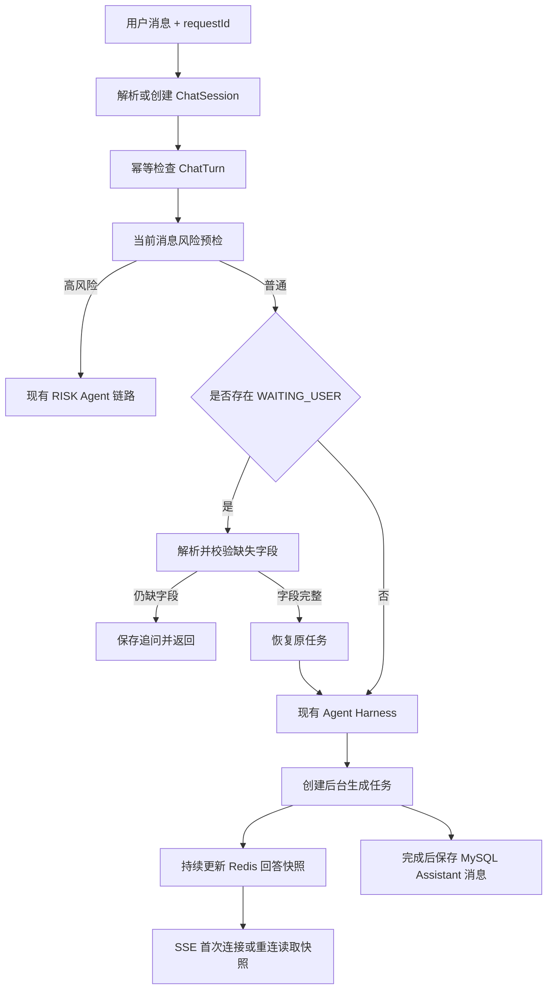

# MindBridge 上下文、记忆、追问与断线重连优化改造方案

> 文档用途：本文件是一份可以直接交给编码 AI 执行的独立改造规格。编码 AI 必须先完整阅读本文件，再检查当前代码，按阶段实施、测试和汇报。
>
> 本文件不依赖仓库中其他优化方案。与其他方案发生冲突时，本次上下文、记忆、追问和断线重连改造以本文件为准。

## 1. 改造目标

在保留当前 FastAPI、SQLAlchemy、MySQL、Redis、Chroma、事件驱动多 Agent 和 SSE 前端的前提下，解决以下问题：

1. 摘要更新后近期原始消息可能消失，导致模型忘记上一轮 Assistant 的问题。
2. 路由器主要依靠用户历史和“继续、刚才”等关键词猜测追问关系，不能可靠理解结构化补充信息。
3. 缺少明确的短期记忆、会话摘要和长期记忆边界。
4. 上下文增长后缺少稳定的裁剪顺序和预算策略。
5. Assistant 消息仅在流式生成完成后保存，网络中断时可能丢失整条回答。
6. 前端没有请求幂等标识和重连能力，失败后只能显示 `network error`。
7. 当前 Agent 黑板是单次请求内状态，不需要在本阶段引入完整 LangGraph checkpoint，但需要保留未来扩展空间。

最终结果必须做到：

- 连续对话能够稳定看到最近完整上下文。
- 长对话通过“结构化摘要 + 最近原文”控制长度。
- 用户回答上一轮追问时，系统按缺失字段处理，而不是重新猜意图。
- 浏览器刷新或短暂断网后，可以使用同一请求继续看到正在生成的回答。
- MySQL、Redis、Chroma 职责清晰，不新增 PostgreSQL、MongoDB、Celery、Kafka、LangGraph 等基础设施。

## 2. 当前项目事实

编码 AI 必须以当前代码为准复核，但不得偏离以下已确认事实：

### 2.1 现有技术栈

- Web：FastAPI + `StreamingResponse` + SSE。
- ORM：SQLAlchemy。
- 主数据库：MySQL，默认连接使用 `mysql+pymysql` 和 `utf8mb4`。
- 数据库迁移：Alembic，当前修订链至少到 `0005_chat_session_archiving`。
- 短期缓存：Redis。
- 知识向量索引：Chroma PersistentClient。
- 知识检索：Chroma 向量召回 + BM25 + 本地重排。
- 默认对话模型：Ollama `qwen3:8b`。
- Agent：自定义事件驱动多 Agent，使用 `CollaborationBlackboard`、Task、Artifact 和 Event。

### 2.2 当前存储职责

- `chat_sessions`：会话。
- `chat_messages`：完整用户和 Assistant 消息。
- `conversation_summaries`：结构化会话摘要及覆盖游标。
- Redis `mindbridge:short-term-memory:{sessionId}`：近期消息缓存。
- `agent_run_traces`：本轮 Agent 轨迹、知识证据和最终模型消息。
- MySQL `knowledge_documents` / `knowledge_chunks`：知识正文和元数据。
- Chroma `mindbridge_knowledge_v2`：知识向量索引。

### 2.3 当前关键问题

1. `ConversationSummaryService.update()` 会把所有未摘要消息纳入摘要，并把 `covered_until_message_id` 推进到最新消息。
2. `PreRouteMemoryLoader.load()` 又只保留摘要游标之后的缓存/数据库消息，因此摘要刚更新后 `recent_messages` 可能为空。
3. `classify_route()` 的上下文判断只关注近期 User 文本，无法稳定绑定上一条 Assistant 追问。
4. `ChatRequest` 只有 `message` 和 `sessionId`，没有 `requestId`。
5. `ChatService.stream_chat()` 在模型流结束后才保存 Assistant 消息。
6. `student.js` 使用一次性 `fetch()` 读取 SSE，异常后不重连。

## 3. 不可更改的架构决策

### 3.1 基础设施边界

必须使用：

| 组件 | 职责 |
|---|---|
| MySQL | 永久事实：会话、消息、摘要、追问状态、生成 Turn、长期记忆 |
| Redis | 临时状态：近期消息缓存、回答快照、短期生成状态、轻量锁 |
| Chroma | 可重建索引：校园知识语义检索；长期记忆语义索引仅作为后续可选项 |

禁止：

- 新增 PostgreSQL、MongoDB 或第二套主数据库。
- 把完整会话只保存在 Redis。
- 把追问状态只保存在 Redis 或摘要里。
- 把生成状态、SSE 内容写进 Chroma。
- 把个人长期记忆混入 `mindbridge_knowledge_v2`。
- 第一阶段引入 Celery、Kafka、RabbitMQ 或 LangGraph。

### 3.2 数据事实来源

- MySQL 是唯一事实来源。
- Redis 数据必须允许过期和重建。
- Chroma 数据必须可以根据 MySQL 知识记录重建。
- Redis 或 Chroma 不可用时，普通聊天仍应降级运行。

### 3.3 安全优先级

任何追问、记忆恢复或普通意图延续都不能覆盖高风险识别：

```text
当前用户消息高风险检查
  -> 高风险：立即进入 RISK 链路
  -> 非高风险：再处理 PendingClarification 或普通路由
```

历史高风险内容不能因为摘要或追问状态被错误地重新触发，但当前消息出现明确高风险信号时必须优先处理。

## 4. 目标请求流程



## 5. 上下文管理改造

### 5.1 最终上下文顺序

模型输入必须按以下顺序组装：

```text
1. 系统提示和安全规则
2. 当前 PendingClarification（若存在）
3. 当前会话结构化摘要
4. 当前会话最近 8～12 条原始消息
5. 当前用户消息
6. 本轮 Skill
7. 本轮 Chroma + BM25 检索证据（仅 CONSULT）
```

不得：

- 仅给路由器 User 历史而排除 Assistant 历史。
- 把其他会话消息加入当前会话。
- 把全量历史直接塞进提示词。
- 用摘要替代待追问状态。
- 让知识检索结果覆盖用户明确提供的时间、课程等事实。

### 5.2 修复近期消息被摘要吞掉

修改 `app/services/memory.py`：

1. `PreRouteMemoryLoader` 无论摘要覆盖游标在哪里，都要独立加载当前会话最后 `memory_compaction_recent_messages` 条原始消息。
2. Redis 命中时，直接从缓存尾部取近期原始消息，不使用 `covered_until_message_id` 再次过滤。
3. Redis 未命中或记录缺少消息 ID 时，从 MySQL 按 `id DESC` 加载最后 N 条，再恢复为升序。
4. 摘要覆盖范围与近期原文允许有少量重叠；正确性优先于去重。
5. 不得把当前用户消息重复放入 `recent_messages`，当前输入只通过 `current_user_message` 添加一次。

### 5.3 摘要保留近期尾部

修改 `ConversationSummaryService.update()`：

1. 查询 `covered_until_message_id` 之后的未摘要消息。
2. 始终留下最后 N 条消息作为近期原文，不纳入本次摘要。
3. 只有可压缩消息数量大于 0 时才更新摘要和覆盖游标。
4. 新的 `covered_until_message_id` 指向本次最后一条被压缩消息，而不是会话最新消息。
5. 继续保留现有 CAS/version 和 degraded 降级机制。

示例：

```text
未摘要消息共 20 条，recent_limit=8
-> 前 12 条进入摘要
-> 后 8 条继续保留原文
-> covered_until_message_id 指向第 12 条
```

### 5.4 摘要结构

保留并完善现有结构：

```json
{
  "current_goal": "",
  "confirmed_facts": [],
  "user_preferences": [],
  "decisions": [],
  "open_questions": [],
  "active_topics": [],
  "recent_emotional_context": [],
  "corrections": []
}
```

规则：

- 只有用户明确表达或确认的信息可以进入 `confirmed_facts`。
- 用户更正必须替换旧事实并写入 `corrections`。
- Assistant 提议不能自动变成用户决定。
- 待追问字段不依赖 `open_questions` 恢复，必须读取专用表。
- 摘要失败时保留旧摘要，使用确定性降级摘要，不阻塞聊天。

### 5.5 长度预算

第一阶段不强制引入模型专用 tokenizer，但必须提供统一预算函数，替换各处随意拼接。

建议首版：

- 近期消息：8 条，允许通过配置调整到 12 条。
- 结构化摘要：1000～1500 个中文字符。
- 知识证据：最多沿用当前 `knowledge_max_evidence=8`，同时受字符预算约束。
- Skill：沿用现有 Skill 字符预算。
- 回答输出：继续使用 `ai_max_tokens`。
- 总提示词达到安全阈值时，先裁剪低分知识证据，再裁剪旧的近期消息；当前用户输入和安全提示绝不裁剪。

增加配置时使用现有 `Settings`，不要散落魔法数字。

## 6. 短期记忆优化

继续使用现有 `RedisShortTermMemoryStore`，保留键：

```text
mindbridge:short-term-memory:{sessionId}
```

要求：

1. MySQL 消息提交成功后再写 Redis。
2. Redis 最多保留当前配置的 40 条消息，TTL 继续默认为 86400 秒。
3. 路由和回答默认只使用最后 8～12 条，而不是把 40 条全部注入。
4. Redis 不可用时回源 MySQL并设置 `degraded=true`，不得导致接口失败。
5. User 和 Assistant 消息都必须缓存。
6. 归档会话继续沿用现有逻辑清理 Redis，但不能删除 MySQL 消息和摘要。

## 7. 长期记忆方案

### 7.1 第一阶段：仅 MySQL 结构化记忆

新增 `UserMemory` / `user_memories`，建议字段：

| 字段 | 类型/约束 |
|---|---|
| `id` | Integer 主键 |
| `public_id` | String(64)，唯一 |
| `user_id` | 外键及索引 |
| `category` | String(32)，索引 |
| `content` | Text |
| `source_message_id` | 可空外键/索引 |
| `confidence` | Float |
| `status` | `ACTIVE / SUPERSEDED / DELETED` |
| `expires_at` | 可空 DateTime |
| `created_at` | DateTime |
| `updated_at` | DateTime |

首版允许保存：

- 用户明确要求系统记住的信息。
- 稳定学习偏好。
- 长期课程或时间约束。
- 校区、专业等已确认且确有后续用途的信息。
- 对已有长期记忆的明确更正。

首版禁止自动保存：

- 临时负面情绪。
- 未确认的心理推断或医学诊断。
- 模型自己的建议。
- 一次性办事问题。
- 密码、证件号、联系方式等敏感身份信息。

读取方式：按当前用户查询少量 `ACTIVE` 记忆，根据 category、更新时间和简单关键词筛选，最多注入 3～5 条。

### 7.2 Chroma 的边界

首版不把用户记忆写入 Chroma。

后续数据量确实增长后，才允许新增独立集合：

```text
mindbridge_user_memory_v1
```

要求：

- 与 `mindbridge_knowledge_v2` 完全隔离。
- metadata 必须包含 `user_id`、`memory_id`、`category`、`status`。
- 查询必须强制过滤当前 `user_id`。
- MySQL仍是正文事实来源，Chroma只存可重建索引。
- 删除或替换MySQL记忆时同步删除/更新向量。

本次首版验收不要求实现这个可选集合。

## 8. 轻量追问机制

### 8.1 设计原则

- 不引入通用工作流引擎。
- 每个会话同一时间最多一个活动追问。
- 最多追问 3 轮。
- 追问状态必须持久化到 MySQL。
- Redis 可以缓存，但不能作为唯一状态。
- 下一轮优先处理追问，再执行普通路由。
- 当前消息风险预检始终先于追问恢复。

### 8.2 MySQL 表

新增 `PendingClarification` / `pending_clarifications`：

| 字段 | 类型/约束 |
|---|---|
| `id` | Integer 主键 |
| `public_id` | String(64)，唯一 |
| `user_id` | 外键及索引 |
| `session_id` | 外键及索引 |
| `status` | `WAITING_USER / RESOLVED / CANCELLED / EXPIRED` |
| `task_kind` | String(64) |
| `original_message` | Text |
| `known_arguments_json` | Text，默认 `{}` |
| `missing_arguments_json` | Text，默认 `[]` |
| `approved_question` | Text |
| `round_count` | Integer，默认 1 |
| `max_rounds` | Integer，默认 3 |
| `expires_at` | DateTime，索引 |
| `version` | Integer，默认 1 |
| `created_at` | DateTime |
| `updated_at` | DateTime |

通过服务约束保证一个会话最多一个 `WAITING_USER`。不依赖 MySQL 部分唯一索引，避免 SQLite 迁移测试兼容问题。

### 8.3 Agent 契约

优先复用现有 Artifact 机制。需要追问时，Agent 产生：

```text
AgentArtifact(kind="clarification_request")
```

payload 契约：

```json
{
  "taskKind": "study_plan",
  "objective": "制定学习计划",
  "knownArguments": {},
  "missingArguments": [
    {"name": "course", "label": "课程"},
    {"name": "deadline", "label": "截止时间"},
    {"name": "availableTimeWindows", "label": "可用时间"},
    {"name": "focusProblem", "label": "当前难点"}
  ],
  "question": "请告诉我课程、截止时间、可用时间和当前难点。"
}
```

`EventDrivenAgentRuntimeService._to_result()` 和 `AgentHarnessOutcome` 应能显式携带该 Artifact 或等价的类型化字段，禁止让 `ChatService` 从自然语言回答中猜测是否为追问。

### 8.4 首版支持范围

首版只实现高价值、字段明确的学习计划追问：

```text
course
deadline
availableTimeWindows
focusProblem
objective
```

不要一开始构建覆盖所有校园业务的通用槽位平台。

字段解析采用“两层方式”：

1. 时间、数字和按顺序回答优先使用确定性解析。
2. 自然语言表达复杂时，允许模型返回严格 JSON，但必须经过字段白名单和业务校验。

禁止接受 `requestId`、`sessionId`、`userId`、`status` 等控制字段作为模型解析结果。

### 8.5 追问恢复流程

收到新消息时：

1. 完成当前消息高风险预检。
2. 查询当前用户和会话的 `WAITING_USER`。
3. 若不存在，进入普通 Agent 运行。
4. 若存在，解析用户回答并合并到 `known_arguments_json`。
5. 校验字段，重新计算 `missing_arguments_json`。
6. 仍有字段缺失：只追问剩余字段，`round_count + 1`。
7. 字段齐全：状态改为 `RESOLVED`，生成标准化任务输入，恢复原任务。
8. 用户明确说“取消、不做了、换个问题”：状态改为 `CANCELLED`，按新意图处理。
9. 超过 `expires_at`：状态改为 `EXPIRED`，当前输入按普通新消息处理。

时间校验必须检测：

- 截止时间是否已经过去。
- 可用时间是否晚于截止时间。
- 可用时间是否恰好从截止时间开始。
- 开始时间是否晚于结束时间。
- “明天、今晚”等相对时间是否基于应用时区解析。

示例输入：

```text
数学，明天晚上七点，晚上7-10点，编程调试
```

应映射为：

```json
{
  "course": "数学",
  "deadline": "明天 19:00",
  "availableTimeWindows": "明天 19:00-22:00",
  "focusProblem": "编程调试"
}
```

由于可用时间从截止时间开始，系统必须请求确认，不能直接生成虚构计划。

## 9. 简化断线重连

### 9.1 目标边界

首版只保证：

- 浏览器刷新。
- Wi-Fi 短暂断开。
- 原 SSE 连接异常关闭。
- 同一用户使用同一 `requestId` 重连。

首版不保证：

- Python进程重启后从精确 token 继续模型调用。
- 跨机器恢复内存中的模型连接。
- 对已经完成的工具副作用重新执行。

服务进程重启后，允许显示已保存的部分回答并将任务标记为 `INTERRUPTED`，由用户重试。

### 9.2 ChatTurn 表

新增 `ChatTurn` / `chat_turns`：

| 字段 | 类型/约束 |
|---|---|
| `id` | Integer 主键 |
| `public_id` | String(64)，唯一 |
| `request_id` | String(64) |
| `user_id` | 外键及索引 |
| `session_id` | 外键及索引 |
| `user_message_id` | 可空 Integer，索引 |
| `assistant_message_id` | 可空 Integer，索引 |
| `trace_id` | 可空 Integer，索引 |
| `status` | `RECEIVED / GENERATING / COMPLETED / INTERRUPTED / FAILED` |
| `partial_content` | Text，默认空字符串 |
| `error` | Text，默认空字符串 |
| `created_at` | DateTime |
| `updated_at` | DateTime |
| `completed_at` | 可空 DateTime |

唯一约束：

```text
(user_id, request_id)
```

不能使用 `(session_id, request_id)` 作为唯一幂等约束，因为创建新会话时客户端还没有 `sessionId`。

### 9.3 DTO 和 SSE 契约

扩展 `ChatRequest`：

```json
{
  "requestId": "客户端生成的 UUID",
  "sessionId": "可空",
  "message": "用户消息"
}
```

`requestId` 必填，长度和格式必须校验。

扩展 SSE：

```text
meta     -> requestId, turnId, sessionId, status
snapshot -> 当前完整 Assistant 内容
error    -> 可理解错误和 status
done     -> requestId, turnId, sessionId, status
```

首版使用完整 `snapshot` 替换前端 Assistant 文本，不继续使用增量 token 追加作为唯一协议。内部模型仍可逐 token 生成，但对客户端可以合并后按快照发送。

### 9.4 Redis 回答快照

新增 Redis 服务，键：

```text
mindbridge:chat-turn:{requestId}
```

值：

```json
{
  "userId": 1,
  "sessionId": "...",
  "turnId": "...",
  "status": "GENERATING",
  "content": "当前完整回答",
  "updatedAt": "..."
}
```

要求：

- TTL 默认 30 分钟，可配置。
- 每个模型 chunk 更新内存缓冲；按节流周期或内容增长阈值写 Redis，避免每个字符都写。
- 推荐 100～250ms 或累计 20～50 个字符写一次。
- 完成时立即写最终快照。
- Redis写失败不能中断模型生成；继续生成并在完成时写MySQL。
- Redis内容必须按当前用户鉴权，不能仅凭 `requestId` 越权读取。

### 9.5 后台生成

当前 `StreamingResponse` 生成器断开时可能被取消，因此模型生成必须与单个 HTTP 读取连接解耦。

首版允许使用进程内 `asyncio.Task` 注册表，不引入任务队列：

```text
requestId -> asyncio.Task
```

要求：

- 创建任务前先写MySQL `ChatTurn(RECEIVED)`。
- Agent Harness 完成后设置 `GENERATING` 并启动生成任务。
- 后台任务必须创建自己的数据库 Session，不能继续使用已结束请求的 Session。
- 相同用户、相同 `requestId` 已存在时不得再次保存用户消息或再次运行 Agent。
- 多个重连请求只读取同一个任务快照，不创建多个模型调用。
- 应用启动时把长时间停留在 `RECEIVED/GENERATING` 的旧 Turn 标记为 `INTERRUPTED`。
- 不要求在首版自动重新生成 `INTERRUPTED` Turn。

如果项目生命周期结构不适合安全管理进程内任务，允许退化为“断线后根据已保存快照显示部分回答并提供重试”，但编码 AI 必须在最终报告中明确说明，不能假称已经实现后台续传。

### 9.6 重连接口

建议增加：

```text
GET /api/chat/turns/{request_id}/stream
```

行为：

1. 校验登录用户。
2. 按 `(user_id, request_id)` 查询 MySQL Turn。
3. 不属于当前用户时统一返回 404。
4. `COMPLETED`：从 MySQL 返回最终 Assistant 快照并 `done`。
5. `GENERATING`：先返回 Redis 当前快照，再继续观察快照变化。
6. `INTERRUPTED`：返回部分内容和明确状态，不自动重复调用模型。
7. `FAILED`：返回错误事件。
8. Redis不存在但MySQL已完成时，以MySQL最终消息为准。

### 9.7 前端改造

修改 `app/static/student.js`：

1. 每次新发送生成 `crypto.randomUUID()` 作为 `requestId`。
2. 保存当前 `requestId` 和 `turnId` 到页面 state。
3. `snapshot` 事件使用完整内容替换 Assistant 文本，不做重复追加。
4. 首次流异常时，最多自动重连 3 次。
5. 建议退避：500ms、1000ms、2000ms。
6. 页面刷新后，如果有当前未完成 Turn，可以根据服务端会话详情或前端保存的非敏感 requestId 尝试恢复。
7. 不在浏览器持久化完整聊天正文、令牌或敏感数据。
8. 超过重试次数后显示“连接中断，可重新连接”，不得覆盖已经显示的部分回答。
9. 相同 `requestId` 重连时不得重复插入用户消息气泡。

如果采用 `sessionStorage` 保存活动 `requestId`，完成、失败、归档或退出登录时必须清理。

## 10. Agent checkpoint 的本阶段取舍

当前主流程是：

```text
Agent Harness 完成路由、知识检索和提示词准备
-> AiClient 开始流式生成
```

因此当前最常见的断点在模型生成阶段，不在 Agent 黑板中间。首版不实现通用 Agent checkpoint。

必须保存并关联：

- `ChatTurn.request_id`
- `ChatTurn.trace_id`
- `AgentRunTrace.response_messages_json`
- `ChatTurn.status`
- Redis回答快照

以后只有在以下情况出现时再实现黑板 checkpoint：

- Agent节点执行时间明显增长。
- 引入人工审批。
- 工具调用跨分钟运行。
- 需要服务重启后从某个 Agent 节点恢复。

不得为了“看起来先进”在本次改造中迁移整个 Agent 框架。

## 11. 需要修改或新增的代码位置

编码 AI 必须先复核实际代码，再按职责修改。建议范围：

### 11.1 数据模型与迁移

- 修改 `app/models/entities.py`。
- 新增 Alembic 修订 `0006_context_clarification_reconnect.py`，`down_revision` 指向当前真实 head。
- 新增 `ChatTurn`。
- 新增 `PendingClarification`。
- 新增 `UserMemory`；如果控制首版范围，可放在最后一个阶段，但迁移和测试必须保持一致。

### 11.2 DTO 和 API

- 修改 `app/schemas/dtos.py`。
- 修改 `app/api/routes.py`。
- `ChatRequest` 增加 `requestId`。
- `ChatStreamEvent` 增加 `requestId`、`turnId`、`status`。
- 增加重连 SSE 接口。

### 11.3 记忆和摘要

- 修改 `app/services/memory.py`。
- 保留 `RedisShortTermMemoryStore`。
- 修复近期消息读取和摘要尾部策略。
- 如新增长期记忆，建议独立 `app/services/user_memory.py`，不要继续膨胀 `memory.py`。

### 11.4 追问

- 新增 `app/services/clarifications.py`。
- 可新增 `app/services/clarification_arguments.py`，但首版仅实现学习计划字段，避免抽象过度。
- 修改 `app/agents/events.py` 或现有 Artifact 使用位置，定义 `clarification_request` 契约。
- 修改 `app/agents/event_driven_runtime.py` 和 `app/agents/harness.py`，显式传递追问结果。
- 高风险预检必须保持在追问恢复之前。

### 11.5 生成与重连

- 重构 `app/services/chat.py`，拆分“创建 Turn/运行 Agent/后台生成/订阅快照”。
- 建议新增 `app/services/chat_turns.py`。
- 建议新增 `app/services/stream_snapshots.py`。
- 后台任务中的数据库 Session 从 `app.core.database` 的 Session factory 独立创建和关闭。

### 11.6 前端

- 修改 `app/static/student.js`。
- 只做必要状态和重连改造，不重做整体视觉设计。
- 保留现有会话归档和权限行为。

## 12. 数据库迁移要求

迁移必须同时兼容：

- 生产 MySQL。
- 当前 SQLite 迁移测试。

要求：

- 使用通用 SQLAlchemy 类型。
- 所有唯一约束和索引显式命名。
- JSON 内容首版使用 `Text`，通过服务统一序列化，避免 MySQL/SQLite JSON 差异。
- 升级不得删除或重写现有会话、消息、摘要、报告和 Trace。
- `downgrade()` 只删除本次新增表和索引。
- 不修改或复制其他项目的迁移历史。

## 13. 分阶段实施计划

编码 AI 必须按顺序执行，每一阶段完成后立即运行相关测试。

### 阶段 0：基线

1. 检查当前 Alembic head。
2. 运行现有测试并记录基线。
3. 检查真实配置仍为 MySQL、Redis、Chroma和 `qwen3:8b`。
4. 不处理与本方案无关的现有修改。

验收：明确基线失败和通过项，禁止把原有失败误报为本次回归。

### 阶段 1：上下文与摘要正确性

1. 修复 `PreRouteMemoryLoader` 的近期消息加载。
2. 修改摘要更新，只压缩近期尾部之前的消息。
3. 路由上下文包含 Assistant 和 User 原文。
4. 增加摘要后仍保留上一轮追问的测试。

验收：长会话摘要更新后，最近 Assistant 问题和用户回答仍进入下一轮上下文。

### 阶段 2：轻量追问

1. 新增追问表和迁移。
2. 新增 `clarification_request` Artifact 契约。
3. 实现学习计划字段解析、合并和校验。
4. 实现取消、过期、最大轮数和风险优先。
5. 用标准化任务恢复现有 Agent。

验收：示例四字段回答不丢失时间，不生成冲突计划。

### 阶段 3：Turn 幂等和Redis快照

1. 新增 `chat_turns` 和迁移。
2. `ChatRequest` 增加 `requestId`。
3. 实现 `(user_id, request_id)` 幂等。
4. 实现Redis完整回答快照。
5. 完成后写MySQL Assistant消息并关联 Turn。

验收：重复提交相同 `requestId` 只保存一条用户消息和一条Assistant消息。

### 阶段 4：断线重连

1. 模型生成与 HTTP 读取连接解耦。
2. 实现重连 SSE 接口。
3. 前端增加最多3次自动重连和快照替换。
4. 实现 stale Turn -> `INTERRUPTED`。

验收：主动关闭第一次SSE连接后，后台生成不重复启动；第二次连接能够看到当前快照和最终回答。

### 阶段 5：长期记忆

1. 新增 `user_memories`。
2. 只实现明确保存、读取、更正和停用。
3. 首版不接 Chroma。
4. 增加隐私和跨用户隔离测试。

验收：长期记忆只能被所属用户读取，用户更正后旧记录不再注入上下文。

### 阶段 6：完整验证

1. 运行全部单元测试和迁移测试。
2. 运行 Engineering Harness。
3. 启动真实 MySQL、Redis、Chroma、Ollama 服务。
4. 使用浏览器验证正常发送、追问、刷新恢复、归档和新会话。

## 14. 必须新增的测试

### 14.1 上下文与摘要

1. 摘要覆盖游标已到最新消息时，Loader仍返回最后N条原文。
2. 摘要更新后始终留下配置数量的近期消息。
3. Redis命中和MySQL回源得到一致顺序。
4. 最近消息同时包含User和Assistant。
5. 当前用户输入只出现一次。
6. 不读取其他会话消息。
7. 用户更正覆盖旧事实。

### 14.2 追问

1. 创建学习计划追问后状态为 `WAITING_USER`。
2. 用户一次回答多个字段时正确映射。
3. 只追问仍缺失的字段。
4. 字段齐全后状态为 `RESOLVED` 并恢复原任务。
5. “取消”将状态改为 `CANCELLED`。
6. 过期追问不接管新输入。
7. 超过最大轮数停止追问。
8. 当前输入出现高风险信号时进入RISK，不继续普通学习计划。
9. 截止时间与可用时间冲突时请求确认。
10. 控制字段不能通过模型解析写入状态。

### 14.3 幂等与断线

1. `requestId` 缺失或非法返回422。
2. 相同用户、相同 `requestId` 不重复生成。
3. 不同用户即使猜到 `requestId` 也不能读取Turn。
4. 第一次SSE断开后，生成任务仍然只有一个。
5. 重连首先返回Redis最新完整快照。
6. `COMPLETED` 且Redis过期时从MySQL返回最终消息。
7. Redis不可用时生成仍能完成并保存MySQL。
8. stale `GENERATING` 在启动恢复时变成 `INTERRUPTED`。
9. `INTERRUPTED` 不自动创建第二次模型调用。
10. Assistant最终消息只保存一次。

### 14.4 长期记忆

1. 用户只能读取自己的记忆。
2. 不自动保存临时情绪和模型推断。
3. 更正后旧记忆变成 `SUPERSEDED`。
4. `DELETED/SUPERSEDED/EXPIRED` 不进入上下文。
5. Redis和Chroma不可用不影响MySQL长期记忆读取。

### 14.5 回归

必须保证：

- `CHAT / CONSULT / RISK` 路由不退化。
- Chroma + BM25 混合检索指标不下降。
- 会话列表、详情和归档行为不变。
- 学生不能查看其他学生会话或Turn。
- 管理员限制不被绕过。
- 风险报告、工具队列和审计记录继续工作。

## 15. 真实场景验收用例

### 场景 A：近期上下文

```text
用户：我想制定数学复习计划。
Assistant：请告诉我截止时间、可用时间和当前难点。
用户：明晚七点，今晚七点到十点，函数题。
```

期望：系统能看到上一条Assistant问题，按字段处理，不把第三句当成独立闲聊。

### 场景 B：原问题中的冲突时间

```text
用户：数学，明天晚上七点，晚上7-10点，编程调试
```

期望：四段内容都被保存；检测到截止和可用时间冲突；只请求确认，不虚构“今晚20:00”。

### 场景 C：长对话

创建超过30条消息并触发多次摘要。

期望：摘要持续增长但有长度上限；最近8条原文始终存在；“刚才那个”能够关联最近Assistant内容。

### 场景 D：浏览器断开

1. 发送需要生成较长回答的问题。
2. 接收部分内容后关闭连接。
3. 使用相同 `requestId` 重连。

期望：不新增用户消息、不启动第二次模型生成；返回当前完整快照并最终完成。

### 场景 E：服务重启

生成中终止应用进程并重启。

期望：旧Turn显示 `INTERRUPTED`；能够读取已保存部分内容；系统不声称从原token继续；用户可明确重试。

## 16. 性能和可靠性要求

- 普通对话不应因为查询长期记忆或追问状态增加明显延迟。
- 追问查询必须有 `session_id + status` 索引。
- Turn查询必须有 `(user_id, request_id)` 唯一约束。
- Redis快照写入必须节流。
- SSE观察快照时不得使用无间隔的忙循环。
- 所有后台任务必须捕获异常、更新Turn状态并关闭数据库Session。
- Redis失败采用降级策略，MySQL失败必须终止写操作并返回明确错误。
- 日志记录ID、状态、耗时和错误类型，不记录完整敏感对话正文。

## 17. 编码约束

- 所有修改文件使用 UTF-8，优先 UTF-8 无 BOM。
- 中文字符串、注释和UI文案保持直接可读。
- 不得把正常中文改成 Unicode 转义形式。
- 使用 `apply_patch` 进行手工代码修改。
- 不进行无关格式化、依赖升级或大规模重构。
- 不回滚用户现有改动。
- 新抽象必须有明确职责，禁止创建空壳Manager或过度通用框架。
- 数据库枚举首版可使用稳定字符串，避免MySQL/SQLite枚举兼容问题。

完成前检查：

```powershell
rg -n "\\u[0-9a-fA-F]{4}" app migrations tests
```

普通中文字符串或注释中发现Unicode转义必须恢复为可读中文。

## 18. 执行验证命令

编码 AI 应根据实际环境调整命令，但至少执行：

```powershell
python -m pytest tests/test_preroute_memory_and_routing.py -q
python -m pytest tests/test_migrations_and_import.py -q
python -m pytest -q
python -m app.harness.runner
```

服务验证：

```powershell
docker compose up -d --build
docker compose ps
docker compose logs --tail 200 app
curl.exe -sS http://127.0.0.1:8080/actuator/health
```

必须确认：

- Alembic达到最新head。
- MySQL连接正常，字符集支持中文。
- Redis近期消息和回答快照可读写。
- Chroma知识集合可用，或按现有策略降级到BM25。
- `/api/agent/status` 显示实际模型为 `qwen3:8b`，不得偷偷切换微调模型或mock。
- 至少完成一次真实Ollama追问对话。
- 至少完成一次主动断开后的重连验证。

## 19. 明确禁止的错误实现

以下任一项出现即视为未完成：

- 新增 PostgreSQL。
- 使用 Chroma 保存 SSE、追问状态或完整会话。
- Redis清空后会话或追问永久丢失。
- 摘要更新后最近Assistant问题消失。
- 下一轮仍只通过“继续、刚才”等关键词猜测追问。
- 让模型自由生成任意状态字段并直接写数据库。
- 相同 `requestId` 重复保存用户消息或重复调用模型。
- 浏览器断开就覆盖已显示的部分回答为错误文本。
- 声称服务重启后可以从模型原token继续，实际只是重新生成。
- 为实现重连而削弱用户鉴权。
- 把个人长期记忆写入校园知识集合。
- 为通过测试而改成mock模型或固定假回答。

## 20. 最终完成标准

以下条件全部满足才能宣布完成：

1. MySQL、Redis、Chroma职责符合本文件定义。
2. 最近原始消息不会被摘要覆盖游标吞掉。
3. 路由和回答能看到最近Assistant与User消息。
4. 摘要只压缩近期尾部之前的旧消息。
5. 学习计划追问具有持久状态，能解析多字段回答和时间冲突。
6. 高风险当前输入优先于普通追问恢复。
7. `requestId` 幂等生效。
8. Redis完整快照和重连接口生效。
9. SSE断开不会创建第二次模型调用。
10. 最终Assistant消息只写入MySQL一次。
11. Redis不可用时普通对话可降级完成。
12. 服务重启后旧生成任务被诚实标记为 `INTERRUPTED`。
13. 长期记忆不自动保存敏感推断，且跨用户严格隔离。
14. 现有RAG、风险链路、会话归档和工具队列回归测试通过。
15. 全部修改文件通过UTF-8和Unicode转义检查。

## 21. 编码 AI 最终汇报模板

完成后必须给出可核验的汇报，不得只写“已优化”。至少包含：

1. 实际修改的模块和行为。
2. 新增MySQL表、索引和Alembic revision/head。
3. 最终上下文组装顺序和近期消息数量。
4. 摘要覆盖游标的新行为。
5. 已支持的追问任务和字段。
6. 断线重连的实际保证范围。
7. 明确说明服务进程重启后的行为。
8. Redis键、TTL和降级策略。
9. Chroma是否发生变化；若未变化也要明确说明。
10. 单元测试、完整pytest和Harness结果。
11. MySQL、Redis、Chroma、Ollama真实服务验证结果。
12. 未完成项、已知限制和后续建议。
