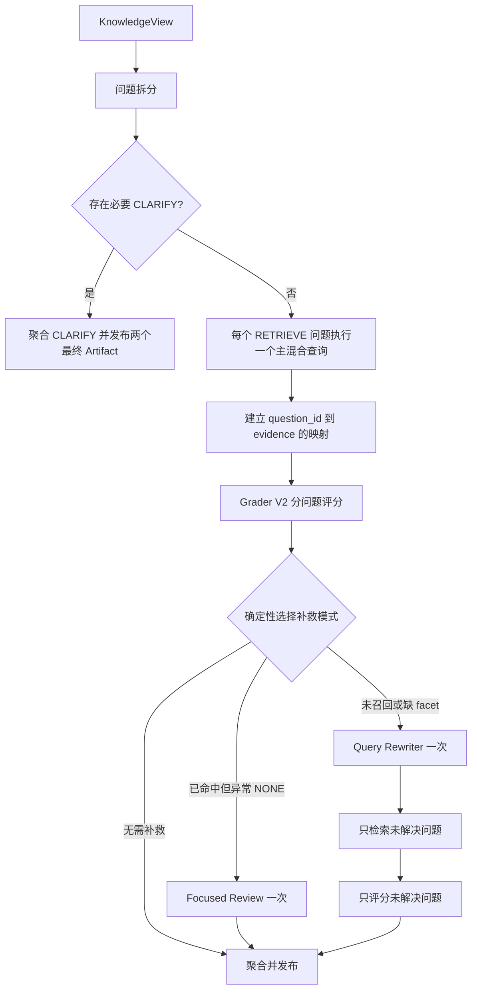

# MindBridge KnowledgeAgent 部分证据保留与复合问题优化实施方案

> 文档状态：可直接交给 AI 编码实施
>
> 编制日期：2026-08-02
>
> 适用项目：`mindbridge-py`
>
> 目标版本：Knowledge Evidence V3
>
> 代码核对基线：2026-08-02 当前工作区（相关 41 项测试通过）

## 1. 使用说明

本文件是代码改造规范，不是概念性建议。执行改造的 AI 或开发者必须按照本文定义的数据契约、处理顺序、文件边界、测试用例和验收标准实施，不得只修改 Prompt 或只增加重试次数后宣称完成。

开始实施前必须：

1. 阅读本文全文、项目根目录 `AGENTS.md`（如存在）、`README.md`、当前 `git status` 以及所有待修改文件。
2. 当前工作区可能包含用户未提交修改，必须保留并在其基础上工作，不得回滚、覆盖或格式化无关内容。
3. 先运行并记录相关测试基线，再修改代码。
4. 先补失败测试，再实施生产代码。
5. 所有编辑文件保存为 UTF-8，优先使用 UTF-8 无 BOM。
6. 中文文字必须直接可读，不得改写为 `\uXXXX` Unicode 转义。
7. 不得在指标、普通日志或隐私安全的 trace 摘要中保存用户原文、Prompt 正文、候选知识正文或模型输出正文。

### 1.1 可行性结论

经逐项核对当前代码，本方案可以在不增加 Agent、不改变外部 Artifact 种类、不引入联网检索和不改数据库结构的前提下实施。现有代码已经具备可复用的基础：

- `KnowledgePlanner` 已支持最多 4 个子问题以及 `SKIP / RETRIEVE / CLARIFY`。
- `KnowledgeService.search()` 已封装 BM25F、可选 BGE-M3 向量召回、RRF 融合与重排。
- `KnowledgeOrchestrator` 已限制最多两轮检索，并已有 Planner、Grader、Rewriter 与预算跟踪。
- `KnowledgeAgent` 已能在同一个 `AgentTurnResult` 中发布 `knowledge_evidence` 和 `clarification_request`。
- `ClarificationService`、`PendingClarification` 与下一轮恢复机制已经存在，不需要另建状态机。

需要改造的核心确实位于现有实现的四个断点：

1. `hard_filter()` 的 accepted 结果及全局 `evidence_pool` 丢失 `question_id`。
2. Grader V1 接收全部问题和扁平证据，无法强制问题级引用边界。
3. `DEADLINE` 混入办理耗时语义，无法准确表达 `PROCESSING_TIME` 缺失。
4. 单次 Grader `NONE` 会使已经召回的正确证据在 `_finalize()` 中整体消失。

因此本方案属于现有 KnowledgeAgent 内部的契约升级和有界流程调整，不是架构推倒重建。

### 1.2 外部事件协议冻结

外部 Artifact 发布协议保持以下顺序和种类：

```text
正常情况：
KnowledgeAgent -> knowledge_evidence

需要用户补充范围：
KnowledgeAgent -> knowledge_evidence
               -> clarification_request
```

约束：

- 不新增中间 Artifact；规划、检索、hard filter、评分、改写和复评都只存在于 `KnowledgeOrchestrator` 内部。
- `knowledge_evidence` 的 kind 不变，payload 使用 `schema_version=3` 做加法式升级。
- `clarification_request` 的 kind、`taskKind=knowledge_scope` 和现有恢复入口不变。
- 高风险请求继续由现有路由短路，不运行 KnowledgeAgent。

## 2. 事故基线

### 2.1 真实请求

```text
校园事务咨询：南望山校区宿舍调整（调宿）线上怎么办，办理时限通常是几个工作日？
```

请求 ID：

```text
44614550-68d1-408b-8c57-bef030e228a3
```

### 2.2 实际链路

```text
SafetyAgent
  -> Knowledge Planner
  -> Planner schema repair
  -> 第一轮本地检索：4 条查询、22 个原始结果
  -> Evidence Grader
  -> Query Rewriter
  -> LOCAL_EVIDENCE_INSUFFICIENT
  -> 应用层直接回复
```

KnowledgeAgent 确实被调用，且 Query Rewriter 也确实被调用。问题不在于 Agent 没有运行。

### 2.3 实际回复

```text
我暂时没有检索到能够核实这个问题的校内资料。当前缺少适用于该校区的官方证据，请确认具体校区或提供相关通知。
```

该回复存在两个语义错误：

1. 用户已明确提供“南望山校区”，不应再次要求确认校区。
2. 本地知识库已经存在南望山校区调宿线上办理入口，不应把已找到的证据整体丢弃。

### 2.4 已存在的有效证据

`app/services/knowledge_import.py` 中存在以下官方服务指南内容：

```text
登录学校官网信息门户，进入服务中心的后勤安保栏目，选择南望山校区宿舍调整、退宿申请或入住申请并在线办理。
```

同时存在调宿线下办理步骤：

```text
下载并填写《学生宿舍调整申请表》；学院学工组签字盖章；学生住宿服务中心核实床位和住宿费；完成楼管、钥匙、门禁权限和住宿费异动。
```

### 2.5 确实缺失的事实

当前本地资料没有说明“提交申请后通常几个工作日办完”。

“每年五月集中办理”描述的是集中申请时间，不等于处理耗时或服务 SLA。禁止将其改写成“几个工作日”。

### 2.6 本次真实调用指标

| 项目 | 数值 |
|---|---:|
| Knowledge Planner | 693 输入 / 528 输出 Token |
| Planner repair | 1821 输入 / 427 输出 Token |
| Evidence Grader | 6611 输入 / 114 输出 Token |
| Query Rewriter | 534 输入 / 113 输出 Token |
| 整轮 Prompt Token | 9884 |
| 整轮 Output Token | 1215 |
| 整轮总 Token | 11099 |
| 首个内容准备时间 | 24587 ms |
| 最终模型 TTFT | `null`，因为走应用直接回复 |

Grader 的 6611 个输入 Token 是本轮最主要成本，也说明当前扁平证据载荷过大。

## 3. 根因结论

本问题由四层缺陷共同造成。

### 3.1 事实类型混淆

当前 `KnowledgeFacet.DEADLINE` 同时吸收“截止时间”“多久”“办理时间”“期限”等表达，将以下两个不同事实混为一类：

- `DEADLINE`：最晚什么时候申请。
- `PROCESSING_TIME`：提交后多久办完、几个工作日办结。

结果可能召回其他制度中无关的“工作日”，也无法稳定表达“线上入口已有证据，但处理耗时未知”。

### 3.2 问题与证据的归属在 Grader 前丢失

`KnowledgeOrchestrator` 检索时持有 `(question_id, result)`，但经过 `hard_filter` 和 `evidence_pool` 后只保留扁平 `EvidenceItem`。Grader 同时接收全部问题和全部证据，不能可靠知道每个切片是为哪个子问题召回的。

### 3.3 单次 LLM `NONE` 没有一致性复核

即使高相关官方证据覆盖了 `CHANNEL` 或 `STEPS`，Grader 返回 `NONE` 后系统也会直接信任。当前策略只校验引用的 chunk ID 是否存在，不校验“全部判空”是否与确定性检索信号明显矛盾。

### 3.4 最终发布策略放大了 Grader 错误

`_finalize()` 只发布 `supported_claims` 引用过的证据。Grader 一旦不生成 claim，已检索到的正确证据会全部消失，`ResponseAgent` 只能进入通用缺证据回复。

## 4. 改造目标

Knowledge Evidence V3 必须实现：

1. 区分申请截止时间和办理耗时。
2. 从检索到 Grader 全程保留 `question_id -> evidence` 归属。
3. 限制每个子问题进入 Grader 的证据数量，降低噪声和 Token。
4. Grader 对每个问题明确输出已覆盖 facet 和缺失 facet。
5. 当 `NONE` 与确定性覆盖信号冲突时，允许一次定向复评。
6. 只要至少一个问题存在可靠 claim，整轮必须为 `PARTIAL`，不能降为 `NONE`。
7. `PARTIAL` 必须回答有证据支持的部分，并明确说明其余事实无法确认。
8. 用户已经提供的校区、事项或时间范围不得再次询问。
9. 保持本地知识闭环，不新增联网检索。
10. 保持现有安全边界、引用校验、PromptEvidenceGuard、幂等、SSE 和 Turn Metrics 语义不变。

## 5. 非目标

本阶段不得：

- 编造调宿办理工作日数字。
- 把“每年五月集中办理”解释为处理耗时。
- 仅通过更换更大模型解决问题。
- 对所有 `NONE` 无条件重试，造成成本失控。
- 使用检索分数直接生成事实 claim。
- 绕过 Evidence Grader，直接把候选知识发送给最终回答模型。
- 将候选知识正文写入普通 trace、metrics 或日志。
- 默认启用真实外部 LLM 测试，破坏测试确定性。
- 为本改造重构无关 Agent、会话、数据库或前端代码。

## 6. 目标行为

对事故基线请求，目标中间结果为：

```json
{
  "overall_grade": "PARTIAL",
  "questions": [
    {
      "question_id": "q1",
      "grade": "SUFFICIENT",
      "supported_facets": ["CHANNEL", "STEPS"],
      "missing_facets": []
    },
    {
      "question_id": "q2",
      "grade": "NONE",
      "supported_facets": [],
      "missing_facets": ["PROCESSING_TIME"]
    }
  ]
}
```

如果 Planner 将两个 facet 保留在同一个问题中，也允许以下等价结果：

```json
{
  "overall_grade": "PARTIAL",
  "questions": [
    {
      "question_id": "q1",
      "grade": "PARTIAL",
      "supported_facets": ["CHANNEL", "STEPS"],
      "missing_facets": ["PROCESSING_TIME"]
    }
  ]
}
```

最终回复语义必须等价于：

```text
南望山校区调宿可登录学校信息门户，在“服务中心—后勤安保”中选择“南望山校区宿舍调整”在线办理。当前校内资料没有注明提交后通常需要几个工作日，因此暂时无法确认具体办理时长，请以办理页面或学生住宿服务中心答复为准。
```

允许模型调整措辞，但必须满足：

- 包含已核实的线上入口。
- 明确办理耗时没有本地证据。
- 不产生任何未经证据支持的数字。
- 不要求用户再次确认南望山校区。

## 7. 核心数据契约

### 7.1 新增 `PROCESSING_TIME` facet

修改 `app/services/knowledge_query.py`：

```python
class KnowledgeFacet(str, Enum):
    ...
    DEADLINE = "DEADLINE"
    PROCESSING_TIME = "PROCESSING_TIME"
    ...
```

语义约束：

| Facet | 表示 | 示例 |
|---|---|---|
| `DEADLINE` | 申请截止日期或可申请时间窗口 | 截止到哪天、什么时候申请、每年五月办理 |
| `PROCESSING_TIME` | 提交后处理、审批或办结所需时间 | 几个工作日、多久办完、审批多久 |

修改 `app/knowledge/retrieval_taxonomy.yaml`，taxonomy `version` 必须递增。

建议配置：

```yaml
PROCESSING_TIME:
  query_terms: [几个工作日, 多少个工作日, 多久办完, 办理多久, 审批多久, 处理时长, 办结时限, 办理时限]
  evidence_patterns: [个工作日, 工作日内办结, 办理时长, 处理时长, 办结时限]
```

同时收紧 `DEADLINE.query_terms`：

- 保留：`截止时间`、`截止日期`、`最晚时间`、`申请时间`、`什么时候申请`、`有效期`。
- 移除或避免单独使用：`多久`、`办理时间`、`期限` 等易与处理耗时混淆的词。

`_variants()` 必须为 `PROCESSING_TIME` 映射稳定标签，例如“办理时长”。

### 7.2 Grader V2 字段

修改 `app/services/knowledge_agent/models.py`：

`QuestionEvidenceGrade` 新增：

```python
supported_facets: list[KnowledgeFacet]
missing_facets: list[KnowledgeFacet]
```

`FinalQuestionResult` 同步新增这两个字段。

验证规则：

1. `supported_facets` 与 `missing_facets` 不得相交。
2. 二者只能包含对应 `ValidatedQuestionPlan.required_facets` 中的值。
3. `SUFFICIENT` 必须有 claim，且 `missing_facets`、`missing_facts`、`contradictions` 均为空。
4. `PARTIAL` 必须至少有一个 claim 或 supported facet，并且必须存在缺失 facet、缺失事实或冲突。
5. `NONE` 不得包含 claim 和 supported facet。
6. `PROCESSING_TIME` 缺失时，不允许用 `DEADLINE` 证据将问题升级为 `SUFFICIENT`。

`KnowledgeEvidenceArtifact.schema_version` 从 `2` 升为 `3`。所有测试 fixture、trace 摘要和 payload consumer 必须同步检查，但不得改变既有字段含义。

### 7.3 内部问题证据池

不要给 `EvidenceItem` 增加持久化的用户问题文本。新增内部结构，名称可按项目风格调整：

```python
class QuestionEvidenceItem(StrictModel):
    question_id: str = Field(pattern=r"^q[1-4]$")
    evidence: EvidenceItem
```

或者在 orchestrator 内使用：

```python
OrderedDict[str, OrderedDict[int, EvidenceItem]]
```

必须满足：

- 同一 chunk 可以属于多个问题。
- 每个问题独立排序和限额。
- 最终 artifact 的 `local_evidence` 仍按 chunk ID 去重。
- 未被 claim 引用的候选证据不得发布给 ResponseAgent。

`EvidenceFilterResult.accepted` 必须从 `list[EvidenceItem]` 改为 `list[QuestionEvidenceItem]`。`hard_filter()` 在 accepted 路径和 rejected 路径都必须保留 `question_id`，不得依赖调用方按列表位置重新配对。

Orchestrator 内部应同时维护两种视图：

```python
evidence_catalog: dict[int, EvidenceItem]
evidence_by_question: dict[str, dict[int, EvidenceItem]]
```

- `evidence_catalog` 保存完整原始证据，用于最终发布被 claim 引用的完整内容。
- `evidence_by_question` 保存问题归属与该问题下的最佳分数，用于裁剪 Grader 输入和引用校验。
- 同一个 chunk 可属于多个问题，但一个问题只能引用分配给自己的 chunk。
- Prompt 裁剪副本不得回写或覆盖 `evidence_catalog` 中的完整证据。

### 7.4 Grader V2 输入

Grader 输入必须将唯一证据正文和问题归属分开，避免重复正文：

```json
{
  "round": 1,
  "questions": [
    {
      "question_id": "q1",
      "standalone_question": "...",
      "required_facets": ["CHANNEL", "STEPS"],
      "site": "NANWANGSHAN"
    }
  ],
  "evidence": [
    {"chunk_id": 496, "content": "裁剪后的证据正文"}
  ],
  "question_evidence": [
    {"question_id": "q1", "allowed_chunk_ids": [496, 493]}
  ],
  "coverage_hints": [
    {
      "question_id": "q1",
      "chunk_id": 496,
      "facets": ["CHANNEL"]
    }
  ]
}
```

`coverage_hints` 只是触发检查和帮助聚焦的确定性词法信号，不是事实证明。Prompt 必须明确要求模型仍然阅读证据正文并生成可核验 claim。

输入限额固定为：

- 每个问题最多 3 个证据块。
- 每个证据正文默认最多 2000 个字符，配置允许 1500～2500。
- 全部问题共享的同一 chunk 正文在 `evidence` 中只出现一次。
- 最终 Artifact 发布被引用 chunk 的完整正文，不发布上述裁剪副本。

## 8. 处理流程设计



最多两轮检索，不允许循环式 Agent 自我调用，也不允许在同一轮同时进入 Focused Review 和 Query Rewriter。

### 8.1 Planner 与策略校准

修改：

- `app/services/knowledge_agent/prompts.py`
- `app/services/knowledge_agent/planner.py`
- `app/services/knowledge_agent/policy.py`

Planner Prompt 升级为 V2，并明确：

1. “截止时间”和“提交后多久办完”必须使用不同 facet。
2. 可以独立形成真假或证据状态的事实应拆成独立问题。
3. 即使不拆问题，也必须完整保留所有 required facets。
4. 不得把知识库缺失的官方处理时长改成要求用户回答的澄清问题。
5. 第一个查询变体是主查询；其余变体只是备用，不得在第一轮自动执行。

澄清优先级必须在模型契约、Policy 和 Orchestrator 三层一致：

1. 只要任一必要子问题在确定性校验后为 `CLARIFY`，本轮整体即为 `CLARIFY`。
2. 本轮不得同时对其他 `RETRIEVE` 子问题执行检索；下一轮由现有澄清恢复机制带回原始任务后重新规划。
3. `KnowledgePlan.validate_plan_contract()` 的 overall action 聚合顺序必须从当前的 `RETRIEVE > CLARIFY > SKIP` 改为 `CLARIFY > RETRIEVE > SKIP`。
4. `KnowledgeOrchestrator.run()` 在 `validate_plan()` 后再次检查 validated questions；若出现 `CLARIFY`，必须在任何 `KnowledgeService.search()` 之前 finalize。
5. 已从当前消息或澄清恢复上下文得到的 site、事项、时间范围或指代，不得再次生成同字段澄清。

Policy 不得完全信任 Planner 返回的 facets。`validate_plan()` 中有效 facet 应为：

```text
stable_union(planner.required_facets, taxonomy_spec.required_facets)
```

必须保持稳定顺序并去重。这样即使小模型漏掉 `PROCESSING_TIME`，taxonomy 仍能补回。

禁止由 Policy 自动生成事实 claim。Policy 只负责类型、范围、查询和结构校验。

`KnowledgePolicy.initial_queries()` 必须只返回每个 `RETRIEVE` 问题的第一个 `validated_query`。当前第二个循环会把第二查询变体也放入第一轮，必须删除。备用变体仅可供第二轮的确定性 fallback 或 Query Rewriter 参考，且仍受 fingerprint 去重和问题预算约束。

### 8.1.1 混合检索边界

每个 admitted query 只调用一次 `KnowledgeService.search()`。该调用内部已经执行：

```text
BM25F 本地检索
+ BGE-M3 向量检索（启用且可用时）
+ RRF 融合和现有重排
```

因此两个子问题等于两次混合检索请求，而不是分别执行两次 BM25F 加两次向量 API。Orchestrator 不得拆开或复制 `KnowledgeService.search()` 内部的召回逻辑。

生产目标配置：

```text
KNOWLEDGE_HYBRID_V3_ENABLED=true
KNOWLEDGE_VECTOR_ENABLED=true
KNOWLEDGE_EMBEDDING_MODEL=bge-m3:latest
```

保留 `KNOWLEDGE_VECTOR_REQUIRED` 降级开关。默认/开发环境可以在向量不可用时降级 BM25F，但正式验收必须至少执行一次 `KNOWLEDGE_VECTOR_REQUIRED=true`，并断言诊断中的 retrieval mode 为 `hybrid-v3`、向量结果实际参与 RRF，而不是静默降级。

### 8.2 保留问题归属的检索池

修改 `app/services/knowledge_agent/orchestrator.py` 和 `policy.py`：

当前：

```text
(question_id, result) -> hard_filter -> flat evidence_pool
```

目标：

```text
(question_id, result)
  -> hard_filter with question_id
  -> evidence_pool_by_question[question_id][chunk_id]
  -> per-question cap
  -> Grader V2 payload
```

排序和限额规则：

1. 每个问题按 `score` 降序。
2. 每个文档对同一问题最多保留现有 `max_evidence_per_document` 限额。
3. 新增 Grader 输入限额：每个问题最多 3 个证据块，整次 Grader 最多 8 个唯一证据块。
4. 对同分证据使用稳定 tie-breaker，例如 `(score desc, document_id asc, chunk_id asc)`，保证测试可重复。
5. 限额只影响 Grader 输入，不得改变底层检索器的候选数量和诊断统计。

建议在 `app/core/config.py` 和 `.env.example` 增加：

```text
KNOWLEDGE_GRADER_MAX_EVIDENCE_PER_QUESTION=3
KNOWLEDGE_GRADER_MAX_TOTAL_EVIDENCE=8
KNOWLEDGE_GRADER_MAX_EVIDENCE_CHARS=2000
KNOWLEDGE_GRADER_MAX_FOCUSED_REVIEWS=1
```

配置必须有 Pydantic 边界；正文字符上限只允许 1500～2500，默认值不得超过当前上下文预算。

### 8.3 Evidence Grader V2

修改：

- `app/services/knowledge_agent/evidence_grader.py`
- `app/services/knowledge_agent/prompts.py`
- `app/services/knowledge_agent/models.py`

要求：

1. `schema_name` 升级为 `evidence_grade_v2`。
2. Prompt 版本升级为 V2。
3. 每个问题只能引用其 `question_evidence.allowed_chunk_ids` 中的 chunk。
4. 已支持部分 facet 时必须输出 `PARTIAL`，不得因为另一个 facet 缺失而输出 `NONE`。
5. 不允许跨问题借用证据。
6. 不允许将“相关”视为“充分”。
7. 不允许通过模型常识补工作日、电话、网址、费用或材料。

Policy 的 `validate_and_recompute_grade()` 必须：

1. 校验问题集合完整。
2. 校验每个 claim 引用只来自该问题的证据集合，而不只是来自全局集合。
3. 校验 `supported_facets` 与 `missing_facets` 只来自当前问题的 `required_facets`，二者不重叠。
4. 重新计算每个问题的等级：全部 required facets 被合法 claim 覆盖才可为 `SUFFICIENT`；存在合法 claim 但仍有缺口只能为 `PARTIAL`；没有合法 claim 才可为 `NONE`。
5. 重新计算 overall grade，不信任模型返回的 `overall_grade`。

聚合规则：

```text
存在必要用户范围缺失 -> overall CLARIFY（在检索前短路）
所有 RETRIEVE 问题 SUFFICIENT -> overall SUFFICIENT
至少存在一个可靠 claim -> overall PARTIAL
没有任何可靠 claim -> overall NONE
全部问题 SKIP -> overall SKIPPED
结构化调用或 Policy 校验失败 -> status FAILED_CLOSED，overall 按现有安全降级语义保持 NONE
```

### 8.4 `NONE` 一致性检查与定向复评

新增一次受预算约束的 focused review，不能无条件触发。

触发条件必须同时满足：

1. 某问题被 Grader 判为 `NONE`。
2. 该问题存在通过 hard filter 的官方证据。
3. taxonomy 的 `evidence_matches_concepts()` 确认核心概念匹配。
4. `covered_facets()` 至少命中一个 required facet。
5. 本轮尚未执行 focused review。
6. `BudgetTracker` 仍允许一次供应商请求，且未超过 deadline。

复评输入只包含：

- 被标记的问题。
- 该问题排名最高的 2～3 个证据块。
- 原 Grader 的 grade、missing facets 和 missing facts。
- 不包含其他问题和无关证据。

复评使用独立调用目的：

```text
purpose = grader_review
schema_name = evidence_grade_review_v1
```

复评结果仍必须经过同一 Policy 校验。禁止用确定性覆盖信号直接把 `NONE` 改成 `PARTIAL` 或 `SUFFICIENT`。

补救模式必须整轮互斥。第一次评分后，Orchestrator 只能选择以下一种模式：

```text
REVIEW：存在“高覆盖候选但异常 NONE”的问题 -> 最多一次 Focused Review -> finalize
REWRITE：不存在 REVIEW 候选，且存在未召回/缺 facet 问题 -> 最多一次 Query Rewriter -> 第二轮检索与评分 -> finalize
STOP：冲突、过期、事实确实缺失或预算不足 -> finalize
```

禁止先执行 Focused Review，再在同一 turn 调用 Query Rewriter；也禁止先改写再复评。多个 REVIEW 候选存在时，按 `question_id` 稳定选择一个，其余问题保持首轮合法结果，避免不确定成本。

LLM 调用路径：

```text
正常：Planner -> Grader V2
改写：Planner -> Grader V2 -> Query Rewriter -> 第二轮 Grader V2
复评：Planner -> Grader V2 -> Focused Review
```

预算优先级：

1. Planner。
2. 第一轮 Grader。
3. 必要的 focused review。
4. 若未进入 focused review 分支，才允许 Query Rewriter。
5. 若 Rewriter 产生合法新查询，才允许第二轮 Grader。

若 focused review 已消耗剩余语义预算，则允许直接以当前 `PARTIAL`/`NONE` 结束，不得突破 `max_semantic_calls` 或 `max_provider_requests`。

### 8.5 Query Rewriter 行为

修改：

- `app/services/knowledge_agent/query_rewriter.py`
- `app/services/knowledge_agent/prompts.py`
- `app/services/knowledge_agent/policy.py`

要求：

1. 只改写仍缺失的子问题或 facet。
2. 已有可靠 claim 的问题不得重新检索已支持 facet。
3. `PROCESSING_TIME` 的改写应保留“办理时长、办结时限、工作日”等语义，不能变成“申请截止日期”。
4. 用户已经提供 `NANWANGSHAN` 时，不得返回 site clarification。
5. 缺少官方事实不是用户可决定的范围，Rewriter 应输出 `STOP`，不得要求用户给出官方答案。
6. 如果模型错误返回无依据的 `CLARIFY`，Policy 应记录拒绝原因并按本地事实缺失结束，不能把错误澄清发送给用户。
7. 第二轮只调用仍未解决问题的 `KnowledgeService.search()`，且第二轮 Grader 输入也只包含这些问题；已解决问题的首轮合法结果原样保留，最后按 `question_id` 合并。
8. 第二轮仍无合法 claim 或新证据时立即停止，不得进入第三轮，也不得再次调用 Rewriter。

建议新增拒绝码：

```text
CLARIFICATION_SCOPE_ALREADY_KNOWN
CLARIFICATION_REQUESTS_OFFICIAL_FACT
GRADER_NONE_WITH_COVERAGE_HINT
FOCUSED_REVIEW_BUDGET_EXHAUSTED
```

诊断中只保存问题 ID、错误码、chunk ID 和查询 fingerprint，不保存查询正文或候选证据正文。

### 8.6 Finalize 和部分证据发布

修改 `app/services/knowledge_agent/orchestrator.py`：

1. 合并第一轮 Grader 和 focused review 时，以通过 Policy 校验后的较新问题结果为准。
2. `local_evidence` 只发布最终 claim 实际引用的证据。
3. 同一 chunk 被多个 claim 引用时只发布一次。
4. 发布顺序必须稳定。
5. 只要存在一个 claim，overall 不得为 `NONE`。
6. `missing_facets` 和 `missing_facts` 必须保留到最终 artifact，供 ResponseAgent 生成准确缺口说明。

不得为了保留部分证据而放宽引用校验或 PromptEvidenceGuard。

### 8.6.1 Artifact V3 与澄清派生关系

`knowledge_evidence` V3 在保留 V2 既有字段的基础上增加：

- 问题级 `supported_facets`、`missing_facets`。
- claim 到问题、chunk 的完整引用关系。
- 每问题候选数、进入 Grader 的证据数、补救模式、补救原因码和预算统计。
- 不包含候选正文、裁剪 Prompt 正文或原始模型 JSON 的隐私安全诊断。

需要澄清时，`KnowledgeAgent.act()` 必须先创建 `knowledge_evidence` Artifact，再确定性生成 `clarification_request`，这样才能记录真实来源 ID：

```python
knowledge_artifact = self._artifact("knowledge_evidence", evidence.as_payload(), task, confidence)
clarification = _knowledge_clarification_request(
    evidence,
    route_payload,
    clarification_state,
    derived_from_artifact_id=knowledge_artifact.id,
)
```

`clarification_request.metadata` 至少包含：

```json
{
  "source": "knowledge_evidence",
  "derivedFromArtifactId": "KnowledgeAgent:knowledge_evidence:...",
  "questionId": "q1",
  "reasonCode": "MISSING_SITE_SCOPE",
  "allowedValues": ["南望山校区", "未来城校区"]
}
```

这里的澄清内容只能来自已通过 Policy 校验的 `FinalQuestionResult.clarification`。禁止在 `_knowledge_clarification_request()` 中再次调用模型或从回复文本猜测字段。现有 `ClarificationService`、`PendingClarification`、`priorRound` 和恢复原始任务的行为保持不变。

### 8.7 ResponseAgent 和兜底回复

修改 `app/agents/autonomous.py`。

`PARTIAL` 路径已经允许最终回答模型使用已发布证据，应保留该架构，并强化系统提示：

- 先回答有证据支持的部分。
- 按 `missing_facets` 明确说明无法确认的部分。
- 不得把缺失部分扩展为通用拒答。
- 不得用模型常识补学校事实。

重写 `_missing_evidence_response()`，禁止继续使用以下错误逻辑：

```python
if "校区" in text:
    detail = "请确认具体校区..."
```

正确逻辑必须以结构化状态为主：

1. 只有 question 的 clarification 明确缺少 `site` 时才询问校区。
2. 输入或计划中已经有 site 时，绝不能再次询问校区。
3. `missing_facets` 包含 `PROCESSING_TIME` 时，说明“当前校内资料未注明提交后的办理时长”。
4. `missing_facets` 包含 `DEADLINE` 时，说明“当前资料未注明申请截止日期或时间窗口”。
5. `FAILED_CLOSED` 与正常事实缺失必须使用不同文案。
6. “提供相关通知”只能作为可选继续核对方式，不能伪装成用户必须补充的范围参数。

### 8.8 Trace 与 Turn Metrics

修改：

- `app/services/trace.py`
- `app/services/turn_metrics.py`（仅在需要识别新 purpose 时）
- `app/services/chat.py`（仅在 schema consumer 需要适配时）

要求：

1. 新增 `evidence_grade_v2` 和 `evidence_grade_review_v1` 调用必须自动进入现有 Turn Metrics 聚合。
2. 不得重复累计 KnowledgeAgent 局部 `llm_calls`。
3. trace 摘要可以记录：每问题候选数、进入 Grader 的 chunk ID、supported/missing facet、复评原因码和 Token。
4. trace 摘要不得记录候选正文、Prompt 正文或模型原始 JSON。
5. `PARTIAL` 进入最终流式回答后，应产生真实 `finalModelTtftMs` 和 `serverE2eTtftMs`。
6. 应用直接回复仍保持 TTFT 为 `null`。

## 9. 文件级改造清单

| 文件 | 必须完成的改造 |
|---|---|
| `app/services/knowledge_query.py` | 新增 `PROCESSING_TIME`，更新 facet 匹配和 query variant 标签 |
| `app/knowledge/retrieval_taxonomy.yaml` | taxonomy 升版，拆分 DEADLINE/PROCESSING_TIME 词项 |
| `app/services/knowledge_agent/models.py` | Grader V2 facet 字段、Artifact schema V3、问题证据模型、CLARIFY 聚合优先级 |
| `app/services/knowledge_agent/prompts.py` | Planner V2、Grader V2、Rewriter 事实缺口规则、focused review Prompt |
| `app/services/knowledge_agent/planner.py` | 暴露新 facet，使用 Planner V2 |
| `app/services/knowledge_agent/evidence_grader.py` | 构建去重证据和 question_evidence 映射，支持 focused review |
| `app/services/knowledge_agent/policy.py` | facet 并集、第一轮主查询、保留 question_id、问题级引用校验、等级重算、错误澄清拒绝、覆盖信号 |
| `app/services/knowledge_agent/orchestrator.py` | CLARIFY 前置短路、按问题维护证据池、互斥补救、未解决问题第二轮、结果合并和稳定发布 |
| `app/services/knowledge_agent/query_rewriter.py` | 仅改写未解决 facet，保留 PROCESSING_TIME 语义 |
| `app/agents/autonomous.py` | PARTIAL 指令、结构化缺证据回复、Artifact 派生 ID，移除关键词式校区误判 |
| `app/core/config.py` | Grader 每题/总量/正文字数限额和 focused review 限额 |
| `.env.example` | 新增配置及中文说明 |
| `app/services/trace.py` | V3 摘要、问题级统计和隐私安全复评诊断 |
| `app/rag_eval/mindbridge-rag-eval.json` | 新增事故基线和 PROCESSING_TIME 用例 |
| `app/rag_eval/runner.py` | 支持新 facet 和 V3 结果，不得把固定 grader 冒充真实 LLM |
| `app/harness/runner.py` | 增加确定性的 partial-evidence 工程场景 |
| `README.md` | 说明部分证据行为和可选真实模型质量测试命令 |

不得预设不存在的文件；实施前必须使用 `rg --files` 核对路径。

## 10. 测试方案

### 10.1 Taxonomy 单元测试

修改或新增 `tests/test_knowledge_query.py`：

| 输入 | 必须识别 | 不应误识别 |
|---|---|---|
| `调宿申请截止到哪一天` | `DEADLINE` | `PROCESSING_TIME` |
| `调宿通常几个工作日办完` | `PROCESSING_TIME` | `DEADLINE` |
| `调宿线上怎么办` | `CHANNEL`, `STEPS` | `PROCESSING_TIME` |
| `五月份集中办理调宿` | `DEADLINE` 或申请时间窗口 | `PROCESSING_TIME` |

必须测试“几个工作日”不会匹配无关文档中的任意数字。

### 10.2 Planner 和 Policy 测试

修改 `tests/test_knowledge_planner.py`、`tests/test_knowledge_policy.py`：

1. Planner 漏掉 `PROCESSING_TIME` 时，Policy 从 taxonomy 补回。
2. Planner 把已知南望山改成 site clarification 时，Policy 拒绝。
3. `supported_facets` 引用了计划外 facet 时拒绝。
4. `PROCESSING_TIME` 缺失但 `DEADLINE` 有证据时不能判充分。
5. 一个问题有 claim、另一个问题无 claim 时 overall 必须为 `PARTIAL`。
6. claim 引用了其他问题的 chunk 时抛出稳定错误码。
7. 计划同时含 `CLARIFY` 和 `RETRIEVE` 时，overall 必须为 `CLARIFY`，且 search 调用次数为 0。
8. 第一轮每个 `RETRIEVE` 问题只调度第一个主查询，备用变体不得执行。

### 10.3 Grader 测试

修改 `tests/test_knowledge_evidence_grader.py`：

1. payload 包含 `question_evidence` 映射。
2. 证据正文按 chunk ID 去重。
3. 每个问题只能引用自己的 chunk。
4. 输入证据超过限额时稳定裁剪。
5. 每问题最多 3 个证据，每段正文最多使用配置字符数，完整证据对象保持不变。
6. `coverage_hints` 不包含正文。
7. Grader 输出 `NONE` 且存在覆盖信号时触发一次 focused review。
8. 没有覆盖信号的真实事实缺口不触发 focused review。
9. focused review 最多一次。
10. focused review 失败时 fail closed，不制造 claim。

### 10.4 Orchestrator 集成测试

修改 `tests/test_knowledge_orchestrator.py`，新增事故基线场景：

```text
南望山校区宿舍调整线上怎么办，办理时限通常是几个工作日？
```

Fake provider 行为：

1. Planner 返回 q1=CHANNEL/STEPS、q2=PROCESSING_TIME。
2. 检索 q1 返回线上流程，q2 无处理耗时证据。
3. 第一轮 Grader 可配置为错误地全部返回 NONE。
4. focused review 将 q1 修正为 SUFFICIENT，q2 保持 NONE。

断言：

- overall 为 `PARTIAL`。
- q1 claim 引用线上流程 chunk。
- q2 missing facet 为 `PROCESSING_TIME`。
- 只发布被 q1 引用的证据。
- 不为 q1 执行无意义的第二轮查询。
- 同一 turn 内 Focused Review 与 Query Rewriter 的调用次数不能同时大于 0。
- provider request、semantic call 和 deadline 不超预算。

另加一个纯改写场景：q1 第一轮已充分、q2 没有候选，断言只对 q2 执行一次改写、一次第二轮混合检索和一次第二轮评分；第二轮 Grader 不再次输入已经解决的 q1，第二轮仍无结果后停止。

### 10.4.1 混合检索边界测试

修改 `tests/test_knowledge_retrieval_regressions.py` 或 `tests/test_embedding_and_index.py`：

1. `KNOWLEDGE_HYBRID_V3_ENABLED=true` 且向量可用时，一次 `KnowledgeService.search()` 同时执行 BM25F 和向量检索，并进入 RRF。
2. `KNOWLEDGE_VECTOR_REQUIRED=false` 时允许向量失败后降级 BM25F，诊断必须标记 degraded。
3. `KNOWLEDGE_VECTOR_REQUIRED=true` 时向量不可用必须失败，不得伪装成 hybrid 成功。
4. Orchestrator 的一次 query execution 只对应一次 `KnowledgeService.search()`。

### 10.5 ResponseAgent 集成测试

修改 `tests/test_routing_integration.py` 或新增聚焦测试：

- 回复包含“信息门户”“服务中心”“后勤安保”。
- 回复包含“未注明办理时长”或等价表述。
- 回复不包含“请确认具体校区”。
- 回复不包含任何无证据支持的“X 个工作日”。
- PromptEvidenceGuard 删除证据后必须降级，不得继续输出该事实。
- 缺少校区时同一结果中先有 `knowledge_evidence(CLARIFY)`，后有 `clarification_request`。
- `clarification_request.metadata.derivedFromArtifactId` 等于同轮 `knowledge_evidence` Artifact 的真实 ID。
- 用户回答校区澄清后恢复原始任务，并且不再次澄清同一校区。

不要对完整自然语言逐字匹配，应断言关键事实、禁止事实和结构化 artifact。

### 10.6 RAG Eval 用例

至少增加：

```json
{
  "id": "housing-online-processing-time-partial",
  "query": "南望山校区宿舍调整线上怎么办，办理时限通常是几个工作日？",
  "expectedGrade": "PARTIAL",
  "requiredFacets": ["CHANNEL", "STEPS", "PROCESSING_TIME"],
  "requiredFacts": ["信息门户", "后勤安保"],
  "expectedMissingFacets": ["PROCESSING_TIME"],
  "forbiddenClaims": ["三个工作日", "五个工作日", "七个工作日", "请确认具体校区"]
}
```

RAG Eval 报告必须明确标注其 grade 是固定 golden-set 判断还是实际 LLM 判断，不得混淆。

### 10.7 真实模型可选测试

真实 Ollama 测试不得进入默认 `pytest` 和默认 `--suite all`。建议使用显式环境开关：

```text
RUN_LIVE_LLM_TESTS=1
```

真实测试必须：

1. 使用 UTF-8 Base64 传递中文输入，避免 PowerShell here-string 把中文转换为问号。
2. 使用独立 SQLite 数据库。
3. 导入正式 manifest 语料。
4. 输出 request ID、最终回复、每次 LLM purpose、TTFT 和 Token。
5. 不把密钥、Prompt 或知识正文写入报告。

## 11. 验收标准

### 11.1 功能验收

事故基线真实调用必须满足：

- KnowledgeAgent 被调用。
- q1 的线上办理证据被引用。
- q2 明确为办理耗时证据缺失。
- overall 为 `PARTIAL`，不能为 `NONE`。
- 最终回复回答线上入口。
- 最终回复不编造工作日数字。
- 最终回复不再次询问校区。
- 最终回答走模型流式生成时存在 `finalModelTtftMs`。

### 11.2 成本验收

在相同语料、相同模型和相同请求下：

- 第一轮 Grader 输入 Token 应低于 3500。
- 第一轮 Grader 输入 Token 相对事故基线 6611 至少下降 30%。
- focused review 未触发时不得新增供应商请求。
- focused review 最多新增一次供应商请求。
- 所有 KnowledgeAgent 请求仍受 `max_semantic_calls`、`max_provider_requests` 和 deadline 约束。

Token 阈值应记录为真实 provider usage；估算 Token 只能用于观察，不能作为硬验收依据。

### 11.3 回归验收

- 无需知识的普通聊天不调用 KnowledgeAgent。
- 缺少必需校区时仍能正确澄清一次。
- 高风险路径不暴露校园事实或绕过安全响应。
- `SUFFICIENT`、`PARTIAL`、`NONE`、`CLARIFY`、`SKIPPED` 和 Artifact status `FAILED_CLOSED` 路径均有测试。
- 高风险请求断言 KnowledgeAgent 和本地检索均未运行。
- 正常情况只发布一个 `knowledge_evidence`；澄清情况按顺序发布 `knowledge_evidence`、`clarification_request`，没有任何中间 Artifact。
- OpenAI/Ollama usage、Turn Metrics、SSE 顺序、幂等和完成校验不回归。
- RAG Eval 原有门禁继续通过。
- 完整 `pytest` 通过。
- `python -m app.harness.runner --suite all` 通过。

### 11.4 编码验收

- `git diff --check` 通过。
- Python 编译检查通过。
- 修改文件为 UTF-8，优先无 BOM。
- 扫描修改文件中的 `\\u[0-9a-fA-F]{4}`。
- 正常中文字符串、注释和 UI 文本不得存在 Unicode 转义。
- 不得覆盖用户原有未提交修改。

## 12. 实施顺序

编码 AI 必须按以下顺序执行：

1. 记录 `git status`、相关测试基线和事故基线指标。
2. 增加 taxonomy 与 `PROCESSING_TIME` 失败测试。
3. 增加 CLARIFY 优先短路、首轮单主查询和外部 Artifact 顺序失败测试。
4. 增加 Grader V2 数据契约和 Policy 失败测试。
5. 增加按问题证据池、裁剪不污染完整证据和跨问题引用拒绝测试。
6. 增加互斥补救、focused review 限次和预算测试。
7. 增加只处理未解决问题的第二轮测试。
8. 增加 ResponseAgent 部分回答、已知校区和澄清恢复回归测试。
9. 实施 taxonomy、模型和 Prompt 改造。
10. 实施 Policy、Grader 和 Orchestrator 改造。
11. 实施 ResponseAgent、Artifact 派生关系、trace、metrics consumer 适配。
12. 更新混合检索配置、RAG Eval、Harness、`.env.example` 和 `README.md`。
13. 运行目标测试。
14. 运行完整测试和 Harness。
15. 在 `KNOWLEDGE_VECTOR_REQUIRED=true` 下运行一次真实混合检索和显式真实 Ollama 调用。
16. 报告最终回复、完整步骤、所有 LLM purpose、TTFT、Token、检索模式和与基线的差异。

不得在只完成 Prompt 修改或只通过 mock 测试后停止。

## 13. 推荐测试命令

实施 AI 应先核对项目当前命令和环境，再执行等价命令：

```powershell
python -m pytest tests/test_knowledge_query.py tests/test_knowledge_planner.py tests/test_knowledge_policy.py -q
python -m pytest tests/test_knowledge_evidence_grader.py tests/test_knowledge_query_rewriter.py tests/test_knowledge_orchestrator.py -q
python -m pytest tests/test_knowledge_retrieval_regressions.py tests/test_embedding_and_index.py -q
python -m pytest tests/test_routing_integration.py tests/test_clarifications.py tests/test_trace_privacy.py tests/test_turn_metrics.py -q
python -m pytest -q
python -m app.harness.runner --suite all
git diff --check
```

Unicode 转义扫描必须只针对本次修改的文本文件，避免第三方或生成文件噪声：

```powershell
rg -n '\\u[0-9a-fA-F]{4}' <本次修改文件列表>
```

发现正常中文被转义时，必须恢复为直接可读中文后再完成任务。

## 14. 交付报告模板

实施完成后，AI 必须向用户报告：

```text
改造结果
- 修改文件：...
- 核心行为：q1=..., q2=..., overall=...
- 是否触发 focused review：...
- 是否执行第二轮检索：...

真实完整调用步骤
1. SafetyAgent ...
2. Knowledge Planner ...
3. Retrieval ...
4. Evidence Grader V2 ...
5. Focused Review / Query Rewriter ...
6. ResponseAgent ...

真实回复
...

指标
- finalModelTtftMs: ...
- serverE2eTtftMs: ...
- firstContentReadyMs: ...
- serverTurnDurationMs: ...
- promptTokens: ...
- outputTokens: ...
- totalTokens: ...
- accuracy: ...

LLM 调用明细
- safety.complete: ...
- knowledge.knowledge_plan_v*: ...
- knowledge.evidence_grade_v2: ...
- knowledge.evidence_grade_review_v1: ...
- knowledge.query_rewrite_v1: ...
- response.generate: ...

验证
- 目标测试：...
- 完整 pytest：...
- Harness：...
- git diff --check：...
- UTF-8 / Unicode 转义检查：...
```

若真实调用仍返回 `NONE`，不得只报告测试通过。必须同时给出：

- 每个子问题的 required/supported/missing facets。
- 每个子问题进入 Grader 的 chunk ID。
- focused review 是否触发以及未触发原因。
- 是否是事实确实缺失、预算耗尽、模型判断异常或 Policy 拒绝。

## 15. 最终决策原则

本改造的核心不是让系统“尽量回答”，而是让系统稳定地区分：

```text
有证据的部分 -> 准确回答并引用
没有证据的部分 -> 明确说明未知
用户已提供的范围 -> 不重复询问
模型与确定性信号冲突 -> 有界复评，不自动放宽
官方资料不存在的数字 -> 永不编造
```

只有同时满足正确性、成本边界、隐私边界和真实调用验证，才能视为完成。
