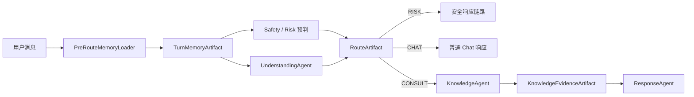
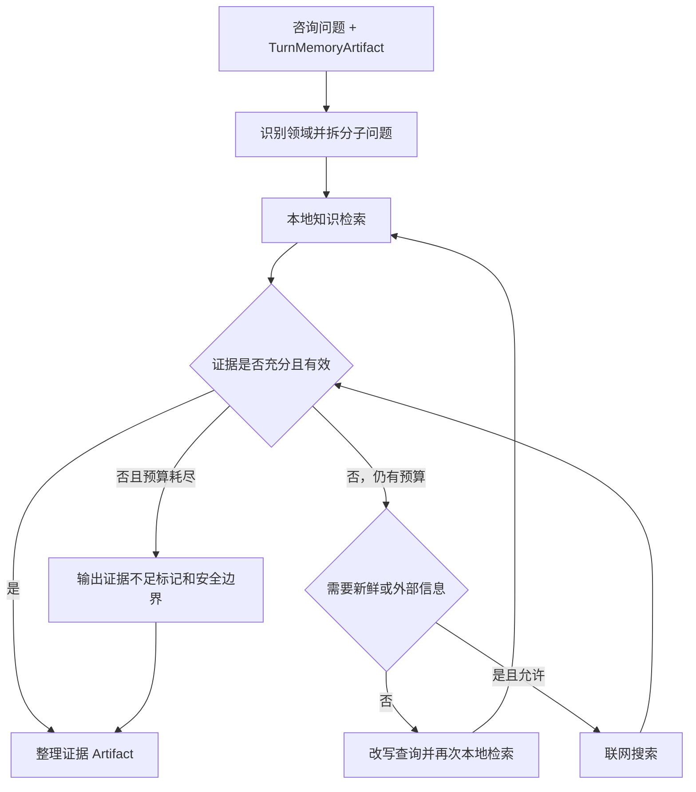

# MindBridge 记忆、KnowledgeAgent、Agentic RAG 与 Skill 优化实施方案

> 文档用途：本文件是后续 AI 编码任务的唯一实施主方案。实施时应先阅读本文件，再检查当前代码，以小步、可验证、可回滚的方式完成改造。
>
> 重要约束：可以从 `D:\BaiduNetdiskDownload\EchoMind` 和 `D:\BaiduNetdiskDownload\mind\mindbridge-py` 借鉴机制、迁移经审核的知识正文与 Skill 正文，但不得直接继承迁移源的知识库元数据模型、数据库记录、向量库、索引快照或 Alembic 修订历史。

## 1. 目标

在不改变项目整体多 Agent 骨架的前提下，完成以下改造：

1. 在路由前加载同一会话的记忆，使意图识别与风险识别看到必要上下文。
2. 删除 `ContextAgent`，由明确的服务和 Artifact 分别承担记忆、Skill、知识检索职责。
3. 新增 `KnowledgeAgent`，负责校园事务、学业、心理相关咨询的 Agentic RAG，并在必要时使用联网搜索。
4. 保留 `CHAT / CONSULT / RISK` 三类路由：
   - 学业、校园事务、心理相关问题统一路由为 `CONSULT`。
   - 编程、写作、常识、闲聊等普通问题路由为 `CHAT`，不因“可能能检索”而进入 RAG。
   - 高风险表达路由为 `RISK`，安全链路优先。
5. 将 `KnowledgeService` 保持为纯知识检索基础设施，不承担记忆、Skill、问题规划或答案生成。
6. 迁移缺失的校园与学业知识、Skill，但使用本方案定义的新元数据和重新构建的索引。
7. 第一阶段只保证单会话连续性，不引入跨会话向量记忆。

## 2. 已审计现状与结论

### 2.1 当前项目

- `UnderstandingAgent` 调用意图提示词时没有传入真实会话历史，因此“继续说”“那个材料呢”等依赖上文的输入容易误路由。
- `ContextAgent` 在路由完成后才加载历史、压缩记忆、检索知识和选择 Skill，无法帮助前面的意图识别与首次风险判断。
- 当前 `KnowledgeService.retrieve()` 实际上只负责知识检索，包括向量检索、BM25、分数融合、重排和相邻块扩展；它没有把 RAG、记忆、Skill 混在一起。混合职责主要发生在 `ContextAgent`。
- 完整消息保存在 MySQL，近期消息可在 Redis 中读取；当前摘要不具备稳定的增量持久化与覆盖位置管理。
- 当前项目仅使用 `Base.metadata.create_all()`，不能可靠地升级已有数据库表结构。
- 当前内置知识以心理类为主，缺少校园事务和学业知识；Skill 也缺少对应场景。

### 2.2 迁移源 `D:\BaiduNetdiskDownload\mind\mindbridge-py`

可借鉴或迁移的内容：

- 5 份学业/校园 Markdown 知识正文。
- 6 个学业/校园 Skill 正文。
- 3 份校方 PDF 原始资料。
- 学生手册按主题拆成 4 个逻辑文档、排除重复学籍页、住宿指南人工结构化等导入思路。
- 增量会话摘要的覆盖游标、版本控制、降级摘要、隐私清理等设计思想。
- Agentic RAG 的轮次预算、领域预算、覆盖度判断、证据预算、超时与取消设计。
- Alembic 工程化方式，但只能在本项目创建新的基线和修订，不能复制源项目修订链。

禁止直接迁移的内容：

- 源项目的知识库元数据结构和数据库表数据。
- `.sql` 备份、`.db`、`.sqlite`、`.sqlite3`。
- `data/chroma/**`、`data/chroma-snapshots/**` 等已有向量索引。
- 风险台账、未经人工核验的联系电话等运营数据。
- 源项目的 Alembic revision 历史。
- 源项目仍然存在的 `ContextAgent` 运行链路。
- 将源项目的 `AgenticRagEngine` 原样替换到本项目。只能借鉴其预算与终止策略，最终编排职责必须归 `KnowledgeAgent`。

### 2.3 三套机制比较与取舍

| 方案 | 优点 | 问题 | 本项目取舍 |
|---|---|---|---|
| 当前项目 | 已有 MySQL 完整消息、Redis 近期消息和 Task/Artifact 骨架；`KnowledgeService` 已具备混合检索 | 记忆在路由之后才由 ContextAgent 使用，摘要不稳定持久化，职责集中 | 保留存储和骨架；把记忆前移并拆除 ContextAgent |
| EchoMind | Harness 流程先加载 Memory，再做 Safety、Intent 和 RAG；Skill 支持目录发现、热加载、错误隔离与长度预算 | 会话摘要主要存 Redis 且有 24 小时 TTL；跨会话情景记忆和用户画像直接进入 Chroma，隐私、纠错、误召回和可删除性成本更高 | 采用“路由前加载”和 Skill 机制；暂不采用跨会话向量记忆与画像 |
| 迁移源 mindbridge-py | 有增量持久摘要、覆盖游标、版本控制、降级摘要、Agentic RAG 预算和较完整校园语料 | 仍保留 ContextAgent；数据库、元数据和向量索引与当前目标不完全一致 | 选择性移植摘要与预算思想、迁移正文；不复制运行链路和数据结构 |

最终选择是三者组合，而不是原样采用任一项目：

- 以当前项目的 Coordinator/Task/Artifact 和消息存储为骨架。
- 采用 EchoMind 的“Memory 在 Safety/Intent 之前”和动态 Skill 的思路。
- 采用迁移源的增量摘要一致性、Agentic RAG 预算和官方语料导入经验。
- 使用本方案独立定义的知识库元数据、Manifest 和重新构建的向量索引。

## 3. 不可更改的架构决策

### 3.1 请求主流程



要求：

- 记忆读取发生在路由之前，但记忆写回必须在本轮消息和响应确定之后进行。
- `RISK` 优先级高于 `CONSULT` 和 `CHAT`。
- `CHAT + LOW` 不运行知识检索、Agentic RAG 或联网搜索。
- `CONSULT` 才进入 `KnowledgeAgent`。
- `ContextAgent` 完全删除，不保留空壳、兼容分支或配置开关。

### 3.2 职责边界

| 组件 | 应负责 | 不应负责 |
|---|---|---|
| `PreRouteMemoryLoader` | 读取最近消息、读取持久摘要、组装有长度上限的本轮记忆 | 意图分类、知识检索、Skill 选择、生成回答 |
| `UnderstandingAgent` | 基于当前输入和记忆识别 `CHAT/CONSULT/RISK`、咨询领域和复合子问题 | 直接访问数据库、直接检索向量库 |
| `SkillManager` | 加载、校验、匹配和裁剪 Skill | 记忆摘要、知识检索 |
| `KnowledgeAgent` | 查询规划、问题拆分、多轮检索、证据充分性判断、必要的联网搜索、证据整理 | 直接操作数据库/Chroma 细节、保存会话记忆 |
| `KnowledgeService` | 结构化检索、过滤、混合召回、重排、相邻块扩展 | Skill、Memory、联网搜索、回答生成、Agentic 循环 |
| `ConversationSummaryService` | 增量更新单会话摘要并持久化覆盖位置 | 路由或知识检索 |
| `ResponseAgent` | 根据路由、Skill 和证据生成最终回答 | 自行重新检索、绕过安全策略 |

## 4. 路由设计

### 4.1 路由结果

继续使用：

- `CHAT`
- `CONSULT`
- `RISK`

`CONSULT` 下增加领域标签，不增加新的顶层路由：

- `MENTAL_HEALTH`
- `ACADEMIC`
- `CAMPUS_SERVICE`
- `MIXED`

编程、软件使用、一般知识、文案、翻译、闲聊等归 `CHAT`。即使这些问题可以联网搜索，也不自动进入本项目的知识库 RAG。

### 4.2 RouteArtifact

`RouteArtifact` 至少包含：

- `route`
- `risk_level`
- `primary_domain`
- `secondary_domains`
- `is_compound`
- `sub_questions`
- `needs_knowledge`
- `needs_web`
- `memory_version`
- `reason_codes`

规则：

- `needs_knowledge` 只在 `CONSULT` 时可能为真。
- `needs_web` 只是候选信号，最终是否联网由 `KnowledgeAgent` 基于本地证据、新鲜度和安全策略决定。
- `reason_codes` 使用稳定枚举，禁止只记录自由文本理由。
- 路由提示词只接收经过裁剪的 `TurnMemoryArtifact`，不直接拼接全量聊天记录。

### 4.3 路由验收示例

| 输入 | 期望 |
|---|---|
| “Python 怎么读取 CSV？” | `CHAT`，不调用 RAG |
| “挂科后还能补考或重修吗？” | `CONSULT + ACADEMIC` |
| “南望山校区怎么办理调宿？” | `CONSULT + CAMPUS_SERVICE` |
| “最近焦虑得睡不着” | `CONSULT + MENTAL_HEALTH` |
| “宿舍太吵，我焦虑得睡不着，也想申请调宿” | `CONSULT + MIXED`，拆成至少两个子问题 |
| “挂科了，我不想活了” | `RISK`，安全链路优先，不执行普通 Agentic RAG |

## 5. 单会话记忆机制

### 5.1 TurnMemoryArtifact

路由前生成一个只读 Artifact，建议字段：

- `session_id`
- `summary_version`
- `summary_covered_until_message_id`
- `structured_summary`
- `recent_messages`
- `current_user_message`
- `unresolved_references`
- `active_topics`
- `user_constraints`
- `token_estimate`
- `degraded`

`structured_summary` 建议采用受控 JSON 结构：

- `current_goal`
- `confirmed_facts`
- `user_preferences`
- `decisions`
- `open_questions`
- `active_topics`
- `recent_emotional_context`
- `corrections`

不得在摘要中生成医学诊断、人格标签或未被用户陈述的风险结论。

### 5.2 读取策略

1. 优先从 Redis 读取近期消息；缓存缺失时从 MySQL 回源。
2. 读取该会话最新持久摘要。
3. 只追加摘要覆盖位置之后的消息。
4. 使用确定性长度预算裁剪，优先保留：
   - 当前用户消息。
   - 最近若干轮原文。
   - 用户纠正内容。
   - 未解决问题与当前主题。
   - 已确认约束和决定。
5. 失败时退化为“最近消息 + 旧摘要”，不得阻塞路由。

### 5.3 摘要写回策略

- 写回发生在本轮完成后，不放入路由关键路径。
- 仅处理上次覆盖位置后的增量消息。
- 使用 `version` 或 CAS 防止并发覆盖。
- 保存 `covered_until_message_id`，禁止每轮重做整个会话摘要。
- LLM 摘要失败时生成确定性降级摘要，并设置 `degraded=true` 与错误信息。
- 用户纠正必须覆盖旧事实，同时保留最小的修正痕迹。
- 日志中只记录消息 ID、版本和状态，不记录完整隐私文本。

### 5.4 ConversationSummary 表

新增表建议字段：

- `id`
- `session_id`，唯一索引
- `version`
- `covered_until_message_id`
- `summary_json`
- `degraded`
- `last_error`
- `created_at`
- `updated_at`

第一阶段明确不做：

- 跨会话用户画像向量化。
- 跨用户共享记忆。
- 将摘要写入知识库向量索引。
- 使用向量相似度决定本轮路由。

## 6. KnowledgeAgent 与 Agentic RAG

### 6.1 触发条件

只有 `RouteArtifact.route == CONSULT` 且风险链路未接管时运行。

### 6.2 内部循环



### 6.3 建议预算

首版使用保守、可配置的硬上限：

- 最大规划/检索迭代：2。
- 最大子问题数：4。
- 每个领域最大本地查询数：2。
- 每轮最大总查询数：6。
- 联网搜索最大查询数：2。
- 最大证据块数：8。
- 单文档最大证据块数：3。
- 设置整轮超时和每次检索超时。

达到任意预算或超时后停止，不允许无限自反思。

### 6.4 证据充分性

至少检查：

- 每个子问题是否有证据覆盖。
- 是否存在过期、未验证或站点不匹配的文档。
- 是否只有单一低分文档。
- 多份证据是否冲突。
- 是否需要最新政策、开放时间、办事入口等时效信息。

本地证据不足时：

- 对稳定的心理支持知识，可以明确说明知识边界，不强制联网。
- 对可能变化的校园政策、办事流程和学业制度，可在允许时优先搜索学校官方域名。
- 联网结果必须记录 URL、标题、访问时间和来源类型。
- 联网结果只作为本轮证据，不自动写入长期知识库。
- 若来源冲突，优先校方官方页面，并在回答中标明不确定性。

### 6.5 KnowledgeEvidenceArtifact

至少包含：

- `plan_id`
- `domains`
- `sub_questions`
- `queries`
- `local_evidence`
- `web_evidence`
- `coverage`
- `conflicts`
- `insufficient_evidence`
- `budget_used`
- `timed_out`

每条证据至少包含：

- `source_key`
- `document_id`
- `title`
- `source_url`
- `domain`
- `section_title`
- `page_number`
- `version`
- `verified_at`
- `expires_at`
- `content`
- `score`
- `retrieval_method`

## 7. KnowledgeService 纯化

现有 `KnowledgeService.retrieve()` 没有混入 Memory 或 Skill，因此不要为了“解耦”而大规模推翻现有混合检索算法。应做的是收紧接口和数据契约。

建议新接口：

```text
search(request: StructuredSearchRequest) -> list[KnowledgeSearchResult]
```

`StructuredSearchRequest` 至少包含：

- `query`
- `domains`
- `tags`
- `site`
- `allowed_source_types`
- `as_of`
- `top_k`
- `document_limit`
- `include_neighbors`

检索服务内部可以继续保留：

- 向量召回。
- BM25 召回。
- 分数融合。
- 本地重排。
- 相邻块扩展。
- 结果去重。

检索服务不得：

- 读取会话消息或摘要。
- 选择 Skill。
- 调用联网搜索。
- 改写查询或决定是否继续检索。
- 生成回答。
- 把搜索结果写入记忆。

必须保证向量检索与 BM25 使用完全相同的状态、领域、站点、有效期过滤规则，避免一条检索路径绕过元数据过滤。

## 8. 本项目知识库元数据模型

本节是唯一目标元数据规范。禁止直接使用迁移源的元数据字段和枚举。

### 8.1 KnowledgeDocument

建议新增文档级实体：

| 字段 | 约束与用途 |
|---|---|
| `id` | 主键 |
| `source_key` | 稳定、唯一，不随文件名或数据库 ID 变化 |
| `title` | 文档标题 |
| `source_url` | 官方来源或内部来源地址，可空 |
| `source_type` | `INTERNAL_GUIDANCE`、`OFFICIAL_HANDBOOK`、`OFFICIAL_POLICY`、`OFFICIAL_SERVICE_GUIDE`、`UPLOAD` |
| `domain` | `MENTAL_HEALTH`、`ACADEMIC`、`CAMPUS_SERVICE`、内部受保护的 `SAFETY` |
| `tags_json` | 规范化标签数组 |
| `site` | `ALL`、`NANWANGSHAN` 等校区枚举 |
| `status` | `DRAFT`、`ACTIVE`、`INACTIVE` |
| `verified_at` | 人工或流程核验时间；发布前必须存在 |
| `expires_at` | 可空，超过后普通检索不可返回 |
| `version` | 业务版本 |
| `content_hash` | 规范化全文哈希 |
| `created_at` | 创建时间 |
| `updated_at` | 更新时间 |

说明：

- `SAFETY` 仅用于风险政策、伦理和隐私边界等受保护内容，不作为普通 `CONSULT` 领域暴露。
- 未经核验的迁移内容一律先进入 `DRAFT`。
- `ACTIVE` 文档必须有 `verified_at`。
- 过期文档默认不进入普通检索，但可供管理员审计。

### 8.2 KnowledgeChunk

在现有知识块基础上增加：

| 字段 | 约束与用途 |
|---|---|
| `id` | 主键 |
| `document_id` | 外键及索引 |
| `source` | 兼容现有评测和日志的稳定来源标识 |
| `source_index` | 文档内稳定序号 |
| `section_title` | 章节标题，可空 |
| `page_number` | PDF 页码，可空 |
| `content` | 文本块 |
| `content_hash` | 文本块哈希 |
| `embedding_json` | 当前兼容存储；后续可独立迁移 |
| `created_at` | 创建时间 |

向量库元数据必须从 `KnowledgeDocument + KnowledgeChunk` 派生，至少包含：

- `document_id`
- `source_key`
- `domain`
- `tags`
- `site`
- `status`
- `verified_at`
- `expires_at`
- `version`
- `source_type`
- `section_title`
- `page_number`
- `source_index`

### 8.3 目标知识清单 Manifest

建立 UTF-8 的版本化 Manifest，例如：

```text
app/knowledge/knowledge_manifest.yaml
```

Manifest 维护本项目自己的：

- `source_key`
- 标题与来源 URL。
- 领域、标签、校区和来源类型。
- 目标状态与版本。
- 原始文件相对路径。
- 预期 SHA-256。
- 拆分/清洗策略名称。

导入器只从 Manifest 获取元数据，不从迁移源数据库反推元数据。

## 9. 知识内容迁移

### 9.1 Markdown

从迁移源审核并迁移以下正文：

- `academic-planning-and-study-strategies.md` → `ACADEMIC`
- `academic-warning-and-recovery.md` → `ACADEMIC`
- `further-study-and-career-development.md` → `ACADEMIC`
- `thesis-research-and-integrity.md` → `ACADEMIC`
- `campus-academic-support-resources.md` → `CAMPUS_SERVICE`，标签包含 `academic_support`

迁移步骤：

1. 复制前检查是否包含过期政策、未经核验的电话、硬编码 URL 或学校专属断言。
2. 对内容做最小必要修订，并保留可读中文。
3. 在目标 Manifest 中创建本项目自己的元数据。
4. 初始状态为 `DRAFT`；审核完成并填写 `verified_at` 后才切换 `ACTIVE`。
5. 使用目标项目的切块器重新切块和重新生成向量。

### 9.2 官方 PDF

可迁移以下原始资料，并在复制后校验哈希：

| 文件 | SHA-256 |
|---|---|
| `中国地质大学（武汉）学生手册（2025年版）.pdf` | `1876CCA7996C4E3297691A32EE12880F657EBBE8B89A2EF9F796968543A17B75` |
| `关于印发《本科生学籍管理办法》的通知.pdf` | `76348A65BC8BB0B35AB986693A2479379B63001893405E11C92FF1372E8CD772` |
| `AE892E7A0A575B1FCD4E1DEE9F3_BAA6D0C7_1E4BE.pdf` | `E9C091D0A61A5C2D03A55187BDC1C60FAA0E8DE9EF6154D1164C4C600E4DBE37` |

对应官方来源：

- 学生手册：`https://bksy.cug.edu.cn/info/2255/15414.htm`
- 学籍管理办法：`https://xxgk.cug.edu.cn/info/1057/3499.htm`
- 南望山住宿服务指南：`https://hqbzc.cug.edu.cn/info/1087/17583.htm`

导入后形成 6 个逻辑文档：

1. 学生手册：学业学习与实践发展 → `ACADEMIC`
2. 学生手册：学生权利、纪律与申诉 → `CAMPUS_SERVICE`
3. 学生手册：校园生活规则与服务 → `CAMPUS_SERVICE`
4. 学生手册：奖励资助与学生组织 → `CAMPUS_SERVICE`
5. 本科生学籍管理办法 → `ACADEMIC`
6. 南望山校区学生住宿服务指南 → `CAMPUS_SERVICE`，`site=NANWANGSHAN`

实现注意：

- 借鉴源导入器的显式页段映射，但页码和章节必须通过测试固定。
- 学生手册内重复收录的旧学籍管理页不再次建库，以独立学籍管理办法 PDF 为唯一权威。
- 住宿指南可借鉴人工规范化的流程块，但必须保留原始页码和来源。
- 源项目中未核验的 11 个电话不得作为 `ACTIVE` 知识迁移。若确需保存，只能进入独立的待核验资源队列。
- 不复制源数据库记录和 Chroma，全部通过目标导入器重建。

## 10. Skill 机制与迁移

### 10.1 SkillManager

Skill 使用文件化、可发现、可校验的机制。每个 Skill 的 Frontmatter 至少包含：

- `name`
- `description`
- `agents`
- `intents`
- `domains`
- `keywords`
- `enabled`
- `priority`
- `max_chars`

运行规则：

1. 应用启动或显式刷新时扫描 Skill 目录。
2. 校验 Frontmatter 和正文结构；错误 Skill 被隔离并记录，不阻塞应用启动。
3. `SkillManager.match()` 根据 Agent、route、domain、关键词和优先级匹配。
4. 设置命中数量与总字符预算，避免把全部 Skill 注入提示词。
5. Skill 只能提供工作流和回答约束，不能覆盖 `RISK` 路由或安全规则。
6. Skill 不存入知识向量库，也不参与会话记忆摘要。

### 10.2 迁移 Skill

审核并迁移以下 6 个正文，同时补齐本项目 Frontmatter：

| Skill | `intents` | 主领域 |
|---|---|---|
| `academic_warning_recovery` | `CONSULT` | `ACADEMIC` |
| `campus_procedure_navigation` | `CONSULT` | `CAMPUS_SERVICE` |
| `dormitory_life_guidance` | `CONSULT` | `CAMPUS_SERVICE` |
| `financial_aid_awards_guidance` | `CONSULT` | `CAMPUS_SERVICE` |
| `further_study_career_decision` | `CONSULT` | `ACADEMIC` |
| `thesis_research_progress` | `CONSULT` | `ACADEMIC` |

初始建议 `agents=[response]`。只有在 `KnowledgeAgent` 确实需要某个 Skill 约束查询规划时，才将其加入对应 `agents`，不要默认对两个 Agent 重复注入。

## 11. 数据库迁移方案

必须为当前项目新增 Alembic，并创建本项目自己的修订链。

建议顺序：

1. 建立能表示当前生产/开发数据库现状的基线。
2. 新增 `conversation_summaries`。
3. 新增 `knowledge_documents`。
4. 扩展 `knowledge_chunks`，增加文档外键、章节、页码和内容哈希。
5. 增加必要唯一约束和索引。
6. 编写旧知识块到文档实体的可重复数据迁移。
7. 保留 `create_all()` 仅用于全新测试库或逐步移除其生产职责，不能继续用它代替升级。

数据库迁移必须：

- 支持 upgrade/downgrade。
- 在空库和含旧数据的数据库上测试。
- 使用 `source_key + content_hash` 保证导入幂等。
- 在迁移前后核对行数和孤儿外键。
- 不连接或导入迁移源的数据库文件。

## 12. 文件级实施指引

AI 实施时应先重新定位实际类名和引用，再按以下范围修改，禁止机械覆盖整个文件：

### 12.1 Agent 与编排

- `app/agents/coordinator.py`
  - 在 Understanding/Safety 前调用预路由记忆加载。
  - 删除 Context 任务创建与依赖。
  - `CONSULT` 创建 Knowledge 任务；`CHAT` 直接进入普通响应；`RISK` 进入安全链路。
  - 将 Artifact 通过现有任务图传递，不改写整体任务协调骨架。
- `app/agents/autonomous.py`
  - 删除 `ContextAgent` 类。
  - 修改 `UnderstandingAgent`，使用 `TurnMemoryArtifact`。
  - 新增或接入 `KnowledgeAgent`。
  - 修改 `ResponseAgent` 的输入契约，接收记忆、Skill 与知识证据 Artifact。
- Agent 注册、枚举、工厂和配置文件
  - 删除所有 Context 注册与开关。
  - 增加 Knowledge 注册。

### 12.2 记忆

- 新增独立的 `PreRouteMemoryLoader`。
- 新增 `ConversationSummaryService`。
- 新增 `ConversationSummary` ORM 模型及 Repository。
- 复用现有消息/Redis 服务，不重复建立消息存储。
- 将摘要写回放在本轮完成后的非关键路径，并确保失败不影响响应落库。

### 12.3 知识检索

- `app/services/knowledge.py`
  - 保留现有混合检索能力。
  - 增加结构化查询和统一元数据过滤。
  - 返回完整 `KnowledgeSearchResult`。
  - 移除任何后来新增的 Memory/Skill 编排倾向。
- 新增 `KnowledgeAgent` 的规划器、预算对象和 Evidence Artifact。
- 联网搜索使用独立接口，便于测试时替换为 Stub。

### 12.4 Skill

- 新增或改造 `SkillManager`、Frontmatter Schema、缓存和刷新机制。
- 迁移 6 个 Skill，补齐目标 Frontmatter。
- 删除 ContextAgent 内旧的 Skill 选择逻辑。

### 12.5 知识导入

- 添加本项目 Manifest。
- 迁移 5 份 Markdown 和 3 份 PDF 原始文件。
- 编写目标导入器、PDF 哈希校验、逻辑文档拆分和幂等导入。
- 清空或使用新 Chroma collection 重建索引，不能将源 collection 复制进来。

## 13. 推荐实施阶段

### 阶段 0：保护现状

- 建立路由、风险、知识检索和会话连续性的基线测试。
- 记录现有接口与数据库状态。
- 确认没有未提交的用户修改被覆盖。

验收门槛：基线测试能够稳定复现当前行为。

### 阶段 1：预路由记忆

- 新增摘要表、服务和 `TurnMemoryArtifact`。
- 在路由前加载记忆。
- 本阶段不得再让新流程依赖 ContextAgent；如为小步提交暂时保留类文件，也只能处于未注册、不可达状态，并在阶段 5 物理删除。

验收门槛：

- “继续”“那个材料呢”“按刚才第二种”能结合本会话正确理解。
- 摘要失败时路由仍可工作。
- 不出现跨 session 数据泄漏。

### 阶段 2：路由与 Artifact

- 固化 `CHAT/CONSULT/RISK` 和领域标签。
- 扩展 RouteArtifact。
- 增加复合问题拆分结果。

验收门槛：编程问题不调用 RAG；学业、校园、心理均进入 `CONSULT`；风险优先。

### 阶段 3：KnowledgeService 与 KnowledgeAgent

- 先完成纯检索接口与元数据过滤。
- 再实现受预算约束的 Agentic RAG。
- 最后接入受控联网搜索。

验收门槛：

- 最多两轮迭代且预算可观测。
- 复合问题可以进行多次、跨领域检索。
- 证据不足时不会伪造政策或办事流程。

### 阶段 4：SkillManager

- 建立动态加载与匹配。
- 迁移 6 个 Skill。
- 把旧 ContextAgent Skill 逻辑迁出。

验收门槛：Skill 命中可解释、有预算、不会覆盖安全策略。

### 阶段 5：删除 ContextAgent

- 删除类、注册、任务类型、配置、提示词、测试和无用 Artifact。
- ResponseAgent 只消费新的三个输入源：记忆 Artifact、Skill Artifact、Knowledge Evidence Artifact。

验收门槛：仓库中不存在运行时 `ContextAgent` 引用，完整测试通过。

### 阶段 6：知识与数据库迁移

- 引入 Alembic。
- 建立目标元数据模型。
- 迁移 Markdown/PDF 正文。
- 重新切块、嵌入和建索引。

验收门槛：

- 5 份 Markdown 和 6 个 PDF 逻辑文档都能按目标元数据查询。
- 所有迁移文档均有稳定 `source_key`、哈希和状态。
- 未核验条目不会出现在普通检索结果中。

### 阶段 7：回归与清理

- 删除兼容代码和无用配置。
- 补充指标、日志与文档。
- 执行编码检查、迁移检查和端到端测试。

## 14. 测试与验收

### 14.1 单元测试

- 记忆长度预算、摘要增量覆盖、CAS 冲突、降级摘要。
- 路由分类和领域标签。
- Skill Frontmatter 校验、排序、禁用和字符预算。
- 元数据状态、有效期、站点和领域过滤。
- Agentic RAG 查询预算、超时、取消和停止条件。
- PDF 哈希、页段映射、重复学籍页排除、幂等导入。

### 14.2 集成测试

- Redis 命中、Redis 缺失回源 MySQL。
- 一轮响应后摘要异步写回，下一轮可读取。
- `CONSULT` 才调用 KnowledgeAgent。
- `CHAT + LOW` 的 KnowledgeService 和 WebSearch 调用次数均为 0。
- `RISK` 不进入普通 Agentic RAG。
- 向量和 BM25 对 `DRAFT/INACTIVE/expired/site/domain` 的过滤一致。
- KnowledgeAgent 多轮检索仍严格遵守总预算。

### 14.3 端到端用例

至少覆盖：

- “Python 怎么读取 CSV？” → 普通 Chat，无 RAG。
- “我最近总是焦虑。”接“学校有没有能求助的地方？” → 利用同会话记忆，心理咨询。
- “我被处分了。”接“申诉材料和时间呢？” → 利用同会话记忆，校园事务检索。
- “这学期挂科了。”接“那还能保研吗？” → 利用同会话记忆，学业检索。
- “南望山宿舍太吵，我焦虑得睡不着，调宿怎么办？” → 心理 + 校园复合检索。
- “助学金和励志奖学金有什么区别，分别要什么条件？” → 多子问题检索与证据合并。
- “挂科了，我不想活了。” → 风险链路优先。
- 同名或相似会话并行请求 → 摘要不串会话、不覆盖新版本。

### 14.4 完成定义

只有同时满足以下条件才算完成：

- `ContextAgent` 已删除且无运行时引用。
- 路由前记忆已生效。
- `CHAT + LOW` 确认零 RAG。
- `KnowledgeAgent` 能完成有预算的多轮本地检索和受控联网搜索。
- `KnowledgeService` 不依赖 Memory、Skill 或 Agent。
- 知识库使用本方案元数据，未复制迁移源数据库与向量索引。
- 缺失的 5 份知识和 6 个 Skill 已按目标规范迁移。
- 3 份 PDF 已校验哈希并生成 6 个逻辑文档。
- 数据库升级和降级测试通过。
- 单元、集成、端到端测试通过。
- 修改文件均为 UTF-8，中文可直接阅读，没有意外 Unicode 转义。

## 15. AI 执行纪律

后续 AI 编码必须遵守：

1. 每个阶段开始前先检查当前代码，不能假设路径和类签名与本文完全一致。
2. 每次只实施一个可验证阶段，测试通过后再继续。
3. 保留项目现有 Coordinator/Task/Artifact 总体骨架，不进行无关重构。
4. 不因“最少改动”保留错误职责，也不因“架构更优雅”大规模重写无关模块。
5. 不复制迁移源数据库、向量库、元数据模型和 migration revision。
6. 迁移知识正文前先审核内容；目标元数据只来自本项目 Manifest。
7. 不把 Skill、Memory 混入知识向量索引。
8. 不把本轮联网结果自动沉淀到知识库。
9. 不新增跨会话向量记忆，除非后续任务明确授权。
10. 任何安全相关变更必须先补回归测试；风险链路始终可中断普通检索。
11. 修改源文件使用 UTF-8，保留可读中文。
12. 阶段结束时报告：
    - 修改文件。
    - 数据库修订。
    - 测试结果。
    - 未完成项。
    - 风险与回滚方式。

## 16. 建议最终交付物

- 新的预路由记忆加载与增量会话摘要。
- 扩展后的 RouteArtifact 和领域分类。
- `KnowledgeAgent`、预算与证据 Artifact。
- 纯化后的 `KnowledgeService.search()`。
- 动态 `SkillManager` 与迁移后的 6 个 Skill。
- 自有 `KnowledgeDocument/KnowledgeChunk` 元数据模型。
- 自有 Manifest 和可重复知识导入器。
- 5 份缺失 Markdown、3 份官方 PDF、6 个 PDF 逻辑文档。
- 新 Alembic 基线与分阶段修订。
- 完整的单元、集成和端到端回归测试。
- 更新后的架构与运维说明。
