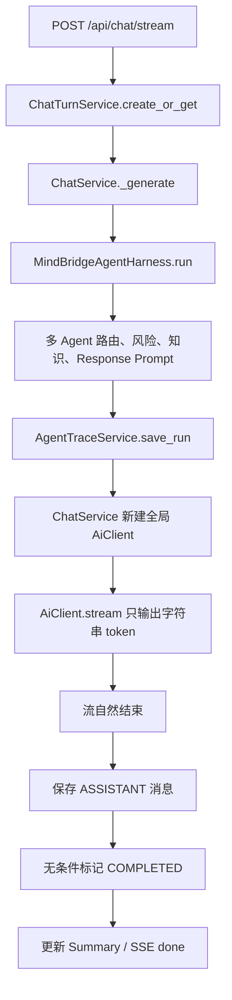
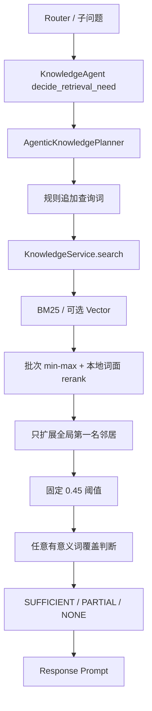
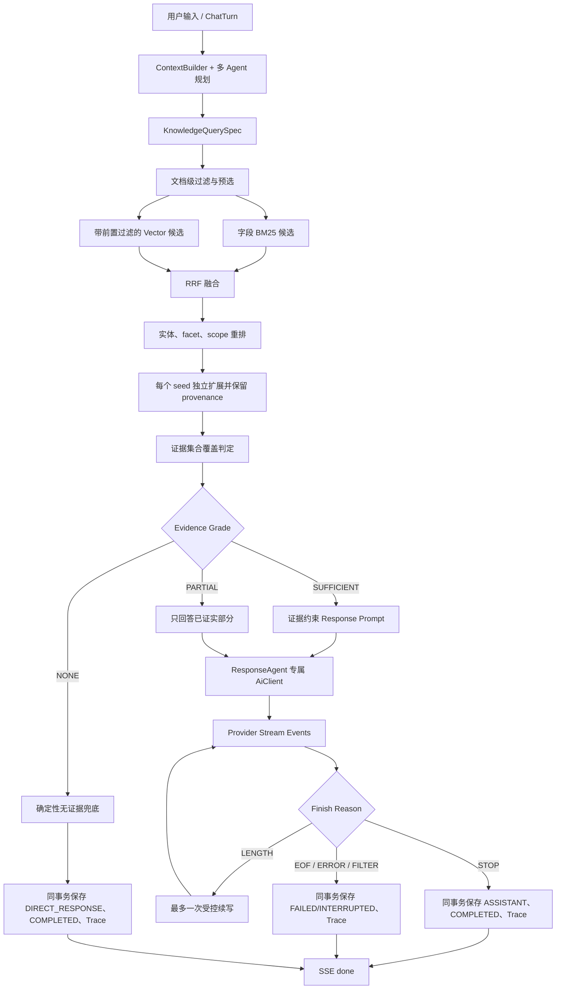
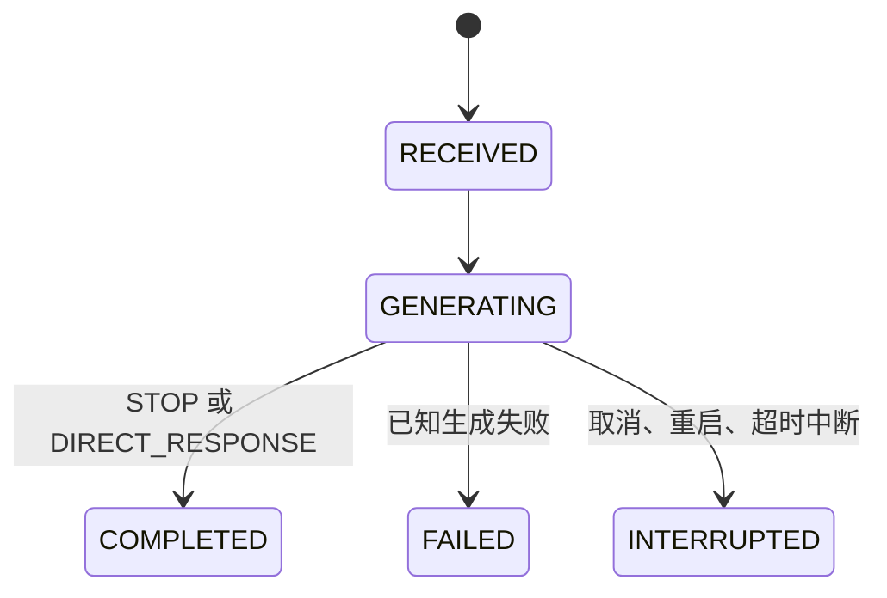

# MindBridge 回答完整性与知识检索可靠性代码改造实施方案

> 文档类型：全新、独立、自包含的代码改造执行方案  
> 代码基线：`D:\BaiduNetdiskDownload\mindbridge-pytest\mindbridge-py` 当前代码  
> 基线核对日期：2026-07-31  
> 目标读者：负责直接修改代码、数据库迁移、配置、测试并完成验收的 AI 或开发者  
> 建议迁移：`0008_response_completion`、`0009_knowledge_governance`  
> 本文档路径：`MIND_BRIDGE_RESPONSE_KNOWLEDGE_RELIABILITY_IMPLEMENTATION_PLAN.md`

---

## 1. 文档定位、优先级与执行边界

本文档是一个完全独立的实施输入。

- 实施者不需要先阅读任何其他方案文档。
- 本文档内部重新说明当前代码基线、问题证据、目标架构、数据契约、实施步骤、迁移、测试、发布和回滚。
- 其他方案文档不得被覆盖、删除或当作本文缺失内容的补充前提。
- 当前代码与本文档描述不一致时，以当前代码为事实源；实施者必须先记录差异，再按本文目标收敛。
- 本文档的实施顺序是强制性的：先修复回答截断和完成语义，再修复通用知识检索，最后进行语料治理、全链路评测和发布。

本轮允许修改：

1. 模型 Provider 适配、最终回答生成、ResponseAgent 模型配置。
2. ChatTurn 状态、SSE 元数据、流式重连和学生端错误展示。
3. Trace 的生成阶段和检索阶段可观测性。
4. KnowledgeAgent 查询规划、知识召回、融合、重排、证据判定和回答约束。
5. Ollama / OpenAI embedding 后端、Chroma 过滤和索引版本。
6. Manifest 受管语料生命周期、PDF 清洗、分块、重复来源归档。
7. 数据库迁移、配置示例、Harness、RAG 评测集和自动化测试。

必须保留：

- MySQL 继续作为消息、ChatTurn、Trace 和知识元数据的事实源。
- Redis 继续只是允许失败的流式快照和短期缓存。
- 当前 `meta`、`snapshot`、`error`、`done` SSE 事件名。
- 当前 `RECEIVED`、`GENERATING`、`COMPLETED`、`FAILED`、`INTERRUPTED` ChatTurn 状态集合。
- 当前 CHAT / CONSULT / RISK 对外路由语义和高风险优先级。
- 当前 ContextBuilder 的上下文信任边界、当前用户消息唯一性和 Token Manifest。
- 高风险本地安全直答不经过普通回答续写链路。
- 本地审核知识优先，不引入联网搜索作为本轮知识兜底。

全局约束：

1. 所有源文件保存为 UTF-8，优先无 BOM。
2. 中文注释、字符串、测试语料保持直接可读，不转换成 `\uXXXX`。
3. 不修改既有 Alembic 迁移；只能新增迁移。
4. 不跨线程共享 SQLAlchemy `Session`。
5. 不在知识查询请求中重建索引、写 embedding 或提交无关事务。
6. 不使用 Git reset、checkout、宽泛覆盖或破坏性文件操作。
7. 本目录当前不是 Git 工作树；不得执行 `git init`。
8. 每个阶段测试通过后才能进入下一阶段。

---

## 2. 当前代码基线与已核对事实

### 2.1 可重复基线

创建本文档时的核对结果：

```text
Alembic head: 0007_context_memory_v2
测试命令: python -m pytest -q
测试结果: 87 passed, 20 warnings
Git 状态: 当前目录不是 Git 工作树
```

警告来自 FastAPI `on_event` 弃用提示，不是本轮阻塞项。实施者必须在阶段 0 重新运行并记录自己的基线，不得直接复用上述数字作为完成证明。

### 2.2 当前回答生成调用链



当前直接问题：

| 问题 | 当前代码 | 后果 |
|---|---|---|
| Ollama 终止原因丢失 | `app/services/ai.py` 只读取 `message.content` | `done_reason=length` 与正常 `stop` 无法区分 |
| OpenAI 终止原因丢失 | 流代码不读取 `finish_reason` | `length`、`content_filter` 或异常 EOF 可被误判 |
| 流结束即成功 | `app/services/chat.py` 无条件写 `COMPLETED` | 半句话会作为完整回答持久化 |
| Response 配置被绕过 | 最终生成直接 `AiClient(self.settings)` | ResponseAgent 专属 provider/model/token 配置不生效 |
| 配置字段缺失 | Registry 动态读取未在 Settings 声明的字段 | 环境变量被 Pydantic 忽略 |
| Trace 创建过早 | Trace 在最终模型生成前落库 | 无法解释模型为何停止、输出多少、是否续写 |
| 部分内容错误进入正式历史 | 截断仍保存 ASSISTANT 并更新 Summary | 后续上下文会继续传播不完整答案 |

### 2.3 回答截断的实证

本次“调宿申请”问题已经确认：

- 数据库内的 Assistant 正文自身停在半句话，前端没有额外裁掉内容。
- Context Manifest 估算约 `1317 / 12000 tokens`，没有丢弃块，不是输入上下文裁剪。
- 当前全局输出上限为 `512`。
- 当前模型 `qwen3:8b` 默认支持 thinking，thinking 与正文共同消耗 Ollama `num_predict`。
- 本机复现中，低 `num_predict` 且 thinking 开启时会得到 `done_reason=length`，甚至出现 thinking 有内容而正文为空。
- 显式 `think=false` 后，同类请求可以正常生成正文并以 `stop` 结束。

历史请求的精确 `done_reason` 无法回溯，因为当前代码没有保存它。不得在修复代码中伪造历史终止原因。

### 2.4 当前知识检索调用链



当前运行状态和复现结果：

- 知识库约有 31 个文档、954 个知识块。
- `vectorEnabled=true`，但 `vectorAvailable=false`，生产实际长期运行在 BM25 降级路径。
- Docker Compose 存在 `OLLAMA_EMBEDDING_MODEL`，但 Settings 和向量实现没有真正使用 Ollama embedding。
- 原“调宿申请怎么办，需要准备什么”经过两轮查询仍为 `grade=NONE`、证据块 0。
- 正确的住宿服务指南确实存在；正文使用“宿舍调整”，章节名使用“调宿办理流程”。
- 首轮高排名结果主要是医保内容，正确住宿块没有进入可用证据。
- 第二轮仍被医保、助学金、退宿等通用词结果干扰。
- 更危险的反向复现是：“处分申诉需要哪些材料”可能把医保材料判为 `SUFFICIENT`。

因此当前系统同时存在：

1. 漏召回：正确资料存在但没有被召回或通过阈值。
2. 错召回：无关资料因为“材料、申请、办理”等通用词得高分。
3. 错判定：无关证据因命中任意通用词被判为充分。
4. 错兜底：`grade=NONE` 后模型仍生成未经学校资料支持的“常见材料”。

### 2.5 当前语料和评测缺口

- BM25 只主要索引 `chunk.content`，标题、标签、章节没有形成独立字段权重。
- 中文 tokenizer 会产生单字和连续双字，并可能跨标点拼接。
- 向量 embedding 只包含正文，不含标题、章节和标签。
- Chroma 查询先全库取 Top K，再在 MySQL 端过滤，目标领域可能在过滤前已被挤掉。
- 只扩展全局第一名候选；第一名错误时会继续扩展错误文档。
- 邻居拼接后沿用单一中心块 ID、页码和分数，引用不精确。
- Manifest 导入只 upsert 当前来源，不归档已经移除或改名的受管来源。
- 存在旧 source key、旧 Markdown 副本、废弃领域和重复 ACTIVE 文档。
- 当前 RAG 评测数据只有心理和风险资料，缺少住宿、申诉、学籍、奖助、医保等官方事务。
- 当前评测只要来源匹配或正文命中任意期望词就可能算 relevant。
- 当前评测只覆盖裸 `retrieve()`，没有覆盖 Planner、证据 grade 和最终 grounded answer。

---

## 3. 改造目标、成功指标与非目标

### 3.1 核心目标

1. 建立 Provider 无关的“模型完成契约”，不再用流自然结束猜测回答是否完整。
2. 让 ResponseAgent 的独立 provider、model、temperature、max tokens 和 think 配置真正进入最终请求。
3. 正常回答只有明确 `STOP` 才能标记 `COMPLETED`；本地固定直答只有明确 `DIRECT_RESPONSE` 才能完成。
4. 对 `LENGTH` 最多进行一次受控续写，仍未完成则保留部分内容但不得进入正式会话历史和 Summary。
5. 让 Trace、ChatTurn、SSE 三处对终止原因保持一致。
6. 建立统一的结构化知识查询契约，分开表达核心概念、同义词、用户请求 facet、校区和来源范围。
7. 用字段感知召回、正确 Hybrid、RRF、实体/facet 校验替代“批次 min-max + 固定阈值 + 任意词命中”。
8. 启用可配置的 Ollama / OpenAI embedding，并在向量不可用时明确降级。
9. 让每条学校事实都能追溯到具体文档、章节、块和页码。
10. 对 `PARTIAL` 和 `NONE` 使用受控回答策略，禁止补写知识库未支持的学校规定。
11. 建立覆盖真实官方事务、同义改写和干扰负例的全链路评测。

### 3.2 硬性成功指标

- 新生成的 `COMPLETED` ChatTurn 中，未验证完成的数量为 0。
- `LENGTH`、异常 EOF、空正文、`CONTENT_FILTER` 进入 `COMPLETED` 的数量为 0。
- ResponseAgent 的 Ollama 请求明确包含正确的 `num_predict`、`num_ctx` 和 `think=false`。
- 同一个 requestId 重放或重连不触发第二次独立生成。
- 截断部分内容不写入普通 ASSISTANT 消息、不进入 Summary。
- “调宿、换宿舍、换寝、宿舍调整”等改写能找到同一规范概念。
- 正确调宿流程进入 Top 3 usable candidates，医保等无关块不得进入 usable evidence。
- “处分申诉 + 材料”不得因医保文档包含“材料”而判 `SUFFICIENT`。
- 无知识负例必须为 `NONE`，不能凭通用词通过。
- BM25-only 和 Hybrid 分别通过独立门槛。
- 所有 ACTIVE 受管文档的生命周期、校区、状态和来源类型过滤 100% 通过。
- 默认 Trace 不保存完整 Prompt、完整知识块、模型输出或 thinking 正文。
- 全量 pytest、Harness、迁移、前端语法检查和真实 Ollama 冒烟全部通过。

### 3.3 明确非目标

本轮不做：

- 联网搜索或将 Web 内容自动写入本地知识库。
- 自动生成或补全学校政策。
- 为单个用户问法硬编码最终答案。
- 训练新的大语言模型。
- 把所有 Agent 框架迁移到另一套编排系统。
- 改写 CHAT / CONSULT / RISK 的对外协议。
- 改写 ContextBuilder 的记忆、摘要和信任边界。
- 用知识图谱替代当前关系库和向量库。
- 无限自动续写或无上限生成。
- 自动硬删除旧知识文档。
- 在没有真实评测校准前引入未经验证的 cross-encoder 作为唯一判定器。

---

## 4. 不可违反的架构决策

### 4.1 完成语义是硬契约

模型输出必须满足下列条件才算成功：

```text
存在非空用户可见正文
+ 收到 Provider 明确语义终止原因
+ 终止原因映射为 STOP
+ 所有生成尝试均已记录
= completion_verified=true
```

本地澄清、高风险固定安全回复等不调用模型的直答，使用 `DIRECT_RESPONSE`，并且必须由应用明确标记。

以下情况永远不能等同于成功：

- 异步迭代器自然结束；
- 正文以句号或括号结尾；
- 正文字数大于某个阈值；
- 收到 OpenAI `[DONE]` 但没有可解释的 choice 语义终止原因；
- Ollama 连接关闭但没有 `done=true`；
- 有 thinking 但没有用户可见正文；
- 已经向前端发送过部分 token。

### 4.2 证据充分性是集合覆盖，不是单分数

学校事实只有同时满足以下条件才能进入回答：

```text
合法文档生命周期
+ 正确领域和校区范围
+ 核心业务概念匹配
+ 用户所问 facet 被证据集合覆盖
+ 引用来源和块可追溯
= usable evidence
```

“材料、办理、申请、流程、怎么、需要”等通用词只能说明用户询问的 facet，不能证明候选文档与核心业务实体相关。

### 4.3 来源权威度不能覆盖相关性

官方文档只有在实体和 facet 已经相关时才能获得权威度加权。不能因为某份医保文档是官方文件，就让它回答调宿或处分申诉问题。

### 4.4 降级必须可见

- 向量不可用且 `required=false`：允许 BM25-only，但必须在状态、Trace、Manifest 和评测中标记。
- 向量不可用且 `required=true`：启动或检索必须明确失败。
- 不得把长期 BM25-only 状态描述为正常 Hybrid。

### 4.5 请求路径只读

知识搜索请求期间：

- 不重建 Chroma；
- 不补写 chunk embedding；
- 不修改文档状态；
- 不 `db.commit()`；
- 不启动会在 Planner 返回后继续写数据的后台任务。

### 4.6 高风险优先级不变

高风险明确硬信号继续优先于知识检索。高风险本地安全直答：

- 不依赖知识证据充分性；
- 不进入普通模型自动续写；
- 不因 embedding 或知识库故障被阻断；
- 仍必须记录 `DIRECT_RESPONSE` 完成原因。

---

## 5. 目标总体架构



---

## 6. 模型完成契约

### 6.1 新增文件

新增：

```text
app/services/model_completion.py
```

该文件是所有 Provider 和 ChatService 共用的唯一完成语义定义，不得在 Ollama、OpenAI、ChatService 中各维护一套状态字符串。

### 6.2 建议数据类型

```python
from __future__ import annotations

from dataclasses import dataclass, field
from enum import Enum
from typing import Literal


class ModelFinishReason(str, Enum):
    STOP = "STOP"
    DIRECT_RESPONSE = "DIRECT_RESPONSE"
    LENGTH = "LENGTH"
    CONTENT_FILTER = "CONTENT_FILTER"
    TOOL_CALL_UNSUPPORTED = "TOOL_CALL_UNSUPPORTED"
    PROVIDER_EOF = "PROVIDER_EOF"
    EMPTY_OUTPUT = "EMPTY_OUTPUT"
    CANCELLED = "CANCELLED"
    ERROR = "ERROR"


@dataclass(frozen=True)
class ModelUsage:
    prompt_tokens: int | None = None
    output_tokens: int | None = None
    thinking_tokens: int | None = None


@dataclass(frozen=True)
class ModelCompletionMetadata:
    provider: str
    model: str
    finish_reason: ModelFinishReason
    semantic_finish_seen: bool
    transport_terminal_seen: bool
    terminal_signal: str
    provider_finish_reason: str
    configured_output_limit: int
    usage: ModelUsage = field(default_factory=ModelUsage)
    thinking_observed: bool = False
    duration_ms: int = 0


@dataclass(frozen=True)
class ModelCompletion:
    content: str
    metadata: ModelCompletionMetadata

    @property
    def verified_complete(self) -> bool:
        return (
            bool(self.content.strip())
            and self.metadata.semantic_finish_seen
            and self.metadata.finish_reason == ModelFinishReason.STOP
        )


@dataclass(frozen=True)
class ModelStreamEvent:
    kind: Literal["delta", "terminal"]
    text: str = ""
    metadata: ModelCompletionMetadata | None = None
```

增加明确异常：

```python
class ModelProtocolError(RuntimeError):
    pass


class IncompleteGenerationError(RuntimeError):
    pass
```

约束：

- 一次流可以有多个 `delta`，只能有一个 `terminal`。
- `terminal` 后继续出现 token 是协议错误。
- `delta.text` 只能包含用户可见正文。
- thinking 原文不得进入 `delta`、数据库、SSE 或 Trace。
- `complete()` 返回 `ModelCompletion`，不再只返回字符串。
- `stream_events()` 返回 `ModelStreamEvent`。
- 可以保留旧 `stream()` 作为一个发布周期的兼容包装，但生产 ChatService 禁止继续使用它判断完成。

必须区分：

- `semantic_finish_seen`：Provider 已明确给出文本生成语义终止原因；
- `transport_terminal_seen`：传输协议已给出 Ollama `done=true` 或 OpenAI `[DONE]` 等终止标记。

Ollama 的最终 `done=true` 通常同时提供两种证据。OpenAI-compatible 服务可能已经给出 `finish_reason=stop`，但没有发送 `[DONE]`；这时可以记录兼容降级并验证语义完成，不能把 `[DONE]` 当作唯一完成证据。

本地 `DIRECT_RESPONSE` 不构造伪造的 ModelCompletion。它由 `GenerationOutcome` 使用以下独立规则验证：

```text
source=APPLICATION
+ 非空固定应用正文
+ finish_reason=DIRECT_RESPONSE
= completion_verified=true
```

模型生成使用：

```text
source=MODEL
+ ModelCompletion.verified_complete=true
= completion_verified=true
```

### 6.3 所有同步调用方必须迁移

使用 `AiClient.complete()` 的当前调用方至少包括：

- `app/agents/autonomous.py`
- `app/services/assessment.py`

改造要求：

1. 读取 `completion.content`。
2. 检查 `completion.verified_complete`。
3. 结构化 JSON Agent 遇到 `LENGTH`、EOF、空正文或 JSON 解析失败时走现有确定性回退。
4. 不把截断 JSON 当作有效语义分类。
5. 测试必须覆盖 thinking-only、截断 JSON 和异常 EOF。

同步 `complete()` 不得保留旧的字符串成功语义：

- Ollama 非流式响应必须通过与流式相同的纯解析函数读取 `done`、`done_reason`、`prompt_eval_count`、`eval_count`。
- OpenAI 非流式响应必须通过相同的终止原因 normalizer 读取 `choices[0].finish_reason` 和 usage。
- Provider 的流式和非流式实现可以使用不同 HTTP 方法，但必须共用 finish reason 映射和完成验证函数。

---

## 7. Provider 适配规则

### 7.1 Ollama

Ollama 流必须解析：

```text
message.content
message.thinking
done
done_reason
prompt_eval_count
eval_count
total_duration
```

映射规则：

| Ollama 状态 | 统一状态 |
|---|---|
| `done=true, done_reason=stop` | `STOP` |
| `done=true, done_reason=length` | `LENGTH` |
| `done=true` 但未知原因 | `ERROR` |
| 连接结束且无 `done=true` | 抛出带 `PROVIDER_EOF` 元数据的类型化异常 |
| 只有 thinking、无用户可见正文 | 最终业务结果 `EMPTY_OUTPUT` |

实现要求：

1. 最终帧若同时带 `message.content`，先发 delta，再发 terminal。
2. `message.thinking` 只设置计数或 `thinking_observed`，不保存正文。
3. `eval_count` 映射为输出 token。
4. `prompt_eval_count` 映射为输入 token。
5. 顶层 `think` 必须由 AgentModelProfile 配置。
6. `options.num_predict` 使用 Agent 专属 max tokens。
7. `options.num_ctx` 使用配置的 Ollama context window。
8. 网络超时、JSON 损坏或非 2xx 响应映射为清理后的错误，不向学生返回内部 URL 或原始响应。

Provider 层只对真实的语义终止发出 `terminal`。EOF、malformed frame、timeout 和 cancellation 必须抛出带脱敏 metadata 的类型化异常，由 ChatService 统一构造失败 `GenerationOutcome`；不得为异常伪造 `semantic_finish_seen=true` 或 `transport_terminal_seen=true`。

空正文拥有业务状态优先级：无论 Provider 原始原因是 `stop` 还是 `length`，只要最终用户可见正文为空，ChatService 的最终 finish reason 都是 `EMPTY_OUTPUT`，原始值只保存到 `provider_finish_reason`。空正文禁止自动续写。

### 7.2 OpenAI-compatible

流必须解析：

```text
choices[0].delta.content
choices[0].finish_reason
usage
[DONE]
```

映射规则：

| OpenAI finish reason | 统一状态 |
|---|---|
| `stop` | `STOP` |
| `length` | `LENGTH` |
| `content_filter` | `CONTENT_FILTER` |
| `tool_calls` | `TOOL_CALL_UNSUPPORTED` |
| 无 finish reason 且连接结束 | 抛出带 `PROVIDER_EOF` 元数据的类型化异常 |

要求：

- `[DONE]` 是传输终止标记，不单独证明文本回答完整。
- 如果兼容服务先给出明确 finish reason，随后在没有 `[DONE]` 的情况下正常 EOF，可以作为带兼容降级标记的 terminal，但必须有测试。
- 没有 `[DONE]` 且没有 finish reason 时必须失败。
- 本轮最终文本回答不接受 `tool_calls` 作为成功结果。
- OpenAI 请求不得发送 Ollama 专属 `think` 或 `num_ctx`。

兼容分支的 metadata 必须是：

```text
semantic_finish_seen=true
transport_terminal_seen=false
terminal_signal=finish_reason_eof
```

它只适用于已经收到明确 `finish_reason` 的正常 HTTP 流结束。没有语义终止原因的 EOF 走类型化异常，不发 terminal。

### 7.3 Mock

Mock Provider 也必须经过相同契约：

```text
delta* -> terminal(STOP)
```

Harness 不能因为使用 Mock 就绕过 finish reason 检查。

---

## 8. Agent 模型配置与上下文预算

### 8.1 Settings 必须显式声明

当前 Registry 通过动态字段名读取配置，但 Pydantic Settings 没有声明相应字段，环境变量会被忽略。必须显式新增至少以下配置：

```python
ai_think: bool = False
ollama_num_ctx: int = 16384
context_model_safety_margin_tokens: int = 1024

agent_model_understanding_temperature: float = 0.1
agent_model_understanding_max_tokens: int = 384
agent_model_understanding_think: bool = False

agent_model_safety_temperature: float = 0.1
agent_model_safety_max_tokens: int = 384
agent_model_safety_think: bool = False

agent_model_knowledge_temperature: float = 0.1
agent_model_knowledge_max_tokens: int = 512
agent_model_knowledge_think: bool = False

agent_model_response_temperature: float = 0.25
agent_model_response_max_tokens: int = 1536
agent_model_response_think: bool = False

chat_response_max_continuations: int = 1
chat_response_max_total_tokens: int = 3072
```

如果 Coordinator 真实调用模型，也要声明对应 temperature、max_tokens 和 think。不得依靠 `extra="ignore"` 下不存在的动态环境变量。

### 8.2 AgentModelProfile

扩展：

```python
@dataclass(frozen=True)
class AgentModelProfile:
    provider: str
    model: str
    temperature: float
    max_tokens: int
    think: bool | None
```

`AgentModelRegistry.client_for("ResponseAgent")` 必须复制完整 profile。最终回答必须使用：

```python
registry = AgentModelRegistry(self.settings)
ai = registry.client_for("ResponseAgent")
```

不得继续在 ChatService 中新建全局 `AiClient(self.settings)`。

### 8.3 上下文窗口校验

Ollama ResponseAgent 启动时必须校验：

```text
context_input_max_tokens
+ agent_model_response_max_tokens
+ context_model_safety_margin_tokens
<= ollama_num_ctx
```

若允许自动续写，第二次请求还会携带部分 Assistant 正文。续写构造器必须重新验证：

```text
续写 Prompt 输入
+ 续写输出上限
+ context_model_safety_margin_tokens
<= 模型 context window
```

`build_continuation_prompt` 的消息顺序固定为：

1. 原 Prompt 中所有受信任 system policy；
2. 固定的应用续写 system 指令；
3. 原 Prompt 中其余历史、摘要、记忆和 reference data，保持原信任边界；
4. 原当前用户问题，只出现一次；
5. 已生成 Assistant partial，作为最后一条 Assistant 消息。

不得新增一条伪装成用户输入的“请继续”，也不得让当前问题出现两次。已验证知识仍然是 `REFERENCE_DATA`，不能因续写而提升为系统指令。

预算不足时按以下顺序删除：

1. 不支持 required facets 的低相关可选知识；
2. 最旧且未被当前问题引用的最近消息；
3. 可选 Skill，referral 优先删除；
4. Summary 的可选字段；
5. 与当前问题无关的 UserMemory。

绝不可删除：

- 固定安全和行为规则；
- 固定续写指令；
- 当前用户问题；
- 已有 Assistant partial；
- 支撑 required facets 的最小证据集；
- 当前高风险硬约束。

若保留上述块后仍超预算，不执行续写，按 `LENGTH` 失败终结。

配置不合法时：

- 生产启动明确失败，或
- 健康状态明确为配置错误并拒绝模型生成。

不得静默把应用允许的 12000 输入 Token 发送给只有 4096 context 的模型。

### 8.4 配置文件

同步修改：

- `app/core/config.py`
- `.env.example`
- `docker-compose.yml`
- `README.md`

Compose 必须显式透传 ResponseAgent、Ollama context、embedding provider/model、强制安全 grader 和 Hybrid V3 feature flag，不能只在宿主机 `.env` 中存在。

---

## 9. ChatService 完成状态、续写与事务

### 9.1 状态机

保留已有状态集合：



具体规则：

| 结果 | ChatTurn 状态 | 保存正式 ASSISTANT | 更新 Summary |
|---|---|---:|---:|
| 首次或续写后 `STOP` | `COMPLETED` | 是，唯一一条 | 是 |
| `DIRECT_RESPONSE` | `COMPLETED` | 是，唯一一条 | 是 |
| 一次续写后仍 `LENGTH` | `FAILED` | 否 | 否 |
| `CONTENT_FILTER` | `FAILED` | 否 | 否 |
| `TOOL_CALL_UNSUPPORTED` | `FAILED` | 否 | 否 |
| 有内容但 Provider EOF | `FAILED` | 否 | 否 |
| 空正文 | `FAILED` | 否 | 否 |
| 应用取消、服务重启、stale 回收 | `INTERRUPTED` | 否 | 否 |

失败和中断可以按原因保留 `ChatTurn.partial_content` 供当前 requestId 重连查看，但部分内容不是正式会话消息：

- `LENGTH`、`PROVIDER_EOF`、`CANCELLED`：可以保留并展示，但必须附加“未完整生成”提示。
- `CONTENT_FILTER`：必须清空用户可见 partial，发送最终累计空 snapshot 或安全固定提示覆盖已显示内容，再发送 error/done。
- `TOOL_CALL_UNSUPPORTED`、malformed frame、普通 `ERROR`：默认可以保留已生成的普通文本并标记不完整；若 Provider 明确标记内容不安全，则按 `CONTENT_FILTER` 处理。

Trace 可以保存清空前正文的字符数和 hash，但不得保存正文。

### 9.2 内部结果类型

在 `app/services/chat.py` 或独立生成服务中定义：

```python
@dataclass(frozen=True)
class CompletionAttempt:
    content: str
    metadata: ModelCompletionMetadata


@dataclass(frozen=True)
class GenerationOutcome:
    content: str
    source: Literal["MODEL", "APPLICATION"]
    complete: bool
    completion_verified: bool
    finish_reason: ModelFinishReason
    attempts: tuple[CompletionAttempt, ...]
    continuation_count: int
    error_code: str = ""
```

建议把以下逻辑拆成可独立测试的方法：

```text
_run_completion_attempt
_build_continuation_messages
_merge_continuation
_finalize_completed_turn
_finalize_failed_turn
_generation_metadata
```

### 9.3 自动续写

只有同时满足以下条件才续写：

- finish reason 为 `LENGTH`；
- 已有非空部分正文；
- 尚未达到 `chat_response_max_continuations`；
- 总输出预算没有超过 `chat_response_max_total_tokens`；
- 当前不是高风险本地直答；
- 没有取消信号。

续写要求：

1. 不重新执行 Router、Safety、KnowledgeAgent 或工具。
2. 使用相同系统规则、当前问题和已验证证据。
3. 携带已有 Assistant 正文。
4. 增加固定应用指令：

   ```text
   仅从上一个回答的中断处继续。不要重复已有内容，不改变已给出的事实和结构，
   不新增引用资料中没有的学校规定。直接输出续写正文，不要写“继续”“接上文”等前缀。
   ```

5. 续写指令由应用固定生成，不得拼接未经边界处理的新用户指令。
6. 最多续写一次，禁止循环直到 stop。
7. 续写必须复用首次最终 Prompt 中同一组“required facet 最小证据集”，不得重新召回或更换事实来源。

### 9.4 重叠去重

`_merge_continuation(existing, continuation)` 必须是确定性算法：

1. 检查 existing 尾部和 continuation 头部最多 200 个字符。
2. 找到长度至少 8 个字符的最大完全一致 suffix/prefix。
3. 删除 continuation 中的重复前缀后追加。
4. 没有精确重叠时直接追加。
5. 不使用模糊语义算法删除用户可见内容。
6. 不调用模型做二次改写。

### 9.5 原子持久化

成功时以下内容必须在同一数据库事务中提交：

- 一条完整 ASSISTANT `ChatMessage`；
- `ChatTurn.assistant_message_id`；
- `ChatTurn.status=COMPLETED`；
- `ChatTurn.finish_reason`；
- `ChatTurn.completion_verified=true`；
- `ChatTurn.partial_content=完整正文`；
- 生成元数据；
- `completed_at`。
- 对应 Trace 的 `generation_json`、`finalized_at`。

当前 `MindBridgeAgentHarness.save_assistant_message()` 会独立 commit。实施者应把最终完成事务收口到 ChatService 或新的 `ChatCompletionFinalizer`，并删除生产路径中的中间 commit 窗口。

事务成功后再进行：

- Redis 最近消息 append；
- ConversationSummary 更新；
- 后置工具调度。

这些后置动作失败时不得回滚已经成功的 Assistant/ChatTurn 事实，但必须记录降级。Summary 只允许读取正式 ChatMessage，因此失败部分不会进入 Summary。

### 9.6 Trace 创建与完成顺序

1. Agent 规划完成后创建 planning Trace。
2. 立即把 `trace_id` 写入 ChatTurn。
3. 执行模型生成。
4. 无论成功、失败或中断，都构造唯一 canonical generation metadata 对象。
5. `finalize_generation_trace(..., commit=False)` 不得自行 commit。
6. 成功时 Assistant、ChatTurn 和 Trace 使用同一个 Session、同一个事务提交。
7. 失败或中断时 ChatTurn 终态、partial/error 和 Trace finalize 也使用同一个事务提交。
8. `ChatTurn.generation_metadata_json` 与 `AgentRunTrace.generation_json` 必须由同一个内存对象序列化，不能各自重新拼装。
9. 首 token 前失败也必须保留可解释 Trace。
10. Trace 更新或终态事务失败时整体回滚并有限重试；不得先把 ChatTurn 标为终态。重试仍失败时交给 stale recovery 以 `ERROR` 完成审计。
11. 所有 `DIRECT_RESPONSE` 分支，包括澄清问题、高风险固定回复和权威知识 `NONE` 确定性兜底，都必须先创建或关联最小 Trace。
12. 显式捕获 `asyncio.CancelledError`，在重新抛出取消前尽力以同一事务写入 `CANCELLED` 和 `INTERRUPTED`。
13. stale recovery 必须在把新 ChatTurn 标为 `INTERRUPTED` 的同一事务中 finalize 关联 Trace。

历史没有 Trace 的旧记录只做兼容读取；迁移后新建的终态 ChatTurn 不得缺少 Trace。

---

## 10. SSE、快照、重连和前端

### 10.1 SSE DTO

保留事件名，给 `ChatStreamEvent` 增加可选字段：

```python
finishReason: Optional[str] = None
completionVerified: Optional[bool] = None
partial: Optional[bool] = None
retryable: Optional[bool] = None
continuationCount: Optional[int] = None
outputTokens: Optional[int] = None
```

所有新增字段必须可选，使旧快照和旧客户端仍能解析。

### 10.2 事件顺序

```text
meta
snapshot*
[error]
done
```

要求：

- 每次流只能发送一个 `done`。
- `done` 不等于成功；客户端必须读取 `status` 和 `completionVerified`。
- 失败且已经有部分正文时，仍然发送 `error`。
- `done` 携带最终 finish reason。
- Redis miss 时必须从 MySQL ChatTurn 恢复真实状态和部分正文。
- Redis 中的旧快照缺少新增字段时按默认值处理。

### 10.3 学生端

修改 `app/static/student.js`：

1. 流 EOF 后调用一次 `decoder.decode()`，解析剩余 buffer。
2. snapshot 继续表示“累计完整快照”，前端整体替换，不盲目追加。
3. 收到 `error` 时，即使正文非空也显示独立提示：

   ```text
   回答未完整生成，以上内容可能不完整，请重试。
   ```

4. `completionVerified=false` 时不得使用正常完成样式。
5. 保留当前部分正文，不用错误提示覆盖正文。
6. 可提供“重新生成”按钮，但不得自动提交新的用户消息。
7. 同 requestId 重连不触发新请求。

### 10.4 错误脱敏

对学生端只返回稳定错误码和安全文案，例如：

```text
GENERATION_LENGTH_LIMIT
GENERATION_PROVIDER_EOF
GENERATION_EMPTY_OUTPUT
GENERATION_CONTENT_FILTER
GENERATION_FAILED
```

不得返回：

- Python 堆栈；
- 内部模型 URL；
- API key；
- Provider 原始响应；
- 数据库错误；
- thinking 内容。

---

## 11. Trace 与可观测性

### 11.1 Trace 两阶段生命周期

`AgentTraceService` 增加：

```python
def create_planning_trace(...): ...

def finalize_generation_trace(
    self,
    trace_id: int,
    generation: dict,
    retrieval_diagnostics: dict | None = None,
    *,
    commit: bool = False,
) -> None: ...
```

如果保留当前 `save_run()` 名称，也必须具备等价的 finalize 方法。

### 11.2 生成 Trace

默认保存：

```json
{
  "schemaVersion": 1,
  "provider": "ollama",
  "model": "qwen3:8b",
  "finishReason": "STOP",
  "providerFinishReason": "stop",
  "semanticFinishSeen": true,
  "transportTerminalSeen": true,
  "configuredOutputLimit": 1536,
  "promptTokens": 1317,
  "outputTokens": 846,
  "outputChars": 1260,
  "outputHash": "sha256...",
  "durationMs": 4300,
  "continuationCount": 0,
  "completionVerified": true,
  "attempts": []
}
```

`finalize_generation_trace` 默认只 `flush` 或更新当前 Session，不能自行 commit。终态事务由 ChatService finalizer 统一控制。

不得保存：

- 完整输出正文；
- thinking 正文；
- 完整 Prompt；
- Provider 原始异常响应。

### 11.3 检索诊断 Trace

`grade=NONE` 时也必须能复盘。默认记录：

- retrieval action 和 reason；
- domain、iteration、query spec hash；
- canonical concepts、facets、site；
- 向量 backend 状态和降级原因；
- 候选 document/chunk/section ID；
- BM25 rank、vector rank、RRF、rerank 分量；
- accepted / rejected；
- rejection reason；
- coverage、missing facets、missing questions；
- stop reason、timed out、budget used；
- taxonomy version、index version和各阶段耗时。

默认不重复保存完整用户输入、完整查询、完整知识正文或完整 Prompt。原始查询只允许在已有显式 debug 开关开启时保存一次。

### 11.4 指标

至少记录：

```text
ai_generation_total{provider,model,finish_reason,status}
ai_generation_length_total
ai_generation_missing_terminal_total
ai_generation_empty_output_total
ai_generation_output_tokens
ai_generation_duration_ms
ai_generation_continuation_total
chat_turn_failed_total{finish_reason}
trace_generation_unfinalized_total
knowledge_retrieval_total{domain,grade,stop_reason,mode}
knowledge_candidate_rejected_total{reason}
knowledge_query_iterations
knowledge_evidence_blocks
knowledge_vector_degraded_total{reason}
knowledge_retrieval_duration_ms{stage}
```

指标标签禁止使用用户文本、知识正文、requestId 或其他高基数字段。

---

## 12. 结构化知识查询契约

### 12.1 新增文件

```text
app/services/knowledge_query.py
app/knowledge/retrieval_taxonomy.yaml
```

taxonomy 是查询规划、召回加权和证据判定共用的唯一业务概念来源。禁止在 Router、Planner、KnowledgeService 和 grader 中各维护互不一致的同义词列表。

### 12.2 QuerySpec

建议定义：

```python
class KnowledgeFacet(str, Enum):
    ELIGIBILITY = "ELIGIBILITY"
    MATERIALS = "MATERIALS"
    STEPS = "STEPS"
    CHANNEL = "CHANNEL"
    DEADLINE = "DEADLINE"
    CONTACT = "CONTACT"
    COST = "COST"
    SCOPE = "SCOPE"
    POLICY_BASIS = "POLICY_BASIS"


class ConceptMode(str, Enum):
    CONTROLLED = "CONTROLLED"
    OPEN = "OPEN"


@dataclass(frozen=True)
class CanonicalConcept:
    concept_id: str
    canonical: str
    aliases: tuple[str, ...]
    required: bool = True


@dataclass(frozen=True)
class QueryVariant:
    kind: str
    text: str
    weight: float


@dataclass(frozen=True)
class KnowledgeQuerySpec:
    question_id: str
    original_question: str
    normalized_question: str
    domain: str
    concept_mode: ConceptMode
    concepts: tuple[CanonicalConcept, ...]
    open_concept_text: str | None
    required_facets: tuple[KnowledgeFacet, ...]
    optional_facets: tuple[KnowledgeFacet, ...]
    site: str | None
    freshness_required: bool
    allowed_source_types: tuple[str, ...]
    preferred_source_types: tuple[str, ...]
    variants: tuple[QueryVariant, ...]
    requires_authoritative_local_info: bool
```

强制约束：

- `original_question` 永不覆盖。
- 每个子问题独立生成 QuerySpec。
- 核心实体和用户请求维度分开表达。
- site 未知时不得猜测。
- “材料、流程”等通用词只能成为 facet。
- 每个子问题最多三个查询变体：
  1. 原问题；
  2. canonical concept + facet；
  3. 高价值 alias + facet。
- 不再把一长串通用词机械追加到原问题末尾。
- 规则无法识别概念时保留原问题，并允许向量语义召回；不得强行映射到错误概念。
- 可选语义模型只能作为低置信度补充，输出必须经过枚举、长度、domain 和 taxonomy 校验。

`allowed_source_types` 是硬过滤；`preferred_source_types` 只在相关性已经成立后作为 tie-break。默认允许类型由 domain 配置决定；空 `allowed_source_types` 表示使用该 domain 默认集合，不表示拒绝全部来源。受控跨域回退不得扩大到全局不可信来源。

未知概念使用明确的开放世界契约：

- taxonomy 命中时 `concept_mode=CONTROLLED`，使用 canonical/alias 硬门槛。
- taxonomy 未命中但提取出有意义的名词短语时 `concept_mode=OPEN`，`open_concept_text` 保存该短语。
- OPEN 不能只凭 facet 词通过；必须满足同领域、合法生命周期、校准后的高语义相关性，并且 title/section/tags 精确命中开放短语，或至少两个相互独立的正文语义信号支持它。
- 如果问题去除停用词和 facet 后没有有效开放概念，直接 `NONE`。
- OPEN 的相关性门槛必须通过 golden set 校准；未校准前最高只能判 `PARTIAL`。

### 12.3 Taxonomy

示例：

```yaml
version: 1

sites:
  NANWANGSHAN:
    aliases: [南望山, 南望山校区]
  ALL:
    aliases: [全校, 各校区]

facet_terms:
  MATERIALS:
    query_terms: [材料, 资料, 准备什么, 要带什么]
    evidence_patterns: [申请表, 提交材料, 提供证明, 材料包括]
  STEPS:
    query_terms: [流程, 怎么办, 如何办理, 办理步骤]
    evidence_patterns: [填写, 提交, 审核, 签字盖章, 办理, 领取]
  CHANNEL:
    query_terms: [入口, 在哪里办, 线上办理, 服务平台]
    evidence_patterns: [服务中心, 信息门户, 线上办理, 办理入口]
  DEADLINE:
    query_terms: [截止时间, 什么时候, 多久]
    evidence_patterns: [截止, 工作日, 办理时间, 有效期]
  ELIGIBILITY:
    query_terms: [条件, 资格, 哪些人可以]
    evidence_patterns: [申请条件, 适用对象, 应当符合, 申请人]

concepts:
  DORM_CHANGE:
    canonical: 宿舍调整
    domain: CAMPUS_SERVICE
    aliases: [调宿, 换宿舍, 换寝, 调寝, 宿舍调换]
    preferred_tags: [宿舍, 调宿, 住宿]
  STUDENT_APPEAL:
    canonical: 学生申诉
    domain: CAMPUS_SERVICE
    aliases: [处分申诉, 申诉处分, 处分复核]
    preferred_tags: [处分, 申诉]
```

实施者必须扫描当前 ACTIVE Manifest 的标题、标签和章节，补充覆盖所有实际官方事务的初始 taxonomy，不能只录入上述两个示例。

Taxonomy 校验：

- version 必填；
- concept id 全局唯一；
- canonical 在同一领域唯一；
- 同一领域内 alias 不得指向多个概念；
- domain 必须属于当前合法枚举；
- site alias 不得冲突；
- 中文必须为直接 UTF-8 字符；
- 配置错误时启动失败，不能静默忽略。

facet 的 `query_terms` 只识别用户需求，`evidence_patterns` 和 section metadata 才用于判断证据是否覆盖 facet。所有 evidence pattern 必须长度受限、预编译并有单测；必须先通过核心实体门槛，再计算 facet coverage，禁止把 pattern 命中反过来当作实体相关性。

### 12.4 路由兼容

- 高风险硬规则不读取 taxonomy，继续拥有最高优先级。
- 非风险 domain hint 可以复用 taxonomy，减少散落词表。
- QuerySpec 不能只依赖 Router 的单一 domain；可以在合法范围内根据 canonical concept 修正知识检索 domain。
- 不改变对外 IntentType 和 RouteArtifact 字段。
- 任何 domain 修正必须写入 Trace。

---

## 13. 两级召回与中文字段检索

### 13.1 第一层：文档级预选

先选合法相关文档，再在文档内选 chunk。

硬过滤：

```text
status == ACTIVE
verified_at 非空
expires_at 未过期
domain 与高置信度 QuerySpec 一致
site 明确时只允许 ALL 或目标 site
source_type 在允许范围
```

文档级评分字段：

- canonical / alias 与 tags 精确匹配；
- title 匹配；
- section title 集合匹配；
- domain、site；
- source type；
- freshness。

文档候选必须是以下集合的并集：

```text
字段检索文档候选
∪ 文档级向量候选
∪ canonical/tag 精确命中文档
```

`CONTROLLED` 且高置信度时通常选择前 4–6 个文档。`OPEN`、低置信度或词法无命中时扩大到 12 个合法文档，并允许一次带 domain/site/status 前置过滤的受控全域文档向量召回。不得先用词法锁死 4–6 个文档，再只在这些文档内部做向量检索。

若高置信度 domain 下没有文档，可以进行一次受控跨域回退，但必须记录 `DOMAIN_FILTER_RELAXED`，并且回退证据最高只能为 `PARTIAL`，除非经过明确人工规则验证。

### 13.2 第二层：chunk 召回

词法索引必须区分字段：

| 字段 | 用途 | 推荐权重 |
|---|---|---:|
| tags | 规范实体和业务标签 | 高 |
| section_title | 直接事项和章节语义 | 高 |
| document title | 文档主题 | 中高 |
| content | 事实正文 | 基础 |

不得通过重复拼接标题字符串模拟权重。应显式计算字段分量，形成 BM25F 或等价字段评分。

### 13.3 中文 tokenizer

新增可测试的 `KnowledgeTokenizer`，要求：

1. 先按标点、空白、段落切分连续片段。
2. 永不跨标点生成 n-gram。
3. 优先识别 taxonomy 中 canonical 和 aliases，并归一到 concept token。
4. 保留英文、数字、政策编号和年份。
5. 对剩余中文片段生成受控 2-gram / 3-gram。
6. 去除“怎么、需要、一下、了解、可以、相关”等停用词。
7. 通用 facet token 不参与核心实体匹配。
8. 索引和查询必须使用同一 tokenizer 版本。

不要求引入新的分词依赖。如果引入第三方中文分词库，必须固定版本、使用独立 tokenizer 实例、加载 taxonomy 自定义词典，并证明 BM25-only 指标提升；否则不得增加依赖。

### 13.4 候选和证据数量分离

- lexical candidate K：建议 48。
- vector candidate K：建议 48。
- RRF 后 rerank：保留 8–12。
- 最终 usable evidence：按 Context Token 预算保留 4–8。
- 每个文档默认最多 2 个直接证据 passage；不足时必须从后续候选回填，不能简单截断。

---

## 14. Embedding Provider 与 Chroma

### 14.1 Provider 抽象

新增：

```text
app/services/embedding.py
```

接口：

```python
class EmbeddingBackend(Protocol):
    name: str
    model: str

    def available(self) -> bool: ...
    def embed_documents(self, texts: list[str]) -> list[list[float]]: ...
    def embed_query(self, text: str) -> list[float]: ...
```

实现：

- `OllamaEmbeddingBackend`
- `OpenAIEmbeddingBackend`
- `DisabledEmbeddingBackend`

### 14.2 配置

新增并统一：

```text
KNOWLEDGE_EMBEDDING_PROVIDER=ollama
KNOWLEDGE_EMBEDDING_MODEL=bge-m3:latest
KNOWLEDGE_EMBEDDING_BASE_URL=http://host.docker.internal:11434
KNOWLEDGE_VECTOR_REQUIRED=false
KNOWLEDGE_VECTOR_CANDIDATE_K=48
KNOWLEDGE_VECTOR_COLLECTION_BASE=mindbridge_knowledge_v3
KNOWLEDGE_SAFE_GRADING_ENABLED=true
KNOWLEDGE_HYBRID_V3_ENABLED=false
```

`KNOWLEDGE_SAFE_GRADING_ENABLED` 只用于首个兼容发布，阶段 3 完成后生产必须为 true，启动时发现 false 应明确拒绝服务或进入维护状态。它不能作为普通回滚开关。`KNOWLEDGE_HYBRID_V3_ENABLED` 只控制新 BM25F/Vector/RRF 候选链，关闭它也必须继续使用安全 QuerySpec 和证据 grader，绝不能重新启用“任意词命中即充分”的旧判定。

兼容：

- `OPENAI_EMBEDDING_MODEL` 继续供 OpenAI backend 使用。
- 现有 `OLLAMA_EMBEDDING_MODEL` 可以兼容映射一个发布周期，但新配置是唯一文档化入口。
- 新旧配置同时存在时以新配置为准，并输出一次非敏感兼容日志。

### 14.3 索引文本

统一 embedding 输入：

```text
文档标题
章节标题
标签
正文
```

文本必须使用清晰字段分隔符；索引和查询版本中记录 `searchable_text_schema_version`。

### 14.4 前置过滤

Chroma query 必须在向量查询时使用 metadata filter：

- domain；
- site；
- status；
- source_type；
- 必要时 document id 集合。

禁止先全库固定取 16 个结果，再只在 MySQL 端丢掉不合法结果。若 Chroma 复杂过滤能力不足，应拆分过滤组合查询或自适应 overfetch，直到得到足够合法候选。

### 14.5 索引签名和切换

索引元数据至少包含：

```text
corpus_hash
taxonomy_version
embedding_provider
embedding_model
embedding_model_digest
embedding_dimension
searchable_text_schema_version
created_at
chunk_count
```

物理 collection 名称固定为：

```text
{KNOWLEDGE_VECTOR_COLLECTION_BASE}__{index_signature前12位}
```

Ollama backend 必须解析实际模型 digest，并把 digest 纳入索引签名。只记录 `bge-m3:latest` 不足以识别标签指向的新模型；无法获取 digest 时必须记录明确降级指纹，并要求运维显式重建。

新增独立维护命令：

```text
scripts/manage_knowledge_index.py build
scripts/manage_knowledge_index.py verify
scripts/manage_knowledge_index.py shadow
scripts/manage_knowledge_index.py activate
scripts/manage_knowledge_index.py rollback
scripts/manage_knowledge_index.py status
```

Active pointer 保存到 MySQL `knowledge_index_registry`，MySQL 是多实例共享事实源。构建命令通过 registry 行锁或 MySQL advisory lock 保证单写，状态按 `BUILDING → READY → ACTIVE / FAILED` 演进。请求路径只读取 ACTIVE 指针，绝不执行 build 或 switch。

任一签名变化：

1. 构建新的版本化 collection；
2. 校验 count、维度和 corpus hash；
3. 运行固定 golden smoke；
4. 在 registry 中标记 `READY`，阶段 5 不切换；
5. 阶段 7 完成 shadow 后，用单个数据库事务切换 ACTIVE 指针；
6. 保留旧 collection 一个发布周期；
7. 回滚命令把 ACTIVE 指针原子切回前一个物理名称；
8. 失败时继续使用旧 ACTIVE collection 或明确 BM25 降级。

Chroma 的 metadata 只是索引快照。向量前置过滤后，KnowledgeService 仍必须以 MySQL 当前 document status/site/expiry/source type 做最终合法性复核，防止刚变为 INACTIVE 的文档继续进入证据。

不得在生产 collection 上原地部分覆盖后立即服务。

---

## 15. 融合、重排、去重和 provenance

### 15.1 RRF

BM25 和 Vector 采用 Reciprocal Rank Fusion：

```text
RRF = Σ weight / (k + rank)
```

建议 `k=60`，权重必须通过 golden set 调整。禁止：

- 对当前批次做 min-max；
- 把相对排名分数当绝对证据置信度；
- 单纯降低原 `0.45` 阈值；
- 只增大 Top K 而不修实体和证据门槛。

### 15.2 分数语义拆分

扩展结果结构：

```python
@dataclass(frozen=True)
class RetrievalScore:
    bm25_rank: int | None = None
    vector_rank: int | None = None
    reciprocal_rank_score: float = 0.0
    rerank_relevance: float = 0.0
    entity_match: float = 0.0
    facet_match: float = 0.0
    scope_match: float = 0.0
    authority_tiebreak: float = 0.0
```

不得用一个 `score` 同时代表词法、语义、实体覆盖、证据可信度和来源权威度。旧 `score` 字段可以保留为展示兼容值，但 grader 不得只依赖它。

### 15.3 重排顺序

1. 文档生命周期硬门槛。
2. 核心实体硬门槛。
3. semantic / lexical relevance。
4. facet coverage。
5. scope / site。
6. 来源权威度 tie-break。
7. freshness tie-break。

如果暂不接入 cross-encoder，当前实现必须命名为 `field_entity_reranker`，不能继续把词面 cosine 称为语义 reranker。

### 15.4 去重

使用：

- `content_hash`；
- 规范化正文 hash；
- canonical document key；
- section / page；

去除旧副本和 overlap 重复。去重后必须回填后续候选，保持最终候选数量。

### 15.5 邻居扩展

每个通过初筛的 seed 独立判断是否扩展，不再只扩展全局第一名。

新增 provenance：

```python
@dataclass(frozen=True)
class EvidenceProvenance:
    seed_chunk_id: int | None
    child_chunk_ids: tuple[int, ...]
    page_numbers: tuple[int, ...]
    content_hashes: tuple[str, ...]
```

规则：

- 只在同一 document、同一 section 或明确连续页扩展。
- 扩展后去除 overlap 重复。
- 扩展 passage 重新计算 relevance 和 facet coverage。
- 不得继续冒用 seed 的单一 chunk ID、单一页码和旧分数。
- Token 超预算时优先保留直接支持必需 facet 的块。

---

## 16. 证据集合判定

### 16.1 覆盖结构

```python
@dataclass(frozen=True)
class FacetCoverage:
    facet: KnowledgeFacet
    covered: bool
    evidence_chunk_ids: tuple[int, ...]


@dataclass(frozen=True)
class QuestionCoverage:
    question_id: str
    core_concepts_covered: bool
    facet_coverage: tuple[FacetCoverage, ...]
    scope_resolved: bool
    freshness_satisfied: bool
    supporting_chunk_ids: tuple[int, ...]
    rejection_reasons: tuple[str, ...]
```

### 16.2 等级规则

`SUFFICIENT`：

- 所有必需核心概念均覆盖；
- 所有 required facets 被证据集合覆盖；
- site/scope 无冲突；
- ACTIVE、verified、未过期和来源要求满足；
- 没有无法解决的事实冲突。

`PARTIAL`：

- 核心概念已覆盖；
- 只有部分 required facets 有证据，或
- 校区范围仍需限定，或
- 存在可解释但未解决的来源冲突。

`NONE`：

- 核心概念未可靠覆盖；
- 只有通用 facet 词命中；
- 候选跨领域、过期、未验证、INACTIVE；
- scope 冲突；
- 所有候选都被合法拒绝。

`SKIPPED`：

- 当前请求不依赖本地知识。

核心概念覆盖按 mode 判定：

- `CONTROLLED`：所有 required CanonicalConcept 都必须通过 canonical/alias 或等价 metadata 门槛。
- `OPEN`：不得把空 `concepts` 当作自动覆盖；必须使用 `open_concept_text` 通过第 12.2 节的开放概念门槛。未校准或信号不足时 `core_concepts_covered=false`。

### 16.3 流程类问题

用户同时询问“怎么办、需要准备什么”时：

- `STEPS` 或 `CHANNEL` 至少一个是必需 facet；
- `MATERIALS` 是用户明确要求的必需 facet；
- 如果正确资料只说明步骤和申请表，没有列出身份证复印件等材料，则只能回答证据支持的申请表、签章和办理步骤；
- 不得用“常见材料”补全。

### 16.4 冲突

冲突键使用：

```text
canonical concept + facet + site + effective period
```

不能只比较同一个 source key 的 version。

冲突处理：

1. 优先 ACTIVE、未过期、范围更具体、版本更新的官方来源。
2. 无法确定时降为 `PARTIAL`。
3. 回答中说明“现有资料存在范围或版本差异”，不得自行合并。

### 16.5 local_evidence

只有实际参与 concept 或 facet coverage 的块才能进入 `local_evidence`。无关高分块不得进入 Response Prompt，也不得只为了凑 Top K 被保留。

### 16.6 Prompt 前二次覆盖校验

证据 grade 必须基于“实际进入最终 Prompt 的 passages”，不能只基于裁剪前候选。

流程：

1. grader 为每个 required concept/facet 选择最小支撑证据集。
2. 这些 passage 标记为高保留优先级，但信任级别仍为 `REFERENCE_DATA`。
3. ContextBuilder 先裁剪不参与覆盖的可选 evidence。
4. Prompt 组装完成后，用实际 passage IDs 再运行一次 coverage 校验。
5. 若 required facet 的唯一证据被移除，grade 必须降为 `PARTIAL/NONE`，并重新选择对应回答策略。
6. 如果最小证据集本身无法放入预算，不得维持 `SUFFICIENT`；应降级并说明资料无法完整装入当前回答上下文。
7. 自动续写必须复用同一最小证据集，并再次执行该校验。

---

## 17. Grounded Answer 策略

### 17.1 SUFFICIENT

- 只依据 usable evidence 回答。
- 按用户 facet 组织，而不是机械罗列所有块。
- 显示资料名称、章节或页码。
- 若有 `source_url`，传入 Response Prompt 并允许形成可点击来源。
- site-specific 资料必须说明适用校区。

### 17.2 PARTIAL

- 明确区分“已确认”和“当前资料未确认”。
- 只回答已经覆盖的 facets。
- 最多提出一个必要澄清问题，例如校区。
- 不使用常识补齐材料、期限、联系方式或办理部门。

### 17.3 NONE

对需要校内权威资料的问题，禁止继续让通用模型自由生成学校流程。使用确定性兜底，例如：

```text
我暂时没有检索到能够核实这个问题的校内资料。
请告诉我你所在的校区，或提供你看到的通知/办理入口，我可以继续帮你核对。
```

不得自动输出：

- “通常由某部门负责”；
- 身份证复印件、住宿合同等“常见材料”；
- 未验证电话、网址、截止日期；
- 将其他学校做法描述为本校流程。

对不要求本校事实的通用知识问题，仍可按正常 CHAT 规则回答；该判断由 `requires_authoritative_local_info` 明确表达。

### 17.4 Evidence Renderer

Response Prompt 中每个 evidence passage 至少包含：

```text
reference id
canonical document key
title
source URL
section title
page numbers
child chunk IDs
适用 site
正文
```

正文仍属于 `REFERENCE_DATA`，不能提升为系统指令。不得把知识块内的指令性文字当作应用规则。

### 17.5 Skill 收口

- 同一回答最多选择两个直接相关 Skill。
- `referral_resource_guidance` 不再对所有 CAMPUS_SERVICE 自动加入。
- 只有证据 `PARTIAL/NONE` 且确实需要资源转介时才加入 referral。
- Skill 不能覆盖 evidence grade，也不能凭自身模板补写学校材料。

---

## 18. 语料生命周期治理

### 18.1 Manifest 所有权

Manifest 是受管知识的唯一声明来源。新增文档元数据：

```text
canonical_key
managed_by
```

建议值：

| managed_by | 含义 |
|---|---|
| `MANIFEST` | 当前 Manifest 受管 |
| `UPLOAD` | 管理员上传 |
| `LEGACY` | 历史来源 |

### 18.2 Manifest 同步

每次同步：

1. 校验 manifest schema 和文件 hash。
2. 更新正文和所有 metadata，不能因正文 hash 未变而跳过 title/tags/site/status 修正。
3. 生成稳定 chunk。
4. 将本次 Manifest 中不存在但 `managed_by=MANIFEST` 的旧文档标为 `INACTIVE`。
5. 不自动删除文档和 chunks。
6. 上传文档默认 `DRAFT`，未经审核不得成为 ACTIVE。
7. 输出新增、更新、未变、归档和冲突报告。

### 18.3 历史重复数据

新增：

```text
scripts/reconcile_knowledge_corpus.py
```

默认 `--dry-run`，检测：

- 冒号/连字符旧 source key；
- Manifest 文档与旧 Markdown 副本；
- 相同或高度相似 content hash；
- `CAMPUS_LIFE` 等废弃 domain；
- 同一 canonical key 多个 ACTIVE 文档；
- verified/status/site 不完整。

执行规则：

- 只有明确 canonical 映射或 hash 证据充分时才能将旧文档标为 `INACTIVE`。
- 执行前导出原状态和向量快照。
- 输出可恢复审计文件。
- 不自动硬删除。
- 不在 Alembic migration 中进行大规模内容归并。

### 18.4 PDF 清洗和分块

- Markdown 以标题、子标题、自然段为边界。
- PDF 先保留页码和章节，再按自然段切块。
- 清除稳定重复的页眉、页脚和孤立页码。
- 去除连续重复句和“问：问：”“答：答：”类提取噪声。
- overlap 不得造成同一句多次进入 Prompt。
- section title 必须参与索引和引用。
- 重新导入相同文件必须产生稳定 source index 和 content hash。

---

## 19. 超时、线程和 Session 安全

当前 `AgenticKnowledgePlanner._call_with_timeout()` 在线程中调用持有请求 Session 的 KnowledgeService。SQLAlchemy Session 不是线程安全对象，SQLite 已可复现跨线程错误。

本轮要求：

1. 不再把持有请求 Session 的 `knowledge.search()` 直接提交到线程池。
2. 优先使用数据库和 HTTP 客户端自身 timeout。
3. 当前本地查询规模下可同步执行，并在每个阶段后检查总预算。
4. 如果必须保留硬线程超时，每个任务必须通过 `sessionmaker` 创建和关闭独立 Session，并在 Planner 返回后禁止任何写操作。
5. 向量和 embedding HTTP 调用使用明确 connect/read/write/pool timeout。
6. 超时结果必须进入 Trace，不能变成空证据且无原因。
7. 每个子问题至少保留一次查询预算，不能被前面的子问题静默耗尽。
8. 请求结束后不存在继续写数据库、索引或 Trace 的失控后台线程。

---

## 20. 数据库迁移

本方案建议拆成两个可独立回滚的迁移。

### 20.1 迁移 0008：回答完成与 Trace

新文件：

```text
migrations/versions/0008_response_completion.py
revision = "0008_response_completion"
down_revision = "0007_context_memory_v2"
```

`chat_turns` 新增：

```text
finish_reason VARCHAR(32) NULL
completion_verified BOOLEAN NOT NULL
generation_metadata_json TEXT NOT NULL
```

`agent_run_traces` 新增：

```text
generation_json TEXT NOT NULL
retrieval_diagnostics_json TEXT NOT NULL
finalized_at DATETIME NULL
```

Upgrade：

1. Text/Boolean 字段先 nullable 创建。
2. 历史 ChatTurn 的 `generation_metadata_json` 回填：

   ```json
   {"schemaVersion":1,"legacy":true,"completionVerified":false,"finishReason":"LEGACY_UNKNOWN"}
   ```

3. 历史 Trace 的 `generation_json`、`retrieval_diagnostics_json` 回填带 `legacy=true` 的最小对象，并把 `finalized_at` 设置为迁移执行时间，表示“已完成遗留分类”，不表示模型曾正常 STOP。
4. 历史 `completion_verified` 回填 false。
5. 历史 COMPLETED 的 `finish_reason` 使用 `LEGACY_UNKNOWN`，不得伪造为 STOP。
6. 再把对应字段改为 non-null。
7. ORM 使用 Python 侧默认值，不依赖 MySQL Text server default。
8. 不修改历史消息正文、输出 hash 或原 Trace 内容。

所有“COMPLETED 必须验证”和“终态 Trace 必须 finalize”的运行指标只统计 `legacy != true` 且创建于迁移部署后的新记录。管理端仍显示遗留记录为 `LEGACY_UNKNOWN`，不得让历史数据触发新发布阻断，也不得把它们伪装成已验证成功。

Downgrade 严格逆序删除新增列。

### 20.2 迁移 0009：知识治理

新文件：

```text
migrations/versions/0009_knowledge_governance.py
revision = "0009_knowledge_governance"
down_revision = "0008_response_completion"
```

`knowledge_documents` 新增：

```text
canonical_key VARCHAR(160) NULL
managed_by VARCHAR(32) NULL

INDEX ix_knowledge_documents_canonical_key(canonical_key)
INDEX ix_knowledge_documents_managed_by(managed_by)
```

回填：

```text
canonical_key = source_key
managed_by = LEGACY
```

新增 `knowledge_index_registry`：

```text
id INTEGER PRIMARY KEY
logical_name VARCHAR(64) UNIQUE NOT NULL
active_collection VARCHAR(160) NULL
previous_collection VARCHAR(160) NULL
ready_collection VARCHAR(160) NULL
active_signature VARCHAR(64) NULL
ready_signature VARCHAR(64) NULL
state VARCHAR(32) NOT NULL
metadata_json TEXT NOT NULL
updated_at DATETIME NOT NULL
```

新 Manifest 导入记录写 `MANIFEST`，管理员上传写 `UPLOAD`。列保持 nullable 以兼容历史和安全回滚，但新代码创建文档时必须显式填写。

迁移本身先把历史记录标为 LEGACY，随后必须运行一次“Manifest 所有权 bootstrap”：

1. 读取并完整校验当前 Manifest。
2. 按 Manifest 的 `canonical_key`；若旧 Manifest 尚无该字段，则按稳定 logical key/source key 映射当前数据库记录。
3. 把当前 Manifest 已存在记录更新为 `managed_by=MANIFEST`，并写规范 canonical key。
4. 校验匹配数量与 Manifest 声明数量；有歧义或缺失时停止，不进行归档。
5. 只有 bootstrap 成功后，后续同步才允许把已移除的 MANIFEST 文档标为 INACTIVE。

0009 downgrade 顺序：

1. 删除 `knowledge_index_registry`。
2. 删除 `ix_knowledge_documents_managed_by`。
3. 删除 `ix_knowledge_documents_canonical_key`。
4. 删除 `managed_by`。
5. 删除 `canonical_key`。

### 20.3 迁移测试

- 空 SQLite 从 base 升到 head。
- 带中文消息、ChatTurn、Trace 和知识文档的 0007 数据升到 0009。
- 0009 → 0008 → 0009 往返。
- 0008 → 0007 → 0008 往返。
- 历史正文和 hash 不变化。
- 历史 Trace 被标为 legacy，不会被误报为 STOP。
- 0009 索引名和 downgrade 顺序正确。
- Manifest 所有权 bootstrap 数量不一致时拒绝归档。
- KnowledgeIndexRegistry ACTIVE 指针切换和回滚使用单事务。
- MySQL DDL 预发布演练。
- `python -m alembic heads` 只能有一个 head。

应用回滚优先保留新增列，不以 downgrade 作为第一响应措施。

---

## 21. 文件级改造清单

### 21.1 新增

| 文件 | 职责 |
|---|---|
| `app/services/model_completion.py` | Provider 无关完成契约 |
| `app/services/knowledge_query.py` | QuerySpec、taxonomy 加载、概念/facet/site 归一 |
| `app/services/knowledge_scoring.py` | 字段评分、RRF、实体/facet 分量 |
| `app/services/embedding.py` | Ollama/OpenAI/Disabled embedding 后端 |
| `app/knowledge/retrieval_taxonomy.yaml` | 唯一领域概念和同义词来源 |
| `scripts/reconcile_knowledge_corpus.py` | 语料 dry-run、归档和恢复审计 |
| `scripts/manage_knowledge_index.py` | 版本化向量索引 build/verify/shadow/activate/rollback |
| `migrations/versions/0008_response_completion.py` | 回答完成和 Trace 字段 |
| `migrations/versions/0009_knowledge_governance.py` | canonical/managed_by 字段 |
| `tests/test_ai_completion.py` | Provider 终止协议 |
| `tests/test_chat_completion.py` | ChatTurn 完成、续写和事务 |
| `tests/test_knowledge_query.py` | QuerySpec/taxonomy/tokenizer |
| `tests/test_knowledge_retrieval_regressions.py` | 真实语料和干扰回归 |
| `tests/test_knowledge_corpus_governance.py` | 生命周期和归档 |
| `app/rag_eval/institutional-retrieval-eval.json` | 官方事务 golden set |

### 21.2 修改

| 文件 | 必改内容 |
|---|---|
| `app/services/ai.py` | 返回结构化 completion/stream events，解析终止帧 |
| `app/services/agent_models.py` | 增加 think 和显式 profile 配置 |
| `app/core/config.py` | 完成、context、embedding、retrieval V3 配置 |
| `app/services/chat.py` | Response client、续写、状态、事务、Trace finalize |
| `app/services/chat_turns.py` | 新字段状态读取和兼容 |
| `app/services/stream_snapshots.py` | finish reason 和完成标志 |
| `app/agents/harness.py` | Trace 两阶段；移除助手消息独立 commit 生产路径 |
| `app/agents/autonomous.py` | 同步 completion 调用方检查终止原因 |
| `app/services/assessment.py` | JSON 模型调用检查完整性 |
| `app/services/trace.py` | 生成和检索诊断，隐私过滤 |
| `app/models/entities.py` | 0008/0009 ORM 字段和 KnowledgeIndexRegistry |
| `app/schemas/dtos.py` | SSE 和管理 Trace DTO |
| `app/services/knowledge.py` | 两级召回、BM25F、RRF、去重、扩展、provenance |
| `app/services/agentic_rag.py` | QuerySpec 和证据集合 grader |
| `app/services/vector_store.py` | Provider 抽象、前置过滤、索引签名 |
| `app/services/knowledge_import.py` | lifecycle、稳定分块、PDF 去噪 |
| `app/core/bootstrap.py` | 不重复导入旧来源；启动索引校验 |
| `app/services/skills.py` | Skill 去重和 referral 触发条件 |
| `app/services/context_builder.py` | Response context window 校验和续写预算 |
| `app/static/student.js` | 尾 buffer、失败部分提示、完成标志 |
| `app/static/admin.js` | 如展示 Trace，兼容新增生成/检索字段 |
| `app/harness/runner.py` | finish reason 和完整链路 Harness |
| `app/rag_eval/runner.py` | 文档/section/grade/forbidden/full planner 评测 |
| `.env.example` | 新配置完整示例 |
| `docker-compose.yml` | 新环境变量透传 |
| `README.md` | 运行、索引、降级、评测和迁移说明 |

### 21.3 收口或删除前必须搜索

实施者在删除旧实现前必须运行：

```text
rg "AiClient\\(" app tests
rg "\\.complete\\(" app tests
rg "\\.stream\\(" app tests
rg "normalize_scores|knowledge_min_evidence_score|_question_terms_covered" app tests
rg "_expand_best|_ensure_vector_index|embedding_json" app tests
rg "CAMPUS_TERMS|ACADEMIC_TERMS|材料|办理流程" app/agents app/services
rg "save_assistant_message" app tests
```

只有全部生产调用迁移且测试通过后，才能删除：

- 纯字符串流完成判断；
- 批次 min-max 融合；
- “任意词覆盖”grader；
- 只扩展全局第一名；
- 请求中懒重建向量索引；
- 重复同义词表。

---

## 22. 分阶段实施步骤

## 阶段 0：冻结基线与失败样本

目标：在修改前把真实失败固化为测试。

操作：

1. 记录 `python -m alembic heads`。
2. 运行 `python -m pytest -q`。
3. 备份当前测试报告和 RAG 报告。
4. 为 Provider 构造以下协议夹具：
   - Ollama stop；
   - Ollama length；
   - Ollama thinking-only；
   - Ollama 无 done；
   - OpenAI stop；
   - OpenAI length；
   - OpenAI 无 finish reason；
   - content filter。
5. 把以下知识问题加入失败基线：
   - 调宿申请流程和材料；
   - 换寝/换宿舍同义改写；
   - 处分申诉材料；
   - 休学申请与休学医保干扰；
   - 一个不存在本地知识的办理问题。
6. 记录当前 top candidates、grade 和错误来源。

完成条件：

- 原问题能稳定复现。
- 新协议测试在旧代码上按预期失败。
- 不修改生产逻辑。

## 阶段 1：模型完成契约和 Provider 适配

操作：

1. 新增 `model_completion.py`。
2. Ollama/OpenAI/Mock 统一产生 stream events。
3. `complete()` 返回 ModelCompletion。
4. 迁移 Understanding 和 Assessment 同步调用方。
5. 添加 ResponseAgent 显式配置和 `think=false`。
6. ChatService 暂时只接入新事件，不做自动续写。

完成条件：

- Provider 协议单测全部通过。
- `LENGTH`、EOF、空正文均能被区分。
- 所有同步模型调用不再把截断 JSON 当成功。

## 阶段 2：ChatTurn、续写、事务、SSE 和前端

操作：

1. 新增并执行迁移 0008。
2. ORM/DTO/快照兼容新增字段。
3. 最终生成使用 ResponseAgent client。
4. 实现一次受控续写和确定性重叠去重。
5. 实现完成/失败 finalizer。
6. 原子保存 Assistant 和 COMPLETED。
7. 失败部分不保存 ChatMessage、不更新 Summary。
8. 更新 SSE 和 student.js。
9. Trace 生成阶段与 ChatTurn 同事务 finalize。
10. 覆盖 CancelledError、stale recovery 和所有 DIRECT_RESPONSE 最小 Trace。

完成条件：

- `LENGTH + COMPLETED` 测试数量为 0。
- 续写成功只保存一条完整 Assistant。
- 续写失败保留 partial，但会话历史无正式 Assistant。
- 重连返回一致状态。

## 阶段 3：检索安全门槛

目标：先阻止无关证据被错误判为充分，再提升召回。

操作：

1. 新增 QuerySpec 和 taxonomy。
2. 分开核心概念与 facet。
3. 重写 `_question_terms_covered` 等逻辑。
4. 生命周期、domain、site、实体成为硬门槛。
5. `NONE` 使用确定性权威资料兜底。
6. Trace 保存 rejected reasons。
7. 移除跨线程共享 Session。
8. 0009 尚未执行时，canonical identity 使用 `canonical_key or source_key` 兼容读取。

完成条件：

- “处分申诉材料 → 医保”误判被阻断。
- 只命中“材料/流程”的候选全部为拒绝。
- 无知识负例为 NONE。

## 阶段 4：语料治理、稳定分块和迁移 0009

操作：

1. 新增并执行迁移 0009。
2. importer 写 canonical_key 和 managed_by。
3. 完成 Manifest 所有权 bootstrap。
4. 改进 PDF 清洗和稳定分块。
5. 运行 reconcile dry-run。
6. 人工/规则确认后只把重复旧来源标 INACTIVE。
7. 实现 Manifest 后续同步归档。
8. 固化最终 corpus hash 和 chunk IDs。

完成条件：

- 同一 canonical key 不存在多个 ACTIVE 受管文档。
- 废弃 domain ACTIVE 数为 0。
- 未验证 ACTIVE 受管文档为 0。
- 所有归档动作有恢复审计。
- 后续 BM25/向量评测使用的是稳定治理后的语料。

## 阶段 5：字段召回、RRF、扩展和 provenance

操作：

1. 先实现文档级字段候选预选，并定义可插入文档向量候选的并集接口；本阶段按 BM25-only 验收。
2. 实现中文 tokenizer 和字段 BM25。
3. 使用 RRF，停止生产使用 min-max。
4. 每个 seed 独立扩展。
5. 保留 child IDs/pages/hashes。
6. 正确文档多样性限制和候选回填。
7. Response renderer 增加 URL、章节、页码。
8. 以阶段 4 的稳定 corpus 运行 BM25-only 正式评测。

完成条件：

- 调宿规范流程进入 Top 3。
- 医保、助学金不进入 usable evidence。
- 邻居引用完全可追溯。
- BM25-only 达到独立门槛。

## 阶段 6：Embedding Provider 和 V3 READY 索引

操作：

1. 新增 embedding provider 抽象。
2. 接入本地 Ollama `bge-m3` 和 OpenAI backend。
3. 索引 enriched searchable text。
4. 把文档级向量候选接入阶段 5 的候选并集。
5. Chroma 前置 metadata filter，MySQL 最终复核。
6. 建立包含模型 digest 的索引签名。
7. 构建版本化 V3 collection。
8. verify/smoke 通过后只标记 `READY`，不切换 ACTIVE。
9. 注入向量故障验证 BM25 降级。

完成条件：

- 状态接口准确显示 ACTIVE、READY 或 degraded。
- 过滤前置和 MySQL 最终复核生效。
- 签名不匹配不会误用旧 embedding。
- READY collection 通过离线 Hybrid 指标。

## 阶段 7：全链路评测、Shadow 和发布

操作：

1. Golden set 扩展到至少 180 条，并允许在当前 schema 下逐步增长到 200 条。
2. 运行 BM25-only、Hybrid、向量故障三套评测。
3. 运行 Router → Planner → grade → Prompt → completion → SSE。
4. 对 READY collection 运行 shadow，对比当前候选但不影响回答。
5. 指标达标后原子切换 registry ACTIVE 指针，并开启 `KNOWLEDGE_HYBRID_V3_ENABLED`。
6. 真实 Ollama 连续冒烟。
7. 更新 README 和运行手册。

完成条件：

- 本文第 24 节所有门槛满足。
- 无硬门槛豁免。
- 回滚开关已验证。

---

## 23. 测试矩阵

### 23.1 Provider 协议

Ollama：

- `stop`；
- `length`；
- thinking 不进入正文；
- thinking-only；
- 最终帧带正文；
- 无 `done=true`；
- malformed NDJSON；
- 中途网络异常；
- usage 缺失；
- Response payload 含 `think=false`、正确 `num_predict/num_ctx`。

OpenAI-compatible：

- `finish_reason=stop`；
- `length`；
- `content_filter`；
- `tool_calls`；
- 有 finish reason 无 `[DONE]`；
- 无 finish reason 无 `[DONE]`；
- malformed SSE；
- usage 缺失。

Mock：

- 明确产生 terminal STOP。

### 23.2 ChatTurn 和 SSE

- STOP 才能完成。
- DIRECT_RESPONSE 可以完成且不调用模型。
- 第一次 LENGTH、第二次 STOP：内容合并，只有一条 Assistant。
- 两次 LENGTH：FAILED，保留 partial，无 Assistant。
- EOF/空正文/filter/tool calls 不得完成。
- CONTENT_FILTER 到达后，已经显示的 partial 被累计 snapshot 安全覆盖。
- 首 token 前失败仍有关联 Trace。
- Assistant、turn 链接和完成状态没有中间崩溃窗口。
- Summary 只消费正式完整消息。
- 同 requestId 并发只生成一次。
- Redis 不可用仍可从 MySQL 重连。
- `asyncio.CancelledError` 和 stale recovery 同事务 finalize Trace。
- 澄清、NONE 兜底和高风险 DIRECT_RESPONSE 均有最小 Trace。
- `error` 和 `done` 顺序、数量正确。
- 前端有 partial 时也显示未完成。
- 续写重叠不会重复句子。

### 23.3 Taxonomy 和 QuerySpec

- schema/version；
- 重复 alias；
- 非法 domain/site；
- 调宿/宿舍调整/换宿舍/换寝归一；
- 处分申诉/处分复核归一；
- 补考/补修/重修的正确区分；
- 材料/流程只形成 facet；
- site 未知不猜测；
- 复合问题拆分；
- 省略主语的追问结合当前上下文；
- tokenizer 不跨标点产生 n-gram。

### 23.4 检索和证据

至少覆盖：

- 宿舍入住、调宿、退宿、线上入口；
- 处分与申诉；
- 奖学金、助学金、困难认定、贷款；
- 医保、报销、就医；
- 课程、补考、重修、学籍、休学、请假；
- 图书馆、校园网、交通；
- 心理咨询预约和资源；
- 明确校区、未知校区、错误校区；
- 最新/今年/截止时间；
- 多领域复合问题；
- 无知识负例。
- evidence pattern 只有在核心实体通过后才能形成 facet coverage；
- ContextBuilder 裁掉可选证据后，以实际 Prompt passages 重算 grade；
- required facet 最小证据集无法装入时，从 SUFFICIENT 正确降级；
- OPEN concept 未校准时不得直接成为 SUFFICIENT。

每个 case 至少包含：

```json
{
  "query": "",
  "expectedDocumentKeys": [],
  "expectedSections": [],
  "requiredFacets": [],
  "forbiddenDocumentKeys": [],
  "expectedGrade": "SUFFICIENT|PARTIAL|NONE",
  "expectedScope": "",
  "requiredFacts": [],
  "forbiddenClaims": []
}
```

### 23.5 关键硬回归

调宿申请：

- 原学生端快捷问题通过。
- 五种同义改写通过。
- 命中住宿服务指南的“调宿办理流程”或正确线上入口。
- 最终回答包含资料实际支持的：
  - 宿舍调整申请表；
  - 学院学工组签字盖章；
  - 住宿服务中心。
- 不得编造身份证复印件、住宿合同。
- 医保、贷款、助学金不得进入 usable evidence。

处分申诉：

- 命中学生申诉处理资料。
- 医保材料不得使 grade 成为 SUFFICIENT。

休学：

- “休学申请”不得用“休学期间医保”文档冒充办理流程。

无知识负例：

- grade=NONE。
- 不得因“办理、申请、材料”命中任意校园文档。

### 23.6 语料和索引

- Manifest 幂等导入。
- metadata 改变但正文不变时仍更新。
- 移除的 MANIFEST 来源变 INACTIVE。
- UPLOAD 不被 Manifest 误归档。
- 重复 canonical ACTIVE 检测。
- PDF 页眉页脚和重复句清理。
- 稳定 chunk source_index/hash。
- embedding 模型或维度变化触发新索引。
- Ollama 模型 digest 变化触发新物理 collection。
- Chroma filter 在 query 端生效。
- Chroma 前置过滤后，MySQL 能拒绝刚变为 INACTIVE 的结果。
- READY 不会在 shadow 前自动成为 ACTIVE。
- 多实例构建锁、ACTIVE 原子切换和 previous rollback。
- V3 构建失败不破坏旧 collection。

### 23.7 Trace 和隐私

- STOP、LENGTH、EOF、ERROR、DIRECT_RESPONSE 都可解释。
- ChatTurn、SSE、Trace finish reason 一致。
- finalize 幂等。
- grade NONE 仍有候选 ID 和拒绝原因。
- 默认无完整 Prompt、知识正文、输出正文、thinking 正文。
- 旧 `{}` JSON 可读取。
- debug 开关不改变检索结果。

### 23.8 必跑命令

```text
python -m alembic heads
python -m pytest -q
python -m app.harness.runner --suite all
python -m app.rag_eval.runner
node --check app/static/student.js
```

如果实际 runner 参数与当前代码不同，实施者可以使用当前等价命令，但必须在阶段报告中记录。

---

## 24. 评测与最终验收门槛

### 24.1 回答完整性

以下数据库一致性指标只统计迁移部署后且 `legacy != true` 的新记录：

- 新 `COMPLETED` 且 `completion_verified=false`：0。
- `LENGTH + COMPLETED`：0。
- Provider EOF + COMPLETED：0。
- 空正文 + COMPLETED：0。
- Trace 未 finalize 的终态 ChatTurn：0。
- 原调宿问题真实 Ollama 连续运行至少 10 次：
  - 不出现半句话结束；
  - 最终 finish reason 均为 STOP；
  - 无重复续写段落。
- 断线重连不丢正文、不重复生成。
- 高风险本地直答不进入模型重试。

### 24.2 知识召回

Golden set 保持在 180–200 条，覆盖所有 ACTIVE 文档及常见口语改写。

评测阶段必须固定：

- `document Recall@5 / MRR / NDCG@5`：统计经过生命周期硬过滤和字段/向量融合后的 post-rerank document/chunk candidates，但在 evidence budget 截断前。
- `forbidden usable evidence rate`：统计最终 grader 接受并进入 Prompt 的 usable evidence；forbidden 文档可以出现在 raw 候选中，但必须被正确拒绝。
- `Evidence grade F1`：统计最终 Prompt 前二次覆盖校验后的 grade。
- `grounded answer`：统计最终回答 claim 与实际 Prompt passages。

多相关文档 case 使用标准 graded DCG；MRR 取第一个合法相关候选的 reciprocal rank。指标先按 query 计算，再按 domain 做宏平均，同时报告全局宏平均；不得用 chunk 数做微平均放大长文档影响。

门槛：

- 正确文档 Recall@5 ≥ 0.95。
- MRR ≥ 0.85。
- NDCG@5 ≥ 0.85。
- BM25-only Recall@5 ≥ 0.90。
- forbidden 文档进入 usable evidence 的比例为 0。
- 无关证据误判 SUFFICIENT：0。
- Evidence grade macro F1 ≥ 0.90。
- 所有关键负例误判 SUFFICIENT：0。
- site/status/expiry/source-type 过滤：100%。
- expanded passage child IDs/page provenance 完整率：100%。

指标必须按领域分别报告，不能只给总体平均分。

### 24.3 Grounded Answer

- 每条学校事实可以映射到具体 evidence passage。
- PARTIAL/NONE 不补写未验证的材料、电话、网址、期限。
- site-specific 规则不会被表述为全校通用事实。
- 调宿硬回归 required facts 全部出现，forbidden claims 全部不出现。
- Prompt 不包含 forbidden evidence。

### 24.4 性能和可靠性

- 单次知识搜索 p95 不超过当前 4 秒预算。
- 一轮 Planner p95 不超过当前 12 秒预算。
- 超时后不存在继续修改数据库或索引的任务。
- 向量故障时降级明确且 BM25 指标达标。
- Redis 故障不影响最终状态事实。

### 24.5 工程质量

- pytest 零失败。
- Harness 全通过。
- 迁移只有一个 head，upgrade/downgrade 演练通过。
- 前端语法检查通过。
- 测试数量不得通过删除旧测试而净减少。
- 无意外 `\uXXXX` 中文。
- 无旧纯字符串流生产路径。
- 无批次 min-max + 固定证据阈值生产路径。
- 无跨线程共享 Session。
- 无针对某一句问题的最终答案硬编码。

---

## 25. 发布、监控与回滚

### 25.1 发布顺序

1. 备份数据库和当前向量索引。
2. 在预发布执行 0008、0009。
3. 运行全量测试、Harness、RAG 评测和真实 Ollama 冒烟。
4. 先发布回答完成契约。
5. 观察 ChatTurn/Trace 一致性。
6. 再发布 QuerySpec、grader 和 BM25F。
7. V3 检索先 shadow，不影响回答。
8. 指标达标后原子切换 registry，并小流量开启 `KNOWLEDGE_HYBRID_V3_ENABLED`。
9. 运行调宿、申诉、休学等 canary。
10. 稳定一个发布周期后再移除旧兼容逻辑和旧 collection。

### 25.2 发布阻断阈值

- 迁移后新 COMPLETED 未验证：任何一条都阻断。
- 迁移后新终态 Trace 未 finalize：任何一条都阻断。
- 终止帧缺失率超过 0.5%：阻断。
- LENGTH 比例连续 15 分钟超过 2%：阻断并检查模型预算。
- 无关证据 SUFFICIENT：任何关键 case 都阻断。
- 调宿或申诉硬回归失败：阻断。
- 某领域 Recall@5 低于门槛：不能用总体平均分放行。

### 25.3 回滚

- 回答完成改造和知识 V3 必须可以分别回滚。
- 检索第一选择是关闭 `KNOWLEDGE_HYBRID_V3_ENABLED` 并切回旧 ACTIVE collection；安全 QuerySpec/grader 继续生效。
- 数据库新增列优先保留，不立即 downgrade。
- V3 失败切回旧 collection 或 BM25-only。
- 语料状态恢复使用 reconcile 审计文件。
- 不删除 ChatTurn、消息、知识或 Trace。
- 不使用 Redis 通配删除。
- 回滚后重新运行 Provider 协议、SSE 重连和关键知识 canary。

---

## 26. AI 实施协议

负责执行本文档的 AI 必须遵守：

1. 把本文档作为独立完整输入，不要求用户补充其他方案。
2. 先完整读取本文档，再读取当前核心代码。
3. 先记录真实 baseline，再修改。
4. 严格按阶段 0 → 7 实施。
5. 每阶段测试通过后才进入下一阶段。
6. 修改前用 `rg` 查找所有调用方、DTO、配置和测试。
7. 只保留一个生产模型完成契约。
8. 只保留一个生产知识检索入口。
9. 不把提高 max tokens 当作截断问题的全部修复。
10. 不把流自然 EOF、末尾标点或正文长度当完成证据。
11. 不忽略 Ollama `done_reason` 或 OpenAI `finish_reason`。
12. 不无限自动续写。
13. 不把失败部分写入正式 Assistant 历史或 Summary。
14. 不记录 thinking、完整 Prompt 或完整输出。
15. 不单纯降低 `0.45` 阈值。
16. 不为“调宿”或任何单句编写检索/回答特判。
17. 不让通用 facet 词独立证明核心实体。
18. 不使用批次 min-max 分数作为绝对可信度。
19. 不允许 Hybrid V3 回滚开关关闭安全 QuerySpec 和证据 grader。
20. 不只扩展全局第一名。
21. 不拼接邻居后冒用单一 chunk ID 或页码。
22. 不在向量查询后才做全部过滤。
23. 不在请求路径重建索引或提交数据库事务。
24. 不跨线程共享 SQLAlchemy Session。
25. 不自动硬删除旧知识。
26. 不修改既有 Alembic 文件。
27. MySQL 是事实源，Redis 失败不得改变完成语义。
28. 所有文件 UTF-8，中文保持直接可读。
29. 使用小范围补丁，不宽泛重写用户文件。
30. 不覆盖或删除其他方案文档。
31. 每阶段必须报告：
    - 修改文件；
    - 状态机或数据流变化；
    - 新增测试；
    - 测试结果；
    - 迁移影响；
    - 配置变化；
    - 隐私影响；
    - 与本文偏差及理由；
    - 遗留风险。
32. 任一硬验收门槛未满足时不得宣称完成。

---

## 27. 最终完成定义

只有同时满足以下条件，整个改造才算完成：

1. 回答不再因 `LENGTH`、EOF 或空正文被误标成功。
2. ResponseAgent 独立配置真实进入最终模型请求。
3. 一次受控续写、失败部分隔离和重连全部可靠。
4. ChatTurn、SSE、Trace 对完成状态完全一致。
5. QuerySpec、taxonomy、召回和 grader 使用同一概念语义。
6. 标题、标签、章节、正文和向量共同参与检索。
7. RRF 和实体/facet 集合覆盖替代旧相对阈值逻辑。
8. Ollama embedding 可以真实工作，向量降级明确可见。
9. 正确证据具有完整 document/chunk/page provenance。
10. PARTIAL/NONE 不再生成未被本地知识支持的学校规定。
11. Manifest 生命周期、重复来源和废弃 domain 已完成可恢复治理。
12. 官方事务 golden set、BM25-only、Hybrid、降级和端到端评测全部达标。
13. 两个迁移可升级、可回滚且只有一个 Alembic head。
14. 全量测试、Harness、前端检查、真实 Ollama 冒烟全部通过。
15. README、`.env.example`、Compose 和状态接口与真实实现一致。
16. 无隐藏旧生产路径继续绕过完成契约或证据契约。

达到这些条件后，MindBridge 才能同时保证：

- 回答在技术上完整结束；
- 学校事实在证据上真实可核验；
- 检索失败时不会用通用模板伪装成校内规定；
- 未来出现问题时能够从 Trace 快速解释“模型为何停止”和“证据为何被接受或拒绝”。
