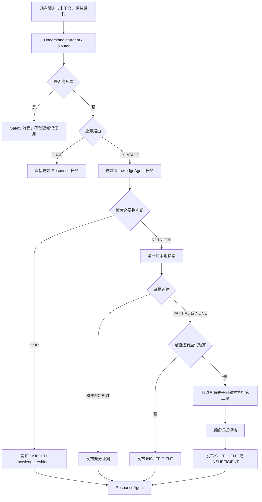

# MindBridge 路由 Agent 与轻量 Agentic RAG 代码优化方案

> 版本：V3  
> 状态：仅为代码改造指导文档，尚未修改业务代码  
> 适用项目：当前 `mindbridge-py`  
> 核心边界：Router 决定业务去向，KnowledgeAgent 决定是否检索，证据评估决定是否再次检索。
> 冻结范围：现有上下文管理和全部记忆机制本期不改，后续根据实际需求另行设计。

---

## 1. 改造结论

当前项目采用下面的轻量分层方案：

1. Router 负责判断 `CHAT / CONSULT / RISK`、风险、领域和复合问题。
2. 所有非高风险 `CONSULT` 都由 Coordinator 创建 KnowledgeAgent 任务。
3. 进入 KnowledgeAgent 不代表一定执行检索。
4. KnowledgeAgent 先判断本轮是否需要知识证据。
5. 需要证据时，先执行第一轮本地知识库检索。
6. 第一轮以后评估每个子问题的证据覆盖情况。
7. 只有证据不足且仍有重试预算时，才改写缺失问题并执行第二轮本地检索。
8. 最多两轮检索，不允许无界循环。
9. 取消官网和互联网兜底，只使用本地知识库。
10. 本地证据不足时明确返回 `INSUFFICIENT`，不得为了完成回答而编造事实。

最重要的职责边界是：

```text
Router：
决定“去哪里处理”

KnowledgeAgent：
决定“是否真正检索”

Evidence Grader：
决定“是否需要第二轮检索”
```

Router 不再输出 `NONE / SINGLE / ADAPTIVE`，因为它在看到第一轮结果之前，无法准确决定是否需要第二轮。

---

## 2. 当前代码的主要问题

### 2.1 Router 把领域咨询等同于需要知识

当前 `app/agents/routing.py` 中，只要命中心理、学业或校园领域，就会产生：

```python
route = IntentType.CONSULT
needs_knowledge = True
```

这会把以下两种不同请求当成同一种知识需求：

```text
“最近压力很大，想和你聊聊。”
“学校心理咨询中心怎么预约？”
```

两者都可以是心理领域 `CONSULT`，但前者主要需要陪伴，后者需要学校流程证据。

### 2.2 Coordinator 实际没有使用 Router 的知识决策

当前 `app/agents/coordinator.py` 重新计算：

```python
needs_knowledge = intent == IntentType.CONSULT and risk != RiskLevel.HIGH
```

因此 Router 的 `needs_knowledge` 并没有真正控制 KnowledgeAgent 调度，形成了两个潜在事实来源。

### 2.3 KnowledgeAgent 没有检索前判断

当前 `KnowledgeAgent` 对所有非高风险 `CONSULT` 都运行 `AgenticKnowledgePlanner`。它缺少：

```text
本轮只是陪伴、改写或头脑风暴，是否可以跳过检索？
```

### 2.4 当前证据覆盖判断过于宽松

当前 Planner 只要某个查询返回任意结果，就把对应问题标记为已覆盖。

```python
if results:
    coverage[question] = True
```

“返回了结果”不等于“结果足以回答问题”，容易把低相关证据当成充分证据。

### 2.5 第二轮检索由固定循环触发

当前 Planner 按 `max_iterations` 循环，第二轮查询使用固定领域后缀。它没有先明确输出：

```text
SUFFICIENT / PARTIAL / NONE
```

也没有只针对第一轮缺失的子问题进行改写。

### 2.6 Web 能力仍存在于执行链

虽然配置中 `web_search_enabled=False`，但以下代码契约仍存在：

- `needs_web`
- `WebSearchService`
- `max_web_queries`
- `web_evidence`
- `web.search.official` 权限
- 学业、校园本地检索不足后的 Web 分支

本方案要求彻底取消其执行作用。

---

## 3. 目标流程



---

## 4. 组件职责

| 组件 | 应负责 | 不应负责 |
|---|---|---|
| UnderstandingAgent / Router | 意图、风险预路由、领域、复合问题、子问题 | 决定检索轮数、评估证据 |
| SafetyAgent | 独立风险判断和回复安全审查 | 执行普通知识检索 |
| Coordinator | 按 route/risk 创建任务并等待必要 artifact | 重复实现知识必要性分类 |
| KnowledgeAgent | 检索必要性判断、查询规划、本地检索、证据评估和一次纠错 | 重新判断全部业务意图、生成最终回复 |
| ResponseAgent | 按现有方式使用 prompt，并消费本轮 Skill 和知识证据 | 自行启动检索 |

---

## 5. Router 目标契约

### 5.1 RouteDecision

建议将 `app/agents/routing.py` 中的契约调整为：

```python
@dataclass(frozen=True)
class RouteDecision:
    route: IntentType
    risk_level: RiskLevel
    primary_domain: KnowledgeDomain | None
    secondary_domains: tuple[KnowledgeDomain, ...]
    is_compound: bool
    sub_questions: tuple[str, ...]
    freshness_required: bool
    memory_version: int
    confidence: float
    reason_codes: tuple[RouteReasonCode, ...]
```

删除 Router 的执行决策字段：

```python
needs_knowledge
needs_web
retrieval_mode
```

说明：

- `freshness_required` 只是描述问题是否依赖时效信息。
- 它不能触发 Web 搜索。
- 它可以帮助 KnowledgeAgent 对本地文档的 `verified_at`、`expires_at` 和版本进行更严格的检查。
- `confidence` 必须来自实际路由过程，不能在 `UnderstandingAgent` 中固定写成 `0.88`。

### 5.2 兼容期

如果前端、Trace 或测试暂时依赖旧字段，可在 `as_payload()` 中保留只读兼容字段：

```python
{
    "needs_knowledge": route == IntentType.CONSULT and risk_level != RiskLevel.HIGH,
    "needs_web": False,
}
```

兼容字段只用于旧消费者过渡，不允许作为是否执行 Retriever 的最终依据。

---

## 6. Router 判断规则

### 6.1 判断顺序

必须按以下顺序：

```text
1. 当前消息硬风险检测
2. 明确闲聊和通用任务识别
3. 领域识别
4. 复合问题与子问题拆分
5. 规则置信度计算
6. 低置信度时才调用语义兜底
```

### 6.2 高风险

高风险优先级最高。当前风险规则与 SafetyAgent 的独立评估继续沿用现有实现，本方案不修改风险上下文的读取方式。

输出示例：

```python
RouteDecision(
    route=IntentType.RISK,
    risk_level=RiskLevel.HIGH,
    primary_domain=None,
    secondary_domains=(),
    is_compound=False,
    sub_questions=(),
    freshness_required=False,
    memory_version=memory_version,
    confidence=0.99,
    reason_codes=(RouteReasonCode.HIGH_RISK_SIGNAL,),
)
```

### 6.3 CHAT

以下通常属于 `CHAT`：

- 问候、感谢、结束语。
- 编程、翻译、改写和普通通用知识。
- 不属于 MindBridge 校园、学业或心理支持范围的请求。
- 明确切换话题后的新问题。

### 6.4 CONSULT

以下通常属于 `CONSULT`：

- 心理支持、压力和情绪陪伴。
- 学业困难、学籍规则、补考和论文规划。
- 校园事务、住宿、奖助、处分和申诉流程。
- 同时包含多个上述领域的复合请求。

`CONSULT` 只表示进入领域咨询处理链，不表示一定执行 Retriever。

### 6.5 上下文与记忆冻结

本期保留 `classify_route(text, memory_payload)` 的现有调用方式和 `memory_version` 字段，但不调整：

- `PreRouteMemoryLoader`
- 历史消息选择方式
- 上下文承接规则
- 会话摘要
- Redis 短期记忆
- 用户长期记忆
- Agent 私有记忆
- Prompt 上下文装配

即使现有上下文规则还有优化空间，也不纳入本次 Router 与 Agentic RAG 改造，避免扩大范围。

### 6.6 语义兜底

规则明确时不调用模型。以下情况才调用一次结构化语义分类：

- 无明确关键词但像领域求助。
- 多领域冲突，无法稳定确定主领域。
- 规则置信度低于阈值。

模型只补充：

```text
route
primary_domain
secondary_domains
is_compound
sub_questions
confidence
reason_codes
```

模型不能决定检索轮数，也不能启动 Web。

---

## 7. Coordinator 改造

Coordinator 只根据最终 route 和独立风险结果创建任务。

目标代码语义：

```python
intent = _intent_value(board)
risk = _risk_value(board)

needs_knowledge_task = (
    intent == IntentType.CONSULT
    and risk != RiskLevel.HIGH
)
```

这里的 `needs_knowledge_task` 表示：

```text
是否需要 KnowledgeAgent 做判断
```

不是：

```text
是否一定执行知识库检索
```

Response 任务等待条件：

```python
can_request_response = (
    route_exists
    and risk_exists
    and (
        intent != IntentType.CONSULT
        or risk == RiskLevel.HIGH
        or knowledge_evidence_exists
    )
)
```

KnowledgeAgent 即使决定不检索，也必须发布一个 `knowledge_evidence` artifact，防止 ResponseAgent 永久等待。

高风险升级时：

- route 强制变成 `RISK`。
- 不创建 KnowledgeAgent 任务。
- 若此前并发产生了知识结果，ResponseAgent 在高风险模式下也不得使用。

---

## 8. KnowledgeAgent 检索前判断

### 8.1 新增 RetrievalNeedDecision

建议在 `app/services/agentic_rag.py` 中新增：

```python
class RetrievalAction(str, Enum):
    SKIP = "SKIP"
    RETRIEVE = "RETRIEVE"


@dataclass(frozen=True)
class RetrievalNeedDecision:
    action: RetrievalAction
    reason_code: str
    queries: tuple[str, ...]
    confidence: float
```

不要在这里设置 `SINGLE` 或 `ADAPTIVE`。是否出现第二轮取决于第一轮证据。

### 8.2 优先使用轻量规则

通常跳过检索：

- 单纯情绪陪伴和倾听。
- 普通鼓励。
- 根据用户已给材料进行改写或总结。
- 不依赖学校制度和专业事实的头脑风暴。
- 用户只是在确认助手是否理解。

通常执行检索：

- 校园具体制度、办理流程、地点、材料和期限。
- 学籍、补考、重修、学位、奖助和申诉规则。
- 学校特定资源或服务。
- 需要可靠心理知识支撑的安全建议。
- 用户明确要求依据、出处、规定或知识库内容。
- 回答错误会明显影响用户行动的问题。
- `freshness_required=True` 且必须核验本地文档版本的问题。

不确定时：

1. 优先执行一次成本较低的本地检索。
2. 不调用 Web。
3. 如果本地没有可靠证据，返回不足。

这样更符合“尽量精准且准确”的目标。

### 8.3 不重复做完整路由

KnowledgeAgent 可以使用 Router 已产生的：

- `primary_domain`
- `secondary_domains`
- `sub_questions`
- `is_compound`
- `freshness_required`
- `confidence`

KnowledgeAgent 只判断知识依赖，不重新分类 `CHAT / CONSULT / RISK`。

---

## 9. 本地 Agentic RAG

### 9.1 证据状态

新增：

```python
class EvidenceGrade(str, Enum):
    SKIPPED = "SKIPPED"
    SUFFICIENT = "SUFFICIENT"
    PARTIAL = "PARTIAL"
    NONE = "NONE"
```

含义：

- `SKIPPED`：本轮不需要检索。
- `SUFFICIENT`：每个必要子问题都有足以支持回答的证据。
- `PARTIAL`：只有部分子问题被可靠覆盖。
- `NONE`：没有达到最低相关性和质量要求的证据。

### 9.2 第一轮

第一轮只执行本地混合检索：

```text
查询标准化
→ 按领域过滤
→ Chroma 向量召回
→ BM25 召回
→ 融合与 rerank
→ 文档状态、版本和有效期过滤
→ 按子问题评估覆盖
```

一个复合问题可以在同一轮并行执行多个子查询。这仍然是一轮 RAG，不是多轮 RAG。

### 9.3 证据评估

不能继续使用 `bool(results)` 作为覆盖结论。

轻量评估至少结合：

- 最高相关分数是否达到阈值。
- 证据领域是否与子问题一致。
- 文档是否为 `ACTIVE`。
- 文档是否过期。
- 时效问题是否有可接受的版本或核验时间。
- 证据内容是否覆盖问题的关键实体和动作。
- 多个子问题是否分别有证据，而不是共享一个弱命中。

建议提供可测试的纯函数：

```python
def grade_evidence(
    sub_questions: tuple[str, ...],
    evidence: list[KnowledgeSearchResult],
    freshness_required: bool,
) -> EvidenceGradeResult:
    ...
```

输出：

```python
@dataclass(frozen=True)
class EvidenceGradeResult:
    grade: EvidenceGrade
    covered_questions: tuple[str, ...]
    missing_questions: tuple[str, ...]
    reason_codes: tuple[str, ...]
```

### 9.4 第二轮

只有同时满足以下条件时才执行：

```text
grade 为 PARTIAL 或 NONE
存在 missing_questions
max_iterations >= 2
未超时
未超过总查询预算
```

第二轮只改写 `missing_questions`，不要重复检索已覆盖问题。

改写应加入缺失实体、动作、制度名或领域限定，而不是所有问题都拼接同一个固定后缀。

第二轮结束后必须停止，不再继续循环。

### 9.5 失败策略

没有官网兜底以后：

```text
本地证据充分 → 基于证据回答
本地证据部分充分 → 只回答有依据的部分，并指出缺失部分
本地证据完全不足 → 明确说明当前本地知识库无法确认
```

禁止：

- 把模型常识伪装成本校规定。
- 给出未经证据支持的时间、地点、材料、电话或网址。
- 本地不足时自动访问互联网。

---

## 10. KnowledgeEvidenceArtifact

建议统一为：

```python
@dataclass
class KnowledgeEvidenceArtifact:
    plan_id: str
    retrieval_action: str
    retrieval_reason: str
    grade: str
    domains: list[str]
    sub_questions: list[str]
    queries: list[dict]
    local_evidence: list[dict]
    coverage: dict[str, bool]
    missing_questions: list[str]
    conflicts: list[str]
    insufficient_evidence: bool
    stop_reason: str
    budget_used: dict
    timed_out: bool
```

`SKIP` 也发布 artifact：

```python
KnowledgeEvidenceArtifact(
    retrieval_action="SKIP",
    retrieval_reason="EMOTIONAL_SUPPORT_WITHOUT_FACTUAL_DEPENDENCY",
    grade="SKIPPED",
    queries=[],
    local_evidence=[],
    coverage={},
    missing_questions=[],
    insufficient_evidence=False,
    stop_reason="RETRIEVAL_NOT_REQUIRED",
    budget_used={
        "iterations": 0,
        "local_queries": 0,
        "web_queries": 0,
        "evidence_blocks": 0,
    },
)
```

为减少一次性迁移风险，兼容期可继续输出：

```python
"web_evidence": []
```

但它必须恒为空，任何逻辑都不能再消费 Web 结果。

---

## 11. 上下文与记忆：本期冻结

上下文管理和记忆不属于本次代码优化范围。

本期不得修改：

- `app/services/memory.py`
- `app/services/user_memory.py`
- `PreRouteMemoryLoader`
- `ConversationSummaryService`
- `RedisShortTermMemoryStore`
- `AgentPrivateMemory`
- `TurnMemoryArtifact`
- `assemble_prompt_messages()`
- `PendingClarification` 及追问恢复逻辑
- 现有上下文长度、摘要、缓存、长期记忆和 Prompt 装配配置

Router 继续接收当前已有的 `memory_payload`；ResponseAgent 继续按当前方式组装 Prompt。为了实现本方案，不新增记忆类型，不重新定义记忆优先级，也不调整上下文承接行为。

KnowledgeAgent 本期只消费 Router 已输出的领域和子问题，以及当前已有的 `model_input`。不得以 Agentic RAG 改造为理由扩展会话记忆读取或写入。

如果后续确实需要优化上下文、摘要、长期记忆或 Agent 私有记忆，应单独分析、单独出方案、单独测试，不与本期路由和 RAG 改造绑定。

---

## 12. 文件级改造清单

### `app/agents/routing.py`

- 删除 Router 对检索方式和轮数的决策。
- 将 `needs_web` 替换为 `freshness_required`。
- 增加实际 `confidence`。
- 保持现有 `memory_payload` 输入和上下文相关逻辑不变。

### `app/agents/autonomous.py`

- UnderstandingAgent 使用 Router 的真实 confidence。
- KnowledgeAgent 增加检索前必要性判断。
- KnowledgeAgent 不再接收 WebSearchService。
- KnowledgeAgent 无论 `SKIP` 还是检索都发布 artifact。
- ResponseAgent 根据 `grade` 处理充分、部分和不足证据。

### `app/agents/coordinator.py`

- 保持所有安全 `CONSULT` 创建 KnowledgeAgent 任务。
- 明确该任务是知识判断任务，不代表必检索。
- 等待 KnowledgeAgent 的 artifact 后再创建普通 CONSULT Response 任务。
- 高风险路径禁止消费知识 artifact。

### `app/services/agentic_rag.py`

- 新增 `RetrievalNeedDecision`。
- 新增 `EvidenceGrade` 和逐子问题覆盖评估。
- 第一轮后再决定是否第二轮。
- 第二轮只改写缺失子问题。
- 最多两轮。
- 删除 Web 执行分支。
- 保留必要的超时、查询数和证据数预算。

### `app/core/config.py`

- 保留 `knowledge_max_iterations=2`。
- 删除或弃用 `knowledge_max_web_queries`。
- 删除或弃用 WebSearch 配置。
- 可新增本地证据最低分阈值。

### `app/agents/event_driven_runtime.py`

- 不再构造和注入 `WebSearchService`。
- 除删除 Web 服务注入外，不调整记忆加载、用户记忆召回和 Prompt 输入。

### 明确不修改

- `app/services/memory.py`
- `app/services/user_memory.py`
- `app/services/clarifications.py`
- 记忆、摘要、上下文和追问相关数据库模型

### 测试

重点调整：

- `tests/test_routing_integration.py`
- `tests/test_knowledge_agent.py`
- `tests/test_agentic_rag.py`
- `tests/test_event_driven_multi_agent.py`

现有记忆、摘要和追问测试只作为回归测试运行，不修改其预期行为。

---

## 13. 分阶段实施

### 阶段 1：固定契约

- 修改 `RouteDecision`。
- 增加 `RetrievalNeedDecision`。
- 增加 `EvidenceGradeResult`。
- 修改 `KnowledgeEvidenceArtifact`。
- 先写契约测试，不修改主流程。

### 阶段 2：修复 Router

- 增加真实 confidence。
- 增加低置信度语义兜底。
- 删除检索轮数判断。
- 不修改现有上下文和记忆逻辑。

### 阶段 3：KnowledgeAgent 检索前 Gate

- 所有安全 `CONSULT` 进入 KnowledgeAgent。
- 情绪陪伴等返回 `SKIPPED`。
- 制度、流程和事实型问题进入本地检索。

### 阶段 4：证据驱动的两轮 RAG

- 第一轮检索。
- 逐子问题证据评估。
- 只对缺失问题执行一次改写和第二轮检索。
- 输出明确停止原因。

### 阶段 5：移除 Web 执行路径

- 取消服务注入。
- 删除 Planner Web 分支。
- 权限中删除 `web.search.official`。
- 兼容字段固定为空或 False。

### 阶段 6：集成与回归

- 验证 CONSULT 的 `SKIP / RETRIEVE`。
- 验证第二轮由证据不足触发。
- 验证风险路径。
- 运行原有记忆、摘要、追问测试，确认行为没有回退。

---

## 14. 核心测试矩阵

### 14.1 路由与检索必要性

| 输入 | Router | KnowledgeAgent |
|---|---|---|
| `你好` | CHAT | 不运行 |
| `Python 怎么读取 CSV` | CHAT | 不运行 |
| `最近压力很大，想聊聊` | CONSULT / MENTAL_HEALTH | SKIP |
| `学校心理咨询怎么预约` | CONSULT / MENTAL_HEALTH | RETRIEVE |
| `挂科后还能补考吗` | CONSULT / ACADEMIC | RETRIEVE |
| `帮我润色奖学金申请说明` | 根据完整语义判断 CHAT 或 CONSULT | 通常 SKIP |
| `奖学金申请需要哪些材料` | CONSULT / CAMPUS_SERVICE | RETRIEVE |
| `我不想活了` | RISK | 不运行 |

### 14.2 多轮检索

| 第一轮情况 | 第二轮 |
|---|---|
| 所有子问题证据充分 | 不执行 |
| 只有一个子问题缺证据 | 只改写该子问题 |
| 无结果但仍有预算 | 改写后执行一次 |
| 已超时 | 不执行 |
| 已达到查询预算 | 不执行 |
| 第二轮仍不足 | 返回 INSUFFICIENT |

### 14.3 冻结能力回归

只验证本次改造没有改变原行为：

- 原有上下文承接测试结果保持不变。
- 原有 Redis、数据库降级和摘要测试保持不变。
- 原有用户长期记忆测试保持不变。
- 原有追问恢复测试保持不变。

这些测试用于防回归，不在本期增加新的记忆规则。

---

## 15. 验收标准

满足以下条件才算完成：

1. Router 不再决定 `SINGLE / ADAPTIVE`。
2. 所有非高风险 `CONSULT` 都产生 KnowledgeAgent 任务。
3. KnowledgeAgent 可以明确返回 `SKIPPED`，且不调用 Retriever。
4. 第一轮以后才决定是否第二轮。
5. 第二轮最多一次，并且只处理缺失子问题。
6. 证据覆盖不再等同于 `bool(results)`。
7. Web 搜索不会被调用。
8. 本地证据不足时 ResponseAgent 不编造学校事实。
9. 高风险路径不执行或不消费知识检索。
10. 上下文、摘要、长期记忆、Agent 私有记忆和追问行为保持原样。
11. 所有新增测试和原有回归测试通过。

---

## 16. 禁止事项

代码改造时不得：

1. 直接复制 EchoMind 或旧 `mindbridge-py` 的路由实现。
2. 把 Router 改成同时负责路由、检索规划和证据评估的巨型 Agent。
3. 把 `CONSULT` 直接等同于必须执行 Retriever。
4. 在 Router 阶段决定第二轮检索。
5. 让 KnowledgeAgent 重新实现完整业务路由。
6. 允许无界 Agent 循环。
7. 恢复官网或互联网兜底。
8. 用 `bool(results)` 判断证据充分。
9. 顺带修改上下文、摘要、长期记忆、Agent 私有记忆或追问逻辑。
10. 用 Unicode 转义替换正常中文源码、注释或文档。

---

## 17. 推荐最终语义

最终系统行为应当可以用下面四句话解释：

```text
Router 判断这是什么请求，以及交给哪个业务能力。
安全的 CONSULT 都进入 KnowledgeAgent 做知识必要性判断。
KnowledgeAgent 需要证据时先检索一次，证据不足才允许再检索一次。
本地知识库仍无法确认时，系统明确说不知道，而不是访问官网或编造答案。
```
