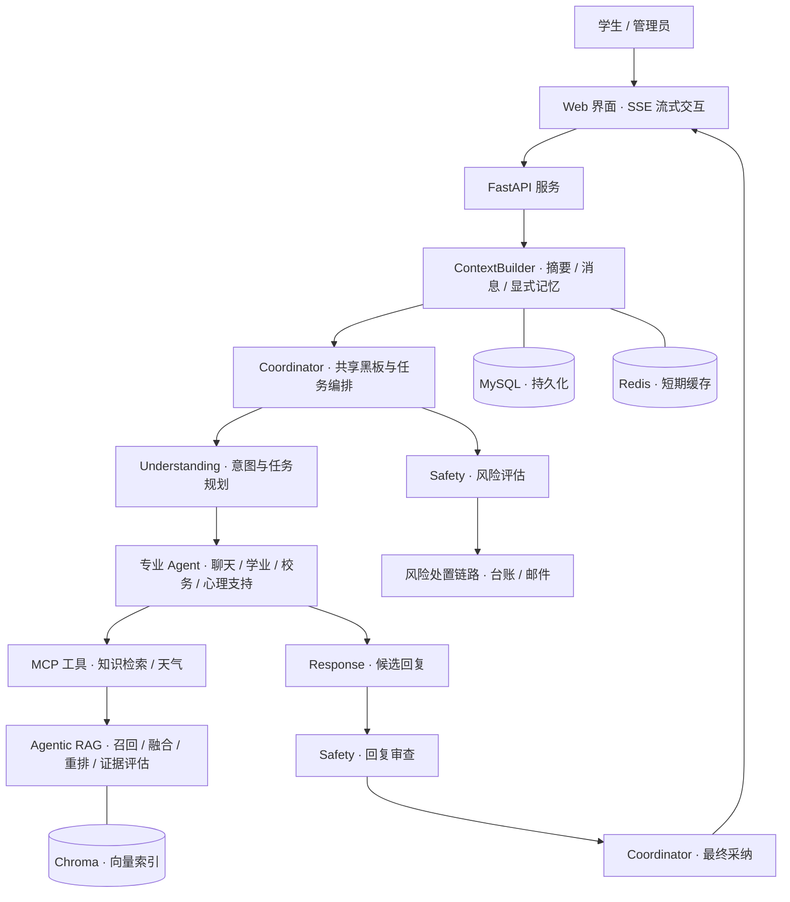

<div align="center">

# CampusCare

### 校园生活有问必答，成长路上多一份陪伴

面向高校学生的 AI 校园陪伴与事务助手  
**多 Agent 协作 · 校园知识检索 · 对话记忆 · 风险识别与人工处置支持**

[项目亮点](#项目亮点) · [系统架构](#系统架构) · [快速启动](#快速启动) · [技术文档](docs/TECHNICAL_GUIDE.md)

</div>


> CampusCare 是一个基于 FastAPI 的校园 AI 应用原型，围绕学生咨询、学习规划、情绪支持和后台个案处理，串联从对话理解到知识检索、回复审查和流式输出的完整流程。代码及部分文档沿用 MindBridge 名称，应用界面沿用 CampusCove 名称。

## 你可以用它做什么

| 场景 | 示例问题 | 系统能力 |
| --- | --- | --- |
| 校园事务咨询 | “申请奖学金需要准备哪些材料？” | 检索已导入的校园资料，为回答提供知识证据 |
| 学业规划 | “这周有两门考试，帮我安排复习。” | 理解目标与约束，交由学业规划 Agent 处理 |
| 日常陪伴 | “今天有点累，想找人聊聊。” | 连续对话、流式回复与上下文记忆 |
| 情绪支持 | “最近压力很大，总担心自己做不好。” | 支持性交流、风险评估与候选回复安全审查 |
| 管理员工作台 | 查看需要跟进的会话与风险记录 | 会话报告、个案处置、Excel 台账及可配置邮件预警 |

以上为演示提问示例；具体回答取决于所接入的模型与知识库内容。

## 项目亮点

### 01 · 多 Agent 协作处理复杂问题

Coordinator 通过共享黑板和任务板组织 Understanding、Safety、专业 Agent 与 Response。系统支持五类意图、多任务依赖、缺参澄清与结果汇总，让一句话中的多个需求有序执行。

### 02 · 基于校园资料的 Agentic RAG

结合 BM25 与向量检索，通过 RRF 融合、LLM 重排和证据评估筛选资料。检索最多执行两轮、查询改写最多一次，为证据不足和依赖故障提供明确的结束路径。

### 03 · 有边界的对话记忆

统一 ContextBuilder 组织会话摘要、近期消息、显式用户记忆与澄清状态，并管理上下文预算和来源。学生端提供“我的记忆”入口，支持围绕连续对话展示记忆能力。

### 04 · 安全审查与后台跟进

风险识别与最终回复审查分别进入对话流程；后台保留风险、情绪和摘要信息。只读检索工具与风险写入工具分离，并具备超时、熔断及幂等控制。

### 05 · 模型接入与工程验证

支持 Ollama 本地模型与 OpenAI-compatible API，包含 Docker Compose、数据库迁移、自动化测试和评测脚本，可用于演示完整 AI 应用的工程实现。

## 系统架构



| 层次 | 技术选型 |
| --- | --- |
| 前端交互 | HTML / CSS / JavaScript、Server-Sent Events |
| API 与服务 | Python、FastAPI、Uvicorn、Pydantic |
| Agent 与工具 | 事件驱动多 Agent runtime、共享黑板、MCP、场景 Skill |
| 模型服务 | Ollama、OpenAI-compatible API、Mock Provider |
| 检索增强 | BM25、Chroma、RRF、LLM Rerank / Grade / Rewrite |
| 存储与迁移 | MySQL、SQLAlchemy、Alembic、Redis |
| 部署与验证 | Docker Compose、unittest、GitHub Actions、独立评测脚本 |

## 快速启动

推荐使用 **Docker Compose + 宿主机 Ollama**。首次启动需要下载依赖和模型，请预留相应磁盘空间与模型运行资源。

### 1. 准备模型

安装并启动 Ollama，在宿主机终端执行：

```bash
ollama pull qwen3:8b
ollama pull bge-m3:latest
```

### 2. 配置并启动

在项目根目录复制环境配置：

```bash
# Linux / macOS
cp .env.example .env
```

```powershell
# Windows PowerShell
Copy-Item .env.example .env
```

```bash
docker compose up -d --build
curl http://127.0.0.1:8080/actuator/health
```

默认 Compose 配置通过 `host.docker.internal` 访问宿主机 Ollama。Linux 环境需配置相应宿主机映射；容器也需要能够连接 Ollama 的监听地址。

### 3. 打开工作台

| 入口 | 本地地址 | 开发演示账号 |
| --- | --- | --- |
| 登录页 | http://127.0.0.1:8080/ | 选择对应角色登录 |
| 学生端 | http://127.0.0.1:8080/student.html | `student / student123` |
| 管理端 | http://127.0.0.1:8080/admin.html | `admin / admin123` |

首次部署会执行数据库迁移和知识语料同步。需要启用向量检索时，继续按照[技术文档](docs/TECHNICAL_GUIDE.md)构建、验证并激活知识索引。默认邮件投递模式为 `log`，实际邮件发送需另行配置。

## 建议的演示顺序

1. **学生端问答**：提出一个校园事务问题，展示流式输出及基于资料的回答。
2. **连续追问**：补充条件或追问上一轮内容，展示上下文衔接与缺参澄清。
3. **复合需求**：同时提出校园咨询与学习规划需求，讲解多 Agent 分工。
4. **管理员视角**：使用模拟会话展示后台报告与个案跟进流程。
5. **工程讲解**：结合上方架构图，介绍 RAG、记忆管理、工具权限与自动化验证。

## 代码导航

```text
app/
├── agents/           # Agent 协作与任务执行
├── api/              # API 路由
├── core/             # 配置、数据库与安全
├── knowledge/        # 校园知识语料与 Manifest
├── mcp_tools/        # 工具服务
├── services/         # 对话、记忆、RAG 与知识入库
├── evaluation/       # 评测配置与数据集
└── static/           # 登录页、学生端与管理端
migrations/           # 数据库迁移
scripts/              # 导入、索引管理与开发脚本
skills/               # 场景 Skill
tests/               # 自动化测试
docs/                # 技术说明
```

## 文档与验证

- [完整技术文档](docs/TECHNICAL_GUIDE.md)：本地开发、模型配置、索引管理、Agent 分工、记忆与评测。
- [测试代码](tests/)：查看关键业务行为与回归测试。
- [自动化工作流](.github/workflows/test.yml)：依赖安装、编译检查与 unittest。
- [知识库说明](app/knowledge/handbook_v2/README.md)：查看内置语料结构。

本仓库包含测试和评测实现，不将其视为未经实际运行验证的性能承诺。当前项目用于原型研究与演示，心理支持功能不提供医疗诊断。演示账号需在实际部署前替换；本地会话数据、风险台账、密钥、缓存和模型权重不随代码上传。
